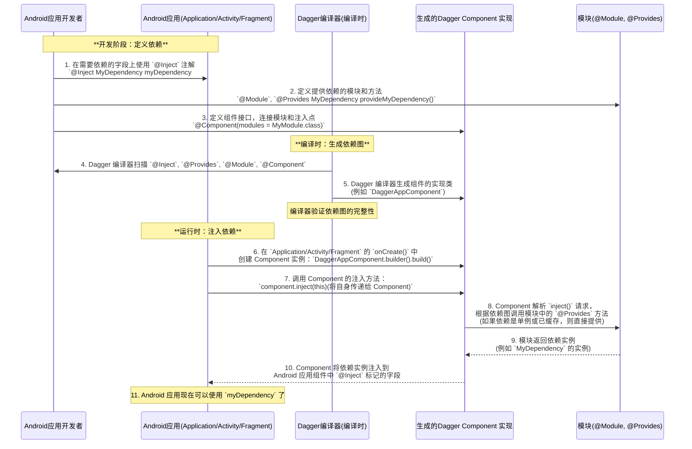

> Android Jetpack 套件之 Dagger2 使用；

<!--more-->

## 1 什么是依赖注入？

**IOC - Inversion of Control**

控制反转，意思是借助于“第三方” **实现** 具有依赖关系的 **对象之间的解耦**（比如在三个互相接触的小齿轮中间增加一个大的齿轮来接触三个小齿轮，以解除三个小齿轮之间的互相依赖）；


反转的是对象的创建方式，即获得依赖对象的过程被反转了，获得依赖对象的过程 **由自身管理变为了由IOC 容器主动注入**，于是 IOC 有了一个新名字：依赖注入，实际上“依赖注入” IOC 的一种实现方式，IOC 框架有两种实现方式：

- 基于反射的实现方式，比如 Spring IOC（动态的进行依赖关系的建立），在程序运行过程中动态的建立依赖关系；
- 静态方式，程序在编译期自动生成代码用于建立依赖关系，dagger2 就属于静态方式；

## 2 手动依赖注入的两种方式

- 构造方法注入
- Setter 方法注入（setXXX 方法）

``` java
public class Car {
    Engine engine;
    public void start() {
        // 主动控制对象的创建
        //engine = new Engine();
        engine.start();
    }
    // 构造方法注入
    public Car(Engine engine) {
        this.engine = engine;
    }
    // Setter 方法注入
    public void setEngine(Engine engine) {
        this.engine = engine;
    }
}
```

主动控制对象的创建，如果 Engine 的构造方法发生了变化，那么 Car 类中也要做出相应的改变，但是如果通过依赖注入，Car 类就不需要再关注 Engine 对象的创建，只关注自己的业务就可以了；

试想一下，Car 不单单只有 Engine，还包括其他的零部件，比如 Wheel，Gearbox 等，Engine 又包含了自己的零部件，这么多的对象如果通过手动依赖注入就需要大量的调用构造方法或者 Setter 方法进行注入，变得异常繁琐，所以我们需要一个工具可以帮我们注入：

``` java
public class Injector {
    public void inject(Car car) {
        Engine engine = new Engine();
        car.setEngine(engine);
    }
}
```

在外部直接调用 inject 方法即可注入依赖对象了；

## 3 什么是 Dagger？

Dagger(匕首) 是提供给 Android 快速实现依赖注入的**框架**，Dagger1.0 由 Square 公司开发共享，Dagger2 由 Google 接手并维护；

## 4 Dagger 使用

首先添加依赖引入 Dagger2：

``` java
// build.gradle(:app)
dependencies {
    // dagger 核心库
    implementation 'com.google.dagger:dagger:2.4'
    // 注解处理器
    annotationProcessor 'com.google.dagger:dagger-compiler:2.4'
}
```

### 4.1 使用构造方法创建对象

1. 定义对象

  ``` java
  public class User {
      @Inject
      public User() {
          
      }
  }
  ```

  `@Inject` 注解用于告知 Dagger 可以通过构造方法创建并获取对象实例；

2. 编写 Component 接口用于执行注入

  ``` java
  @Component
  public interface AppComponent ｛
      public void inject(MainActivity mainActivity);
  ｝
  ```

  Component 可以当成 IOC 容器，IOC 容器则存在一些实例，`inject()` 方法参数表示把对象注入到 MainActivity 中（或者说这个 Component 中的对象会在哪个类使用）；

3. 定义依赖对象

  ``` java
  public class MainActivity extends AppCompatActivity {
      @Inject
      User user;
      ...
  }
  ```

  `@Inject` 表示这个依赖对象需要注入；

4. 执行依赖对象注入

  ``` java
  public class MainActivity extends AppCompatActivity {
      @Inject
      User user;
      
      @Override
      protected void onCreate(Bundle savedInstanceState) {
          super.onCreate(savedInstanceState);
          setContentView(R.layout.activity_main);
          DaggerAppComponent.create().inject(this); // 执行注入
      }
  }
  ```

要执行 build 后才会生成 DaggerAppComponent，DaggerAppComponent 是 AppComponent 的实现类，调用 AppComponet 中定义的方法执行注入动作；

通过以上 4 个步骤就完成了一个对象的注入；

但是如果有些对象的构造是第三方框架提供的，就无法在构造方法上添加 `@Inject` 注解了，又或者提供依赖的构造函数是带参数的，如果只是简单的使用 `@Inject` 标记，那么它的参数又如何来的呢？`@Module` 可以帮我们解决这些问题；

### 4.2 使用 Module 的 provideXXX() 创建对象

1. 定义 Module

   **Module 的作用是提供各种功能对象**

   ``` java
   @Module
   public class NetModule() {
       @Provides
       public User provideUser() {
           return new User(); // 或者其他提供对象的方式
       }
       
       @Provides
       public Retrofit provideRetrofit() {
           return new Retrofit.Builder("http://www.baidu.com").basUrl().build();
       }
   }
   ```

   `@Module` 表示这个类的类型是一个 Dagger 模块，可以注入到容器中；

   `@Provides` 表示告知 Dagger 可以通过下面这种方式来获取到要注入对象的实例；

2. 把 Module 装载到 Component 中

   ``` java
   @Component(modules = NetModule.class)
   public interface AppComponent {
       void inject(MainActivity mainActivity);
   }
   ```

   在 `@Component` 注解后面括号里把 Module 装载到 Component 中，modules 参数接收的类型是一个数组，表示被装入 Component 的 Module 有哪些，如果是多个 module，则写为 `modules = {A.class,B.class}`；

3. 执行注入

   ``` java
   public class MainActivity extends AppCompatActivity {
       @Inject
       User user;
       @Inject
       Retrofit retrofit;
       
       @Override
       protected void onCreate(Bundle savedInstanceState) {
           super.onCreate(savedInstanceState);
           setContentView(R.layout.activity_main);
           DaggerAppComponent.create().inject(this); // 执行注入
           Log.d(TAG, "user: " + user + ", retrofit: " + retrofit);
       }
   }
   ```

4. 复杂情况使用（引用 Module 中已知的对象）

   创建一个 ApiService 接口

   ``` java
   public interface ApiService {}
   ```

   假如获取 ApiService 对象需要使用到 Retrofit 对象，则直接在参数中引入 Retrofit 对象即可，因为 Module 已经知道如何获取 Module 对象了，所以不需要再重复调用创建 Retrofit 的方法了；

   ``` java
   @Module
   public class NetModule() {   
       @Provides
       public Retrofit provideRetrofit() {
           return new Retrofit.Builder("http://www.baidu.com").basUrl().build();
       }
   
       @Provides
       public ApiService provideApiService(Retrofit retrofit){
           // 一般使用
           //new Retrofit.Builder("http://www.baidu.com").basUrl().build().create(ApiService.class);
           retrofit.create(ApiService.class);
       }
   }
   ```

   此处想说明的就是如果 Module 中已经知道如何获取一个对象，那么 Module 中的其他对象的创建方法中可以直接使用这个对象；

### 4.3 作用域

#### 4.3.1 局部单例

作用域注解可以**将某个对象的生命周期限定为其组件的生命周期（即如果 Module 中的获取实例的方法指定了某个作用域，那么对应的 Component 也需要指定这个作用域）**，<font color=red>**在作用域范围内使用到的是同一实例**</font>；

作用域是用于 **控制依赖对象的生命周期** 和 **复用策略** 的一种机制。它是依赖注入系统中非常关键的一部分，在实际开发中用于防止重复创建对象、提升性能，并在一定程度上帮助构建清晰的架构层级。

``` java
@Module
public class NetModule() {
    @Singleton
    @Provides
    public Retrofit provideRetrofit() {
        return new Retrofit.Builder("http://www.baidu.com").basUrl().build();
    }
}
```

`@Singleton` 是 Dagger 提供的一种默认的作用域注解；

``` java
@Singleton
@Component(modules = NetModule.class)
public interface AppComponent {
    void inject(MainActivity mainActivity);
}
```

装载 Module 的 Component 也需要添加 `@Singleton` 注解；

``` java
public class MainActivity extends AppCompatActivity {
    @Inject
    Retrofit retrofit;
    
    @Inject
    Retrofit retrofit2;
    
    @Override
    protected void onCreate(Bundle savedInstanceState) {
        super.onCreate(savedInstanceState);
        setContentView(R.layout.activity_main);
        DaggerAppComponent.create().inject(this); // 执行注入
        Log.d(TAG, "retrofit: " + retrofit + ", retrofit2: " + retrofit2);
    }
}
```

如果打印出来就可以看出 retrofit 和 retrofit2 是同一个对象；

但是假如有另一个 Activity，同样注入了 Retrofit 对象，那么和上面是否是同一个实例呢？

``` java
public class SecondActivity extends AppCompatActivity {
    @Inject
    Retrofit retrofit;
    
    @Override
    protected void onCreate(Bundle savedInstanceState) {
        super.onCreate(savedInstanceState);
        DaggerAppComponent.create().inject(this);
        Log.d(TAG, "retrofit3: " + retrofit3);
    }
}
```

把依赖对象注入到 SecondActivity 供其使用：

``` java
@Singleton
@Component(modules = NetModule.class)
public interface AppComponent {
    void inject(MainActivity mainActivity);
    void inject(SecondActivity secondActivity);
}
```

这里打印出的结果表明 SecondActivity 中的 retrofit3 和 MainActivity 中的两个 Retrofit 对象并非同一个对象，因为在 SecondActivity 中又通过 DaggerAppComponent.create() 创建了一个新的 Component 对象，上面说了，只有同一个 Component 中的对象才是同一个，所以这里就和 MainActivity 中的对象不是同一个了；

#### 4.3.1 全局单例

``` java
public class MyApplication extends Application {
    static AppComponent appComponent = DaggerAppComponent.create();
    public AppComponent getAppComponent() {
        return appComponent;
    }
}
```

在 Activity 中使用 Application 中提供的 AppComponent 进行对象注入：

``` java
public class MainActivity extends AppCompatActivity {
    @Inject
    Retrofit retrofit;
    
    @Inject
    Retrofit retrofit2;
    
    @Override
    protected void onCreate(Bundle savedInstanceState) {
        super.onCreate(savedInstanceState);
        setContentView(R.layout.activity_main);
        //DaggerAppComponent.create().inject(this); // 执行注入
        MyApplication.getAppComponent().inject(this); // 执行注入
        Log.d(TAG, "retrofit: " + retrofit + ", retrofit2: " + retrofit2);
    }
}
```

同理 SecondActivity 中也是用同样的方法注入，这样 MainActivity 和 SecondActivity 中的 Retrofit 对象就是同一个对象了，因为使用的是同一个 Component 注入的；

#### 4.3.3 自定义作用域

``` java
@Scope
@Documented
@Retention(RUNTIME)
public @interface MyScope {

}
```

直接复制 Singleton 的注解，修改为自定义的作用域名称即可；

#### <font color=red>4.3.4 使用作用域的规则</font>

- 在没有必要的情况下，尽量使用默认的作用域，即不指定作用域；
- Module 中要么不使用作用域，要么和 Component 中的作用域保持一致；
- 开发设计时，一定要有清晰的依赖图，不然容易产生依赖死循环；

Lazy 和 Provider 区别：Lazy 是单例（使用 DoubleCheck），Provider 不是单例；

### <font color=red>4.4 组件依赖和子组件</font>

组件依赖与子组件主要解决不同作用域时组件之间的复用问题：

- 在一个组件指定作用域后，就已经确定了该组件创建对象的生命周期，但是有些对象的实例可能生命周期更短，这时就需要定义新的组件；
- 新组件需要使用原组件的部分资源；

两种实现方式：

- 为新组件 `@Component` 添加 `dependencies` 参数，指定该组件依赖的原组件；
- 直接使用 `@Subcomponent` 注解创建新的组件，并装载到父组件中；

#### 4.4.1 dependencies 方式

1. 定义新组件的作用域：

   ``` java
   @Scope
   @Documented
   @Retention(RUNTIME)
   public @interface UserScope {
   
   }
   ```

2. 定义新组件

   ``` java
   @UserScope
   @Component(modules = UserModule.class, dependencies = AppComponent.class)
   public interface UserComponent {
       void inject(MainActivity mainActivity);
   }
   ```

   **多个 component 上面的 scope 不能相同**，没有 scope 的组件不能去依赖有 scope 的组件，新组件 UserComponent 依赖原组件 AppComponent 组件，所以 <font color=red>**指定新组件的作用域 UserScope**</font>，如果不给新组件指定作用域，会报如下错误：

   ``` shell
UserComponent(unscoped) cannot depend on scoped components
   ```
   
   因为原组件指定了作用域，所以 <font color=red>**新组件需要指定一个不同的作用域，并且对应的 Module 中的 provideXXX() 也需要指定作用域；**</font>

3. 原组件中对应需要注入对象的 Activity 的 inject 就不需要了，并且暴露原组件装载的 NetModule 中想要给新组件使用的对象 Retrofit；

   ``` java
   @MyScope
   @Component(modules = NetModule.class)
   public interface AppComponent {
       //void inject(MainActivity mainActivity);
       Retrofit getRetrofit(); // 暴露需要给新组件使用的对象
   }
   ```

4. User 对象

   ``` java
   public class User {
       //@Inject
       public User() {
       }
   }
   // 创建 UserModule
   @Module
   public class UserModule() {
       @UserScope// 指定作用域
       @Provides
       public User provideUser() {
           return new User();
       }
   }
   ```

   因为使用 UserModule 提供 User 对象了，所以 User 的构造方法不需要添加 `@Inject` 注解了；

5. 注入对象

   ``` java
   public class MainActivity extends AppCompatActivity {
       @Inject
       User user;
       @Inject
       User user2;
       @Inject
       Retrofit retrofit;
       UserComponent userComponent;
   
       @Override
       protected void onCreate(Bundle savedInstanceState) {
           super.onCreate(savedInstanceState);
           setContentView(R.layout.activity_main);
           userComponent = DaggerUserComponent.builder
               .appComponent(MyApplication.getAppComponent()) // 指定原组件
               .build();
           userComponent.inject(this);// 执行注入
       }
   }
   ```

   因为 UserComponent 的生命周期决定了和它同作用域对象的生命周期，所以需要把 UserComponent 定义在 Activity 的变量中，这样那些对象就和 Activity 的生命周期一致了，<font color=red>**必须指定原组件；**</font>

   如此一来 user 和 user2 引用的就是同一个对象了，局部单例，而且原组件装载 Module 中的 Retrofit 对象也注入了；

6. 引入 ApplicationContext

   ``` java
   @Module
   public class NetModule {
       private Application application;
       public NetModule(Application application) {
           this.application = application;
       }
       @Provides
       Context provideContext() {
           return application.getApplicationContext();
       }
   }
   ```

   application 需要通过 NetModule 构造方法传入，

   ``` java
   public class MyApplication extends Application {
       static AppComponent appComponent;
       @Override
       public void onCreate() {
           super.onCreate();
           appComponent = DaggerAppComponent.builder.netModule(new NetModule(this)).build();
       }
       public AppComponent getAppComponent() {
           return appComponent;
       }
   }
   ```

   这里在 `onCreate()` 中指定一个新的 NetModule 给 AppComponent，并且把 Application 传入构造函数，这样 NetModule 就拥有了 Application 对象；

   接着在 MainActivity 中注入 Context：

   ``` java
   public class MainActivity extends AppCompatActivity {
       @Inject
       Context context;
   
       @Override
       protected void onCreate(Bundle savedInstanceState) {
           super.onCreate(savedInstanceState);
           setContentView(R.layout.activity_main);
           userComponent = DaggerUserComponent.builder
               .appComponent(MyApplication.getAppComponent()) // 指定原组件
               .build();
           userComponent.inject(this);// 执行注入
       }
   }
   ```

   Context 是由 NetModule 提供的，NetModule 是属于 AppComponent 的，所以 AppComponent 可以暴露 Context 对象给到依赖 AppComponent 的新组件中，这样就复用了原组件的 ApplicationContext；

#### 4.4.2 SubComponent 使用

1. 创建 Student 类：

   ``` java
   public class Student {
       
   }
   ```

2. 创建 StudentComponent

   ``` java
   @Subcomponent(modules=StudentModule.class) // 指定为子组件
   public interface StudentComponent {
       @Subcomponent.Factory
       interface Factory { // 用来提供 StudentComponent 的创建
           StudentComponent create();
       }
       void inject(SecondActivity);
   }
   ```

   `@Subcomponent` 说明该组件为子组件；

3. 创建子组件 Module

   ``` java
   @Module(subcomponents = StudentComponent.class)// 指定子组件
   public class SubComponentModule {
       
   }
   ```

4. 把子组件 Module 装载到 AppComponent 中：

   ``` java
   @MyScope
   @Component(modules = SubComponentModule.class)
   public interface AppComponent {
       StudenComponent.Factory studentComponent(); // 指定 Factory
   }
   ```

   那么子组件就属于父组件 AppComponent 了，那么 就可以共享父组件提供的一些功能；

5. 创建 StudentModule，并装载到 StudentComponent 中：

   ``` java
   @Module
   public class StudentModule {
       @Provides
       Student provideStudent() {
           return new Student();
       }
   }
   ```

6. 注入

   ``` java
   public class SecondActivity extends AppCompatActivity {
       @Inject
       Student student;
       @Override
       protected void onCreate(@Nullable Bundle savedInstanceState) {
           super.onCreate(savedInstanceState);
           MyApplication.getApplicationComponent().studentComponent().create().inject(this);
           Log.d(TAG, "student: " + student);
       }
   }
   ```

   总结就是：

   父 Component 装载父 Module，父 Module 创建子 Component（在父 Module 中指定 subcomponents 为子 Component），子 Componet 装载子 Module，子 Module 创建XXX对象，然后父 Component 提供获取子 Component 的方法，子 Component 提供 inject 方法；

   需要注意的是，子 Componet 没有单独的 Dagger 子 Component，而是存在于 Dagger 父 Component 中，所以注入的时候使用 `Dagger父Component.子Component().create().inject(this)` 的方式；

和组件依赖相比，子组件如果使用父组件的功能，父组件不需要额外声明想要暴露的方法；

#### 4.4.3 子组件完整示例

适合上下级关系明确的常见，比如 App -> Activity -> Fragment

##### 定义作用域

``` java
@Scope
@Retention(RetentionPolicy.RUNTIME)
public @interface ActivityScope {}

@Scope
@Retention(RetentionPolicy.RUNTIME)
public @interface FragmentScope {}
```

##### AppComponent（父组件）

``` java
@Singleton
@Component(modules = AppModule.class)
public interface AppComponent {
    ActivityComponent.Factory activityComponent();

    ApiService getApiService(); // 也可以提供给外部
}
```

##### AppModule

``` java
@Module
public class AppModule {
    @Provides
    @Singleton
    ApiService provideApiService() {
        return new ApiService(); // 模拟网络服务
    }
}
```

##### ActivityComponent（子组件）

``` java
@ActivityScope
@Subcomponent(modules = ActivityModule.class)
public interface ActivityComponent {
    FragmentComponent.Factory fragmentComponent();

    void inject(MyActivity activity);

    @Subcomponent.Factory
    interface Factory {
        ActivityComponent create();
    }
}
```

##### ActivityModule

``` java
@Module
public class ActivityModule {
    @Provides
    @ActivityScope
    ActivityHelper provideActivityHelper() {
        return new ActivityHelper();
    }
}
```

##### FragmentComponent（孙组件）

``` java
@FragmentScope
@Subcomponent(modules = FragmentModule.class)
public interface FragmentComponent {
    void inject(MyFragment fragment);

    @Subcomponent.Factory
    interface Factory {
        FragmentComponent create();
    }
}
```

##### FragmentModule

``` java
@Module
public class FragmentModule {
    @Provides
    @FragmentScope
    FragmentHelper provideFragmentHelper() {
        return new FragmentHelper();
    }
}
```

##### 使用方式

``` java
// 在 Application 中初始化
AppComponent appComponent = DaggerAppComponent.create();

// 在 Activity 中
ActivityComponent activityComponent = appComponent.activityComponent().create();
activityComponent.inject(this);

// 在 Fragment 中
FragmentComponent fragmentComponent = activityComponent.fragmentComponent().create();
fragmentComponent.inject(this);
```

#### 4.4.4 组件依赖完整示例

适合**跨模块解耦**场景，比如基础层和功能层分离。

##### AppComponent（被依赖组件）

``` java
@Singleton
@Component(modules = AppModule.class)
public interface AppComponent {
    ApiService getApiService();
}
```

##### FeatureComponent（依赖 AppComponent）

``` java
@ActivityScope
@Component(
    dependencies = AppComponent.class,
    modules = FeatureModule.class
)
public interface FeatureComponent {
    void inject(MyFeatureActivity activity);

    @Component.Factory
    interface Factory {
        FeatureComponent create(
            @BindsInstance Context context,
            AppComponent appComponent
        );
    }
}
```

##### FeatureModule

``` java
@Module
public class FeatureModule {
    @Provides
    @ActivityScope
    FeatureHelper provideFeatureHelper(ApiService apiService) {
        return new FeatureHelper(apiService);
    }
}
```

##### 使用方式

``` java
AppComponent appComponent = DaggerAppComponent.create();

FeatureComponent featureComponent = DaggerFeatureComponent.factory()
    .create(context, appComponent);

featureComponent.inject(this);
```

#### 4.4.5 组件依赖和子组件对比总结

| 对比项     | **组件依赖（Component dependencies）**                      | **子组件（Subcomponent）**                |
| ---------- | ----------------------------------------------------------- | ----------------------------------------- |
| 关系结构   | 平级组件间依赖（需要显式传入）                              | 父子组件嵌套（由父组件生成）              |
| 作用域继承 | **不继承**父作用域（需手动管理）                            | **继承**父作用域                          |
| 实例获取   | 通过接口显式提供依赖                                        | 直接共享父模块提供的依赖                  |
| 组件构建   | 每个组件需单独 `@Component.Builder` 或 `@Component.Factory` | 由父组件通过 `@Subcomponent.Factory` 创建 |
| 灵活性     | 更灵活，适合大型模块之间的解耦                              | 由父组件通过 `@Subcomponent.Factory` 创建 |
| 使用复杂度 | 稍复杂，需要明确接口传递                                    | 简单，自动获取父提供的依赖                |


### 4.5 @Binds 使用

`@Binds` 是 Dagger 2 中一种非常常见且**高效**的绑定方式，用于将一个实现类绑定为接口的提供者。它是 `@Provides` 的一种简洁替代，用在 **抽象方法中**，不能直接返回实例，而是告诉 Dagger **用某个具体实现来满足某个接口的依赖**。

**使用前提**

- `@Binds` 方法必须是 **`abstract` 抽象方法**
- 所在的类必须是用 `@Module` 标注的 **抽象类**
- 参数是实现类，返回类型是接口

**使用示例**

常规写法：

``` java
@Module
class AppModule {

    @Provides
    Animal provideDog() {
        return new Dog();
    }
}
```

使用 `@Binds` 写法

``` java
@Module
abstract class AppModule {

    @Binds
    abstract Animal bindDog(Dog dog);
}
```

等价于告诉 Dagger：

> “当需要 `Animal` 时，就注入 `Dog` 实例”。

**常见应用场景**

- 接口注入：`Repository`、`DataSource`、`Service` 等
- <font color=red>**多个实现：搭配 `@Named` 或 `@Qualifier`**</font>
- ViewModel、UseCase、Handler 层抽象绑定

**示例：接口绑定**

``` java
interface UserRepository {
    void login(String user, String password);
}

class UserRepositoryImpl implements UserRepository {
    public void login(String user, String password) {
        // 登录逻辑
    }
}

@Module
abstract class RepositoryModule {
    @Binds
    abstract UserRepository bindUserRepository(UserRepositoryImpl impl);
}
```

然后在依赖方：

``` java
@Inject
UserRepository userRepository;
```

Dagger 会自动注入 `UserRepositoryImpl`。

### 4.6 @Qualifier 使用

如果一个类存在多个构造方法，如何注入对象呢？首先可以使用 `@Named` 注解；

`@Named` 注解

``` java
@Qualifier
@Documented
@Retention(RUNTIME)
public @interface Named {
    String value() default "";
}
```

Student 类有 2 个构造方法：

``` java
public class Student {
    String name = "Xiaohong";
    public Student(){
        
    }
    
    public Student(String name) {
        this.name = name;
    }
    
    public String getName() {
        return name;
    }
}
```

定义 StudenModule，用 `@Named("XXX")` 注解标识对象不同的创建方法：

``` java
@Module
public class StudentModule {
    @Named("student1")
    @Provides
    Student provideStudent1(){
        return new Student();
    }

    @Named("student2")
    @Provides
    Student provideStudent2() {
        return new Student("Xiaoming");
    }
}
```

注入时加上对应的 `@Named` 注解即可：

``` java
@Named("student1")
@Inject
Student student1;

@Named("student2")
@Inject
Student student2;
```

这样 *student1* 的名字就是 `Xiaohong`，*student2* 的名字就是 `Xiaoming`；

我们也可以模仿 `@Named` 注解定义我们自己的注解，比如：

``` java
@Qualifier
@Documented
@Retention(RUNTIME)
public @interface StudentQualifier1 {
    String value() default "";
}

@Qualifier
@Documented
@Retention(RUNTIME)
public @interface StudentQualifier2 {
    String value() default "";
}
```

这样直接用 `StudentQualifier1` 或者 `StudentQualifier2` 代替 `@Named("xxx")` 即可；

### 4.7 @BindsInstance 使用

- `@BindsInstance` 的作用是让一个运行时传入的实例成为组件依赖图的一部分；

- <font color=red>**将一个在运行时才确定的对象实例，直接添加到 Dagger Component 的依赖图中，而无需通过 `@Provides` 方法或 `@Inject` 构造函数来提供它。**</font>

- 简而言之，它允许你在**创建 Component 实例的时候**，就把一些“外部”对象“注入”到 Component 中，让 Component 知道如何提供这些对象。

**Dagger 2 的依赖解析机制**

Dagger 2 是一个**编译时**依赖注入框架。这意味着它在代码编译阶段就会构建出一个完整的依赖图。当你在 `@Provides` 方法中声明一个参数时，你并不是在告诉 Dagger **“把这个参数从模块的构造函数里给我传进来”**，而是告诉 Dagger **“我这个方法需要一个指定类型的依赖，请你从**当前的组件依赖图**中给我提供一个！”**

**举例说明**

<font color=red>*我们来思考一个问题：以下例子中为什么 `AppResourceModule` 和 `DomainModule` 中的 `provideXXX(Application application)` 方法可以直接使用 `application` 参数呢？*</font>

1. `AppComponent.Factory` 中的 `@BindsInstance Application application`

   ``` java
   @Component.Factory
   interface Factory {
       AppComponent create(
               @BindsInstance Application application, // <--- 关键点 1
               @BindsInstance ParkingHmiHandler parkingHmiHandler,
               AppResourceModule appResourceModule,
               DomainModule domainModule
       );
   }
   ```
   
   - `@BindsInstance` 注解的作用是：它告诉 Dagger，当调用 `create()` 方法时，传入的 `Application` 对象（以及 `ParkingHmiHandler`）应该被**绑定到 `AppComponent` 的依赖图**中。
   
   
   - 这意味着，一旦 `AppComponent` 被创建，这个特定的 `Application` 实例就会成为该组件能够提供的**可注入依赖**。任何请求 `Application` 类型的 `@Inject` 字段或 `@Provides` 方法参数，Dagger 都会提供这个通过 `@BindsInstance` 绑定的实例。
   
2. `applicationInjector()` 中的 `DaggerAppComponent.factory().create(...)` 调用

   ``` java
   protected AndroidInjector<? extends DaggerApplication> applicationInjector() {
       return DaggerAppComponent.factory().create(
               this, // <--- 关键点 2: 传入了 `Application` 实例 (即 `this`)
               this, // ParkingHmiHandler 假设 `this` 也是
               new AppResourceModule(), // <--- 关键点 3: 手动实例化模块
               new DomainModule());     // <--- 关键点 4: 手动实例化模块
   }
   ```
   
   
   - 当你在 `create()` 方法中传入 `this`（即 `MyApplication` 的实例）作为第一个参数时，这个 `MyApplication` 实例就被 `AppComponent` 的依赖图**绑定**了。
   
   
   - 同时，你手动 `new` 了 `AppResourceModule()` 和 `new DomainModule()` 的实例，并将它们作为参数传递给了 `create()` 方法。这表示你正在使用**模块实例**来初始化组件，而不是让 Dagger 自动创建模块。
   
3. `AppResourceModule` 和 `DomainModule` 中的 `@Provides` 方法

   ``` java
   // 假设在 AppResourceModule 或 DomainModule 中
   @Module
   class SomeModule {
       @Provides
       SomeResource provideSomeResource(Application application) { // <-- 关键点 5
           return new SomeResource(application.getResources());
       }
   }
   ```

   - 当 Dagger 需要提供 `SomeResource` 的实例时，它会查找 `provideSomeResource` 方法。

   - 它发现 `provideSomeResource` 方法需要一个 `Application` 类型的参数。

   - 此时，Dagger 会在**当前组件（`AppComponent`）的依赖图**中查找 `Application` 类型的绑定。

   - 由于你在 `AppComponent.Factory` 的 `create()` 方法中通过 `@BindsInstance` 绑定了一个 `Application` 实例，Dagger 就会**自动将那个已绑定的 `Application` 实例作为参数传递给 `provideSomeResource` 方法**。

4. 总结

   上述问题的核心原因在于：

   - **`@Provides` 方法的参数不是由模块的构造函数传入的。** 它们是由 Dagger **从组件的依赖图中注入的**。
   - **`@BindsInstance` 的作用是让一个运行时传入的实例成为组件依赖图的一部分。**
   - 当你 `new AppResourceModule()` 和 `new DomainModule()` 时，你只是提供了**模块本身**的实例给 Dagger。但这些模块内部的 `@Provides` 方法在执行时，它们所需的依赖（如 `Application`）仍然是 Dagger **从已构建的依赖图中智能获取并注入的**。

   所以，即使模块本身是手动实例化的，其 `@Provides` 方法的参数仍然能享受 Dagger 的依赖注入能力，只要这些参数的类型在父级 Component 的依赖图中有对应的绑定（通过 `@BindsInstance`、其他 `@Provides` 方法或 `@Inject` 构造函数）。这正是 Dagger 2 强大而灵活的体现。

### 4.8 Dagger 模块的实例化

Dagger 2 在编译时会生成 Component 的实现代码。这个实现代码负责实例化所有必要的依赖，包括模块本身。关于模块的实例化，Dagger 遵循以下规则：

#### 4.8.1 Dagger 自动实例化模块 (默认且常见方式)

- **前提条件：**

  - 模块类必须有一个 **无参的公共构造函数**
    - *重要：** 如果你没有显式定义任何构造函数，Java 会**隐式生成**一个无参的公共构造函数。
  - 模块中的 `@Provides` 方法**可以是静态的，也可以是非静态的**。

- **工作方式：** 当你在 `@Component` 注解中通过 `modules = {MyModule.class}` 引用一个模块时，Dagger 编译器会生成代码来自动创建 `MyModule` 的实例（如果需要）。

  - **如果所有 `@Provides` 方法都是静态的：** Dagger 在生成的代码中甚至不需要创建模块实例，可以直接通过类名调用静态方法来提供依赖。这是一种性能优化。
  - **如果模块中包含任何非静态的 `@Provides` 方法：** Dagger 将会调用模块的无参构造函数来创建模块的实例，然后通过这个实例调用非静态的 `@Provides` 方法。

- **示例 (正确的自动实例化示例)：**

  ``` java
  @Module
  public class NetworkModule { // 隐式存在无参公共构造函数
      @Provides // 非静态方法，Dagger 会实例化 NetworkModule 来调用它
      public OkHttpClient provideOkHttpClient() {
          return new OkHttpClient();
      }
  
      @Provides // 静态方法，Dagger 不需要模块实例也能调用它
      public static Retrofit provideRetrofit(OkHttpClient client) {
          return new Retrofit.Builder().client(client).baseUrl("https://api.example.com").build();
      }
  }
  
  @Component(modules = NetworkModule.class) // Dagger 会自动创建 NetworkModule 的实例（因为有非静态方法）
  public interface MyComponent {
      OkHttpClient getOkHttpClient();
      Retrofit getRetrofit();
  }
  
  // 在使用时：
  // MyComponent component = DaggerMyComponent.create(); // Dagger 自动处理 NetworkModule 实例化
  ```

  在这个例子中，`NetworkModule` 包含非静态的 `provideOkHttpClient()` 方法，所以 Dagger 会自动创建 `NetworkModule` 的实例。即使 `provideRetrofit()` 是静态的，Dagger 也会为了 `provideOkHttpClient()` 而创建实例。

- 如果所有 `@Provides` 方法都是静态的，且没有实例状态：

  ``` java
  @Module
  public class StaticProvidersModule { // 隐式存在无参公共构造函数
      @Provides
      public static String provideAppName() { // 所有 @Provides 方法都是静态的
          return "My App";
      }
  }
  
  @Component(modules = StaticProvidersModule.class) // Dagger 可以不创建 StaticProvidersModule 实例
  public interface MyComponent {
      String getAppName();
  }
  
  // 在使用时：
  // MyComponent component = DaggerMyComponent.create();
  ```

  这种情况下，`StaticProvidersModule` 的实例甚至不会被创建，Dagger 直接调用其静态方法。

#### 4.8.2 手动实例化模块 (Module Instance Provided)

- **前提条件：**

  - 模块类有一个**带参数的构造函数**。

  - 或者，你出于某种特殊目的，希望**手动控制模块实例的创建**（即使它有无参构造函数）。

- **工作方式：** 当你有一个带参数的模块构造函数时，Dagger **无法自动实例化它**，因为它不知道如何获取构造函数所需的参数。你必须在 Component 的 Builder 或 Factory 中明确地提供模块的实例。

- **示例 (带有构造函数参数的模块)：**

  ``` java
  @Module
  public class MyConfigModule {
      private final String configValue;
  
      public MyConfigModule(String configValue) { // 模块构造函数需要运行时参数
          this.configValue = configValue;
      }
  
      @Provides
      public String provideConfigValue() {
          return configValue;
      }
  }
  
  @Component(modules = MyConfigModule.class)
  public interface MyComponent {
      String getConfigValue();
  
      @Component.Factory
      interface Factory {
          MyComponent create(MyConfigModule moduleInstance); // <-- Factory 接收模块实例
      }
  }
  
  // 在使用时：
  // MyComponent component = DaggerMyComponent.factory().create(new MyConfigModule("production_config"));
  ```

  在这个例子中，`MyConfigModule` 必须被手动实例化，因为它有一个带参数的构造函数。

## 5 Dagger2 Android 依赖注入流程图




## 6 总结

Dagger 比较重要的就是作用域、组件依赖和子组件，下一篇分析 Dagger 的实现原理；
