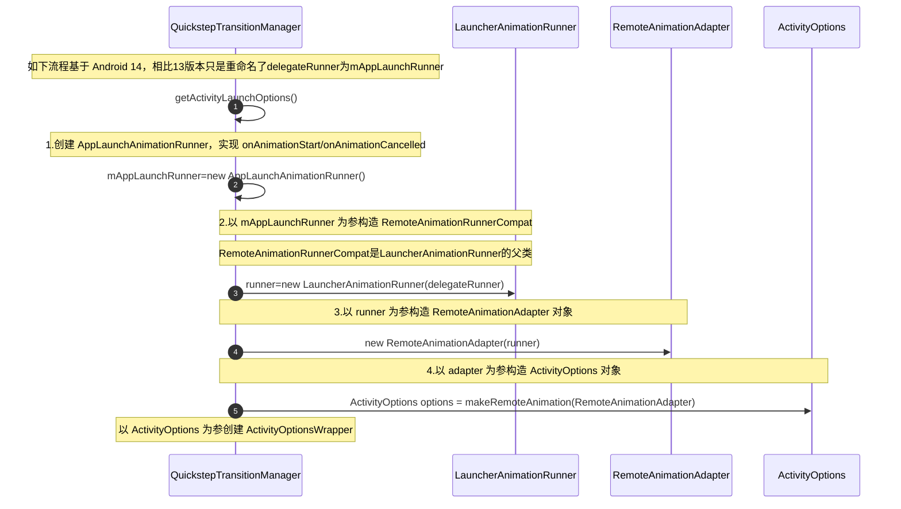
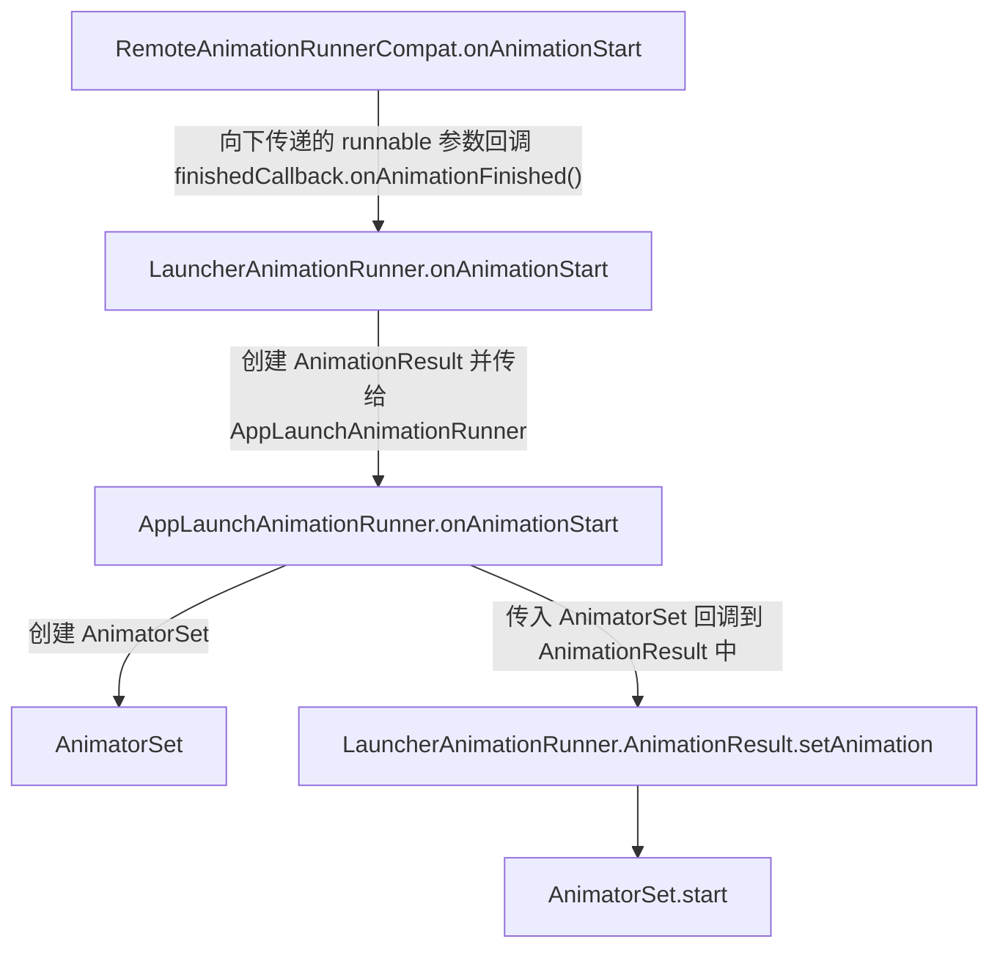
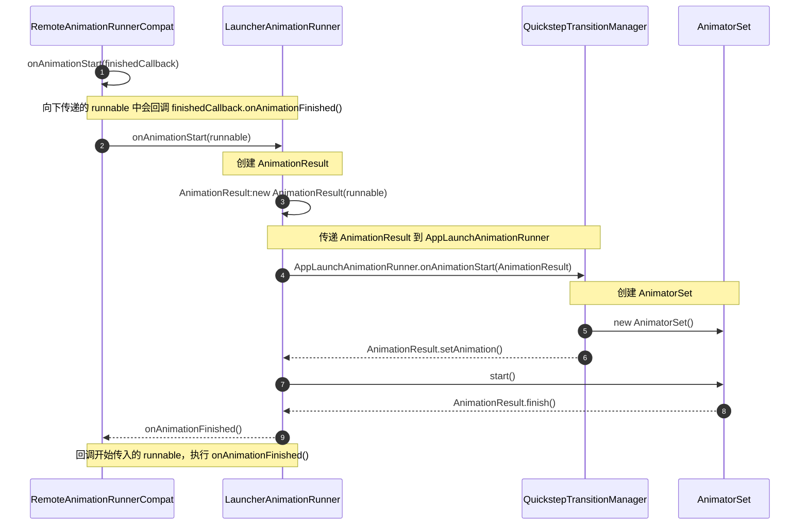
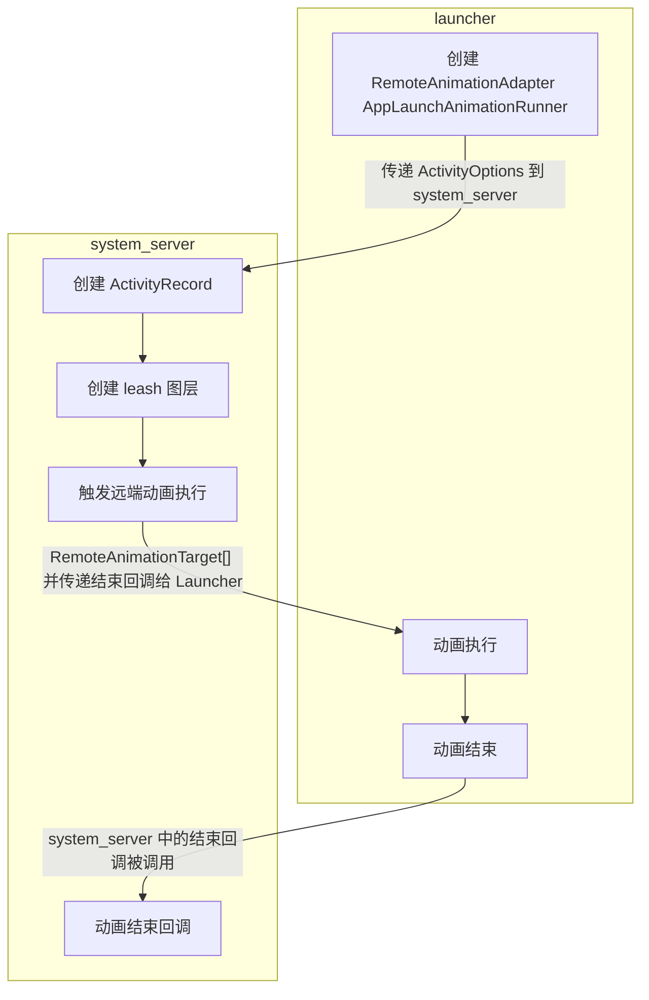
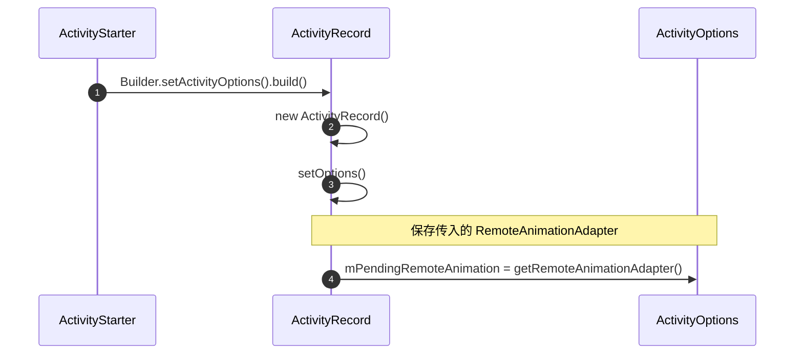
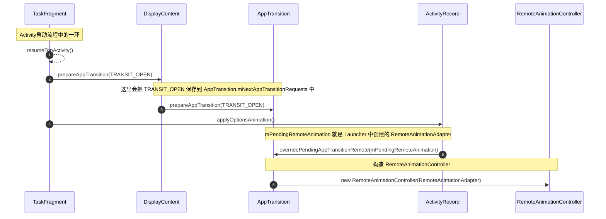

> WMS 动画专题。

<!--more-->


动画类型

- 本地动画
- 远程动画

Leash 的 Surface 图层特点

- 把需要进行动画的子节点都挂到这个 leash 节点


# 窗口动画

为窗口添加动画，比如 Activity 内打开一个 TYPE_APPLICATION_OVERLAY 窗口，窗口渐变显示和渐变退出的动画。

定义动画

``` xml
<!--exit.xml-->
<set xmlns:android="http://schemas.android.com/apk/res/android">
    <alpha android:fromAlpha="1.0" andrid:toAlpha="0.0" android:duration="1000" />
</set>
<!--enter.xml-->
<set xmlns:android="http://schemas.android.com/apk/res/android">
    <alpha android:fromAlpha="0.0" andrid:toAlpha="1.0" android:duration="1000" />
</set>

<!--style.xml-->
<style name="MyWindow">
    <item name="android:windowEnterAnimation">@anim/enter</item>
    <item name="android:windowExitAnimation">@anim/exit</item>
</style>
```

使用动画

``` java
WindowManager.LayoutParams mLayoutParams;
mLayoutParams = new WindowManager.LayoutParams();
mLayoutParams.type = WindowManager.LayoutParams.TYPE_APPLICATION_OVERLAY;
mLayoutParams.windowAnimations = R.style.MyWindow;
```

点击打开窗口后，会发现有动画了，通过查看 WinScope，发现有一个 window_animation 类型的 leash 挂载到了 WindowState 的上面，在 WindowToken 的下面。

查找动画流程的方法：根据 winscope 中的 animation-leash 信息，直接在源码中搜索，发现是在 `SurfaceAnimator.createAnimationLeash()` 中设置的，然后在这个方法里打印堆栈信息；

从 commitFinishDrawingLocked() 开始

## 总结

- 在 `commitFinishDrawingLocked()` 开始，逐步调用到 `SurfaceAnimator.createAnimationLeash()`
- 创建 leash 图层，挂在 WindowToken 下面，WindowState 上面
- 动画结束后，通过回调，开始执行退出动画
- 

# 应用切换动画

常见 proto log：`WM_DEBUG_REMOTE_ANIMATIONS/WM_DEBUG_ANIM WM_DEBUG_APP_TRANSITIONS_ANIM/WM_DEBUG_APP_TRANSITIONS/WM_DEBUG_STARTING_WINDOW/WM_DEBUG_STATES/WM_SHOW_SURFACE_ALLOC`


andrid 手机，从桌面点击图标打开短信应用，这个过程中抓取了 WinScope，显示有5个动画： 

- 壁纸动画（<font color=red>**壁纸稍微动一下（视差效果）**</font>）：挂载在 WallpaperWindowToken 之上的 Surface `animation-leash of window_animation`

    ``` scss
    Leaf:0:1#8
    └── Surface leash-animation of window_animation
      ├── WallpaperWindowToken
        ├── ImageWallpaper
          ├── ImageWallpaper
            ├── Wallpaper BBQ wrapper
    ```

    

- Launcher 动画（<font color=red>**Launcher 缩小消失**</font>）：挂载在 DefaultTaskDisplayArea 之下，Launcher Task 之上的 Surface `animation-leash of app_transition`

    ``` scss
    DefaultTaskDisplayArea
    └── Surface leash-animation of app_transition
      ├── Task(Launcher)
        ├── ActivityRecord
          ├── SplashScreen WindowState
    ```

    

- APP 打开动画（<font color=red>**短信整体（带着 SplashScreen）放大跳出来**</font>）：挂载在 DefaultTaskDisplayArea 之下，短信 Task（Task 的 ActivityRecord 的 WindowState 是短信的 SplashScreen 图层） 之上的 Surface `animation-leash of app_transition`

    ``` scss
    DefaultTaskDisplayArea
    └── Surface leash-animation of app_transition
      ├── Task(短信)
        ├── ActivityRecord
          ├── SplashScreen WindowState
    ```

    

- starting_reveal（<font color=red>**准备好“揭开”帘子，露出后面的短信主页**</font>）：挂载在短信 ActivityRecord 和短信 Activity WindowState 之间的 Surface `animation-leash of starting_reveal` 图层，而且这个图层和 SplashScreen 所在 WindowState 的图层是同级的

    ``` scss
    Task
    └── ActivityRecord（短信主页 Activity）
      ├── Surface leash-animation of starting_reveal
        ├── App 主 WindowState（短信主页）
      ├── SplashScreen WindowState
    ```

    

- splash screen 移除（<font color=red>**帘子（SplashScreen）自己执行淡出/缩放动画，彻底离开舞台**</font>）：挂载在短信 ActivityRecord 和短信 SplashScreen WindowState 之间的 Surface `animation-leash of window_animation` 图层

    ``` scss
    Task 
    └── ActivityRecord（短信主页 Activity）
      ├── App 主 WindowState（短信主页）
      ├── Surface leash-animation of window_animation
        ├── SplashScreen WindowState
    ```


<font color=blue>**针对第二步和第五步，能看到 SplashScreen 的显示和移除，为什么一个是 app_transition，一个是 window_animation？**</font>

这是由于 **动画的发起者和作用域** 不同决定的：

- 第 2 步：`app_transition`（应用间切换动画）

    - **本质**：这是由 `Launcher` 退出、`短信 Task` 进入的“整体大转场”。

    - **为什么叫这个名字**：在 WMS 中，当发生 Activity 切换时，系统会创建一个 `RemoteAnimationAdapter`。这时生成的 Leash（控制杠杆）通常被标记为 `app_transition`，因为它代表的是 **Task 或 ActivityRecord 级别** 的宏观过渡。它负责把短信的整个 Task 作为一个整体进行位移或缩放。

    - **SplashScreen 的角色**：此时 SplashScreen 已经在短信的 Task 里了，所以它会跟着这个 `app_transition` 的 Leash 一起动（比如从图标处放大的效果）。

- 第 5 步：`window_animation`（窗口级动画）

    - **本质**：这是 SplashScreen **自身消失** 的动画。
    - **为什么叫这个名字**：当短信应用的第一帧（真正的内容）绘制完成后，SplashScreen 完成了使命，需要“功成身退”。此时的动画不再是应用间的切换，而是 **同一个 Activity 内部，两个窗口状态之间的平滑过渡**。
    - **逻辑**：系统通过 `SplashScreenView#remove()` 触发消失逻辑，WMS 为这个特定的 WindowState（SplashScreen）单独创建一个 Leash 来执行退出（通常是淡出或缩放）。在代码层级，这类针对特定 Window 的动画常被归类为 `window_animation`。

<font color=blue>**什么时候是 window_animation / app_transition / starting_reveal？**</font>

这三者代表了 Android 动画框架中不同的层级和职责：

- App Transition (应用过渡)
    - **触发时机**：跨 Activity、跨 Task 切换时。
    - **作用对象**：通常挂载在 `Task` 或 `ActivityRecord` 级别。
    - **特点**：它是“外层壳子”的动画。比如你看到的第 2 步（Launcher 逻辑）和第 3 步（短信进入逻辑）。
- Window Animation (窗口动画)
    - **触发时机**：特定窗口（WindowState）的显示、隐藏、移除，或者是不涉及 Activity 切换的窗口变化（如弹窗弹出）。
    - **作用对象**：挂载在 `WindowState` 级别。
    - **特点**：它是“内层元素”的动画。你看到的第 5 步正是为了让 SplashScreen 消失时不显得突兀，单独给它加的特效。
- Starting Reveal (启动揭露)
    - **触发时机**：这是 **Android 12+ SplashScreen 体系** 特有的机制。
    - **作用对象**：处于 Activity 层次结构中间，用来衔接“启动图”和“真实内容”。
    - **特点**：
        - 它的存在是为了实现 **“揭露”效果**（Reveal Effect）。
        - 当 SplashScreen 还在上面盖着，而下面的 `App 主 WindowState` 准备好了，系统会通过这个 Leash 同步两者的状态。
        - 你看到的第 4 步正是起到了“承重墙”的作用：它确保在 SplashScreen 消失的过程中，底下的主界面能以正确的节奏显示出来。

## 构建动画相关类（Runner/Adapter）

### Launcher 处理部分

本部分解释 Launcher 如何构建动画相关类，包括：

- <font color=red>**AppLaunchAnimationRunner**</font>：实现 `LauncherAnimationRunner` 中的 `RemoteAnimationFactory` 接口，定义了 `onAnimationStart()/onAnimationCancelled()` 方法
- <font color=blue>**LauncherAnimationRunner(子类)/RemoteAnimationRunnerCompat(父类)**</font>：``LauncherAnimationRunner` 通过 `mFactory` 持有 `AppLaunchAnimationRunner`
- **RemoteAnimationAdapter**：通过 `mRunner` 持有 `LauncherAnimationRunner`

Android 14 版本：




Launcher 进程在 `startActivitySafely()` 中调用上述 `getActivityLaunchOptions().toBundle()`，把 optsBundle 通过 `context.startActivity(intent, optsBundle)` 传给 system_server 进程，如此以来

- ActivityOptionsWrapper 通过 `options` 持有 <font color=bule>**ActivityOptions**</font>，ActivityOptionsWrapper 被转为 Bundle 对象传递到 system_server 进程
- QuickstepTransitionManager 通过 `makeRemoteAnimation()` 创建的 <font color=bule>**ActivityOptions(opts.mAnimationType = ANIM_REMOTE_ANIMATION)**</font> 持有 <font color=green>**RemoteAnimationAdapter**</font>
- <font color=green>**RemoteAnimationAdapter**</font> 通过 `mRunner` 持有 <font color=blue>**LauncherAnimationRunner**</font>
- <font color=blue>**LauncherAnimationRunner**</font> 通过 `mFactory` 持有 <font color=red>**AppLaunchAnimationRunner**</font>
- 
- <font color=red>**AppLaunchAnimationRunner**</font> 是 QuickstepTransitionManager 的内部类，实现了 RemoteAnimationFactory，RemoteAnimationFactory 是定义在 <font color=blue>**LauncherAnimationRunner**</font> 中的 interface，定义了 `onAnimationStart()/onAnimationCancelled()` 方法
- <font color=blue>**LauncherAnimationRunner**</font> 继承自 RemoteAnimationRunnerCompat，RemoteAnimationRunnerCompat 继承自 `IRemoteAnimationRunner.Stub`
- RemoteAnimationRunnerCompat 中的 `onAnimationStart()`通过调用子类的 `onAnimationStart()` 向子类（<font color=blue>**LauncherAnimationRunner**</font>）传入了一个 runnable，**runnable 中调用了 `finishedCallback.onAnimationFinished()`，**
- <font color=blue>**LauncherAnimationRunner**</font> 中的 `onAnimationStart()` 又通过传入的 Runnable 创建了 AnimationResult 对象，并通过 getFactory() 获取到 <font color=red>**AppLaunchAnimationRunner**</font> 对象，再通过 `AppLaunchAnimationRunner.onAnimationStart()` 把 AnimationResult 传递到 <font color=red>**AppLaunchAnimationRunner**</font> 中，
- `QuickstepTransitionManager.AppLaunchAnimationRunner.onAnimationStart()` 则调用 `AnimationResult.setAnimation()` 设置动画










### system_server 处理部分

本部分介绍动画相关类如何传递到 `system_server` 进程中并保存。

在构造 ActivityRecord 时，调用了 `setOptions(ActivityOptions)`，




``` java
// ActivityRecord.java

    private RemoteAnimationAdapter mPendingRemoteAnimation;

    private void setOptions(@NonNull ActivityOptions options) {
        mLaunchedFromBubble = options.getLaunchedFromBubble();
        mPendingOptions = options;
        // makeRemoteAnimation 时赋值 ANIM_REMOTE_ANIMATION
        if (options.getAnimationType() == ANIM_REMOTE_ANIMATION) {
            // 保存传入的 RemoteAnimationAdapter
            mPendingRemoteAnimation = options.getRemoteAnimationAdapter();
        }
        mPendingRemoteTransition = options.getRemoteTransition();
    }
```

这样 ActivityRecord 就通过 `mPendingRemoteAnimation` 持有了 RemoteAnimationAdapter，

接下来在启动流程的 `TaskFragment.resumeTopActivity()` 中，调用了 `DisplayContent.prepareAppTransition()` 和 `DisplayContent.applyOptionsAnimation()`，并把 `mPendingRemoteAnimation` 传入 AppTransition 中用于构建 `RemoteAnimationController` 对象：

``` scss
ActivityRecord:applyOptionsAnimation()
	AppTransition:overridePendingAppTransitionRemote(mPendingRemoteAnimation)
		new RemoteAnimationController()
```

RemoteAnimationController 通过 `mRemoteAnimationAdapter` 持有了 RemoteAnimationAdapter 对象；



到这里就知道了 Launcher 创建的 RemoteAnimationAdapter 就传递到了 RemoteAnimationController 里的 mRemoteAnimationController 参数，**applyOptionsTransition() 的作用就是把 RemoteAnimationAdapter 传递到 RemoteAnimationController 中**。

## AppTransition

### AppTransition 介绍

- **每个 DisplayContent 只有一个 AppTransition 实例**。
- 表示一次 **Activity 切换过程**（解锁、冷启动、应用内跳转都算一次）。
- 内部维护一个 **mNextAppTransitionRequests** 列表，用于记录当前触发的 TransitionType。

### TransitionType 类型

由 WindowManager 定义，共 **13 种**。

冷启动场景主要是：

- **TRANSIT_OPEN**：新 Activity 显示
- **TRANSIT_TO_FRONT**：已有 Activity 重新可见
- **TRANSIT_CLOSE**：Activity 关闭

### AppTransition 的三段式流程

#### prepareAppTransition - 收集事件阶段

- 任何会导致 Activity 切换的操作都会调用： `AppTransition::prepareAppTransition(type)`
- 将对应的 **TransitionType 加入 mNextAppTransitionRequests**。
- 冷启动场景会执行 **两次**：
    1. **Activity 启动流程**（startActivityInner → Task.startActivityLocked）
    2. **Source Activity pause 流程**（resumeTopActivity → prepareAppTransition）

👉 两次 TRANSIT_OPEN 都会加入集合，不影响后续逻辑。

#### executeAppTransition（setReady）— 标记准备阶段

- DisplayContent::executeAppTransition 会调用： `AppTransition::setReady()`
- 将状态置为： `APP_STATE_READY`
- 触发一次 **requestTraversal()**，等待下一次 layout

触发 setReady 的两种典型路径：

1. **realStartActivityLocked → minimalResume → completeResume → executeAppTransition**
2. **StartWindow（Splash Screen）绘制完成 → performShowLocked → executeAppTransition**

👉 哪个先触发取决于 **应用进程启动速度**。


#### goodToGo — 真正执行动画阶段

- 在下一次 layout 中，若 `isReady() == true` 且窗口满足条件，则进入： `AppTransitionController::transitionGoodToGo`
- 主要做两件事：
    1. **创建 leash 图层**
    2. **触发 Activity 切换动画执行**

下面我为你把当前页面的核心内容**提炼成一份结构化、面向系统理解与面试表达的要点总结**，帮助你快速抓住 *Android 13 AppTransition（第三篇）* 的关键机制。
 （内容基于你当前浏览的页面   [juejin.cn](https://juejin.cn/post/7373606026027319333)）

------

# 🚀 **Android 13 AppTransition（3）— goodToGo 与动画执行全流程要点总结**

## 🧩 1. 本篇核心主题

本篇聚焦 **AppTransition 的第三阶段：goodToGo**，即 **真正触发动画执行** 的关键流程，并深入解析：

- leash 图层是如何创建的
- RemoteAnimation（远端动画）如何从 system_server 传递到 launcher
- RemoteAnimationTarget 如何构建
- goodToGo 如何最终触发 launcher 执行动画

------

# 🧩 2. RootWindowContainer::checkAppTransitionReady

在 layout 流程中频繁触发，但只有当：

- `mAppTransition.isReady() == true`

时才会进入：

```
AppTransitionController::handleAppTransitionReady()
```

这是动画执行的入口。

------

# 🧩 3. transitionGoodToGo — 动画是否可以继续的判断

`transitionGoodToGo()` 会检查每个 opening app 是否满足：

- `activity.allDrawn == true`
- 或 `startingDisplayed == true`
- 或 `startingMoved == true`

否则返回 false，动画不会继续。

典型日志：

```
Checking X opening apps...
Check opening app: allDrawn=false startingDisplayed=true ...
```

满足条件后才会进入动画执行阶段。

------

# 🧩 4. leash 图层创建（动画的核心载体）

### **4.1 动画目标提升（getAnimationTargets）**

系统会将动画目标从 ActivityRecord **提升到 Task**，因此动画最终作用在 Task 上。

### **4.2 applyAnimations → WindowContainer.applyAnimation**

最终进入：

```
SurfaceAnimator::startAnimation
```

### **4.3 createAnimationLeash — leash 图层创建**

关键逻辑：

- leash 的父节点设为 Task 的父节点（如 DefaultTaskDisplayArea）
- 再将 Task reparent 到 leash 下
- 形成动画结构：

```
DefaultTaskDisplayArea
 └── leash
       └── Task（真正做动画的对象）
```

这是 Android 动画体系的核心机制。

------

# 🧩 5. RemoteAnimationAdapterWrapper — 远端动画适配器

在 launcher 注册的 RemoteAnimationAdapter 会被封装为：

```
RemoteAnimationAdapterWrapper
```

在 `startAnimation()` 中：

- 保存 leash
- 保存动画结束回调
- **并不真正执行动画**（远端动画不会在 system_server 中执行）

真正执行发生在 goodToGo 阶段。

------

# 🧩 6. RemoteAnimationRecord 与 mPendingAnimations

每次创建 RemoteAnimationRecord 都会加入：

```
mPendingAnimations
```

这些记录会在 goodToGo 中被转换为 RemoteAnimationTarget 数组，传递给 launcher。

------

# 🧩 7. goodToGo — 真正触发动画执行的地方（核心）

### **7.1 RemoteAnimationController::goodToGo**

关键步骤：

1. **创建动画结束回调（FinishedCallback）**

2. 构建 RemoteAnimationTarget 数组

    - appTargets（打开/关闭的 Task）
    - wallpaperTargets
    - nonAppTargets

3. 调用 launcher 的 onAnimationStart

    ```
    mRemoteAnimationAdapter.getRunner().onAnimationStart(...)
    ```

典型日志：

```
goodToGo()
goodToGo(): onAnimationStart, apps=2, wallpapers=1, nonApps=0
```

这标志着动画正式交给 launcher 执行。

------

# 🧩 8. RemoteAnimationTarget 的构建流程

流程链：

```
RemoteAnimationRecord::createRemoteAnimationTarget
 → TaskFragment::createRemoteAnimationTarget
 → ActivityRecord::createRemoteAnimationTarget
```

最终构造：

```
RemoteAnimationTarget(
    taskId,
    mode,
    capturedLeash,
    bounds,
    insets,
    position,
    ...
)
```

其中最关键的是：

- **taskId**：动画作用的任务
- **capturedLeash**：动画图层（真正被 launcher 操作的 SurfaceControl）

------

# 🧩 9. system_server → launcher 的最终触发链（总览）

```
RootWindowContainer::checkAppTransitionReady
 → AppTransitionController::handleAppTransitionReady
 → transitionGoodToGo
 → applyAnimations（创建 leash）
 → AppTransition::goodToGo
 → RemoteAnimationController::goodToGo
 → createAppAnimations（构建 RemoteAnimationTarget）
 → IRemoteAnimationRunner.onAnimationStart（进入 launcher）
```

------

# 🧩 10. 一句话总结（适合面试）

> **AppTransition 的 goodToGo 阶段负责真正触发动画执行：system_server 创建 leash 图层并构建 RemoteAnimationTarget，随后通过 RemoteAnimationAdapter 将动画交给 launcher 进程执行，实现应用启动/关闭动画的跨进程协作。**

------

如果你愿意，我还能帮你把这篇内容整理成：

- **面试口述版（1 分钟 / 3 分钟）**
- **简历 bullet point 版本**
- **Mermaid 时序图版**
- **与 ShellTransitions 的对比总结**

你想要哪一种？

### 冷启动场景下的关键调用链

第一次 prepareAppTransition

```scss
startActivityInner
  → Task.startActivityLocked
      → DisplayContent.prepareAppTransition(TRANSIT_OPEN)
```

第二次 prepareAppTransition

```scss
resumeTopActivity
  → DisplayContent.prepareAppTransition(TRANSIT_OPEN)
```

setReady 触发链（典型）

```scss
realStartActivityLocked
  → minimalResumeActivityLocked
      → completeResumeLocked
          → executeAppTransitionForAllDisplay
              → DisplayContent.executeAppTransition
                  → AppTransition.setReady
```

另一条 setReady 触发链（StartWindow）

```scss
Splash Screen Window finishDrawing
  → performShowLocked
      → ActivityRecord.onStartingWindowDrawn
          → DisplayContent.executeAppTransition
              → AppTransition.setReady
```

### 总结

- 为什么 prepare 会执行两次

    - 因为冷启动包含两个 Activity 状态变化：
        - 新 Activity 创建
        - 旧 Activity pause
        - 两者都属于 Activity 切换事件，因此都会触发 prepare

- 为什么 setReady 会有多个触发点

    - 因为系统认为“可以开始动画”的条件有多个：
        - 新 Activity 即将显示（realStartActivityLocked）
        - StartWindow 已经绘制完成
        - 只要满足任意一个，就可以标记为 ready

- 真正动画执行不在 setReady，而在 goodToGo

    setReady 只是“准备好”，真正执行动画是在下一次 layout 中。

AppTransition 通过 prepare → setReady → goodToGo 的三段式流程管理 Activity 切换动画。冷启动场景中会多次收集 TRANSIT_OPEN，并在 StartWindow 或 Activity 真正可见时触发 setReady，最终在下一次 layout 中执行动画。

