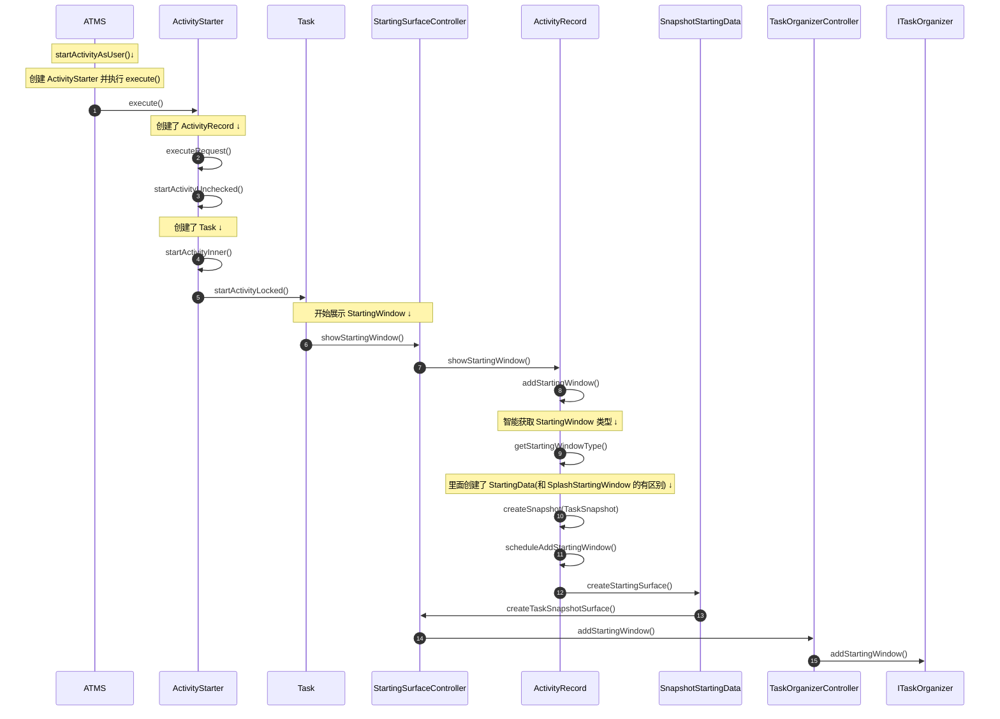
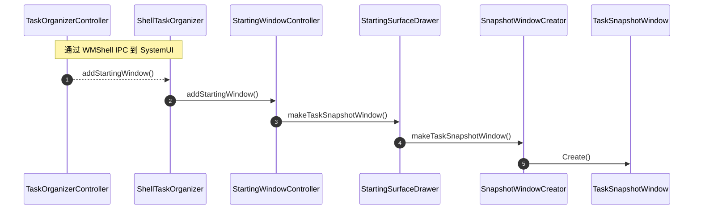

> WMS SnapshotStartingWindow 启动。

<!--more-->

在 createSnapshot() 中创建了 StartingData，这个参数会往下传递到 `scheduleAddStartingWindow()`，STARTING_WINDOW_TYPE_SPLASH_SCREEN 类型的也会创建 StartingData 以及调用 `scheduleAddStartingWindow()`，所以这个 StartingData 是这个阶段两种类型的不同之处。

这里的 `TaskSnapshotWindow.create()` 是最核心的方法，这个方法内部会执行以下底层操作：

- 创建窗口会话：通过 IWindowSession 向 WMS 申请创建一个新的 Window。
- 绑定图形 Buffer：将传入的 snapshot（包含截图的硬件缓存 GraphicBuffer）通过 SurfaceControl 绑定到新创建的窗口 Surface 上。
- 自移除回调：传入了一个 Lambda 表达式，当这个快照窗口不再需要时（比如应用内容绘制完成了），它会自动调用 removeWindow 来清理自己。
