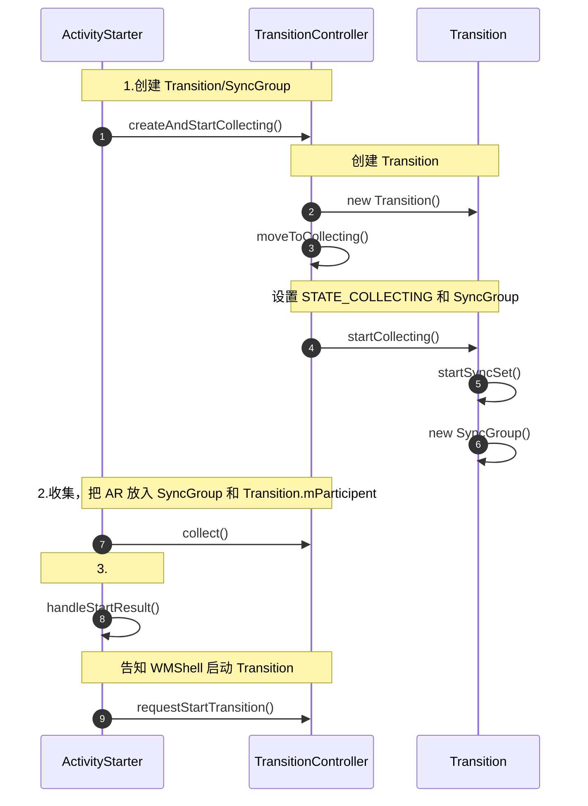
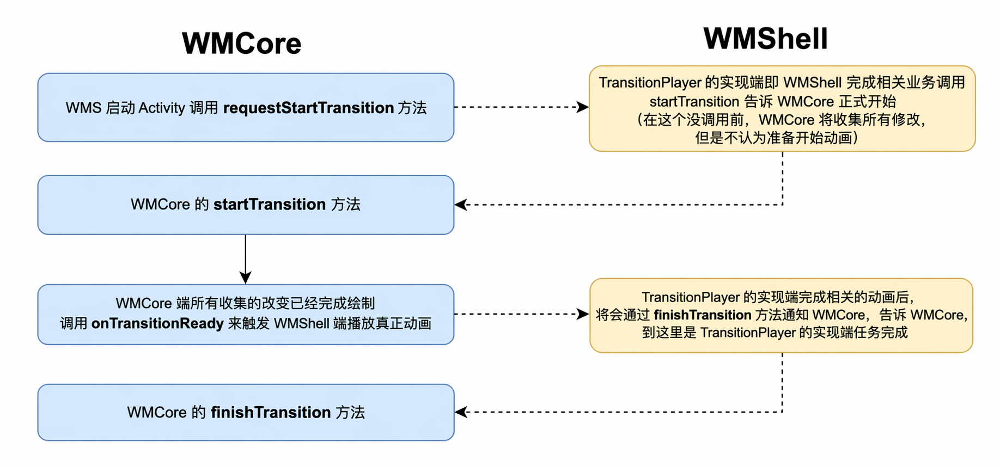
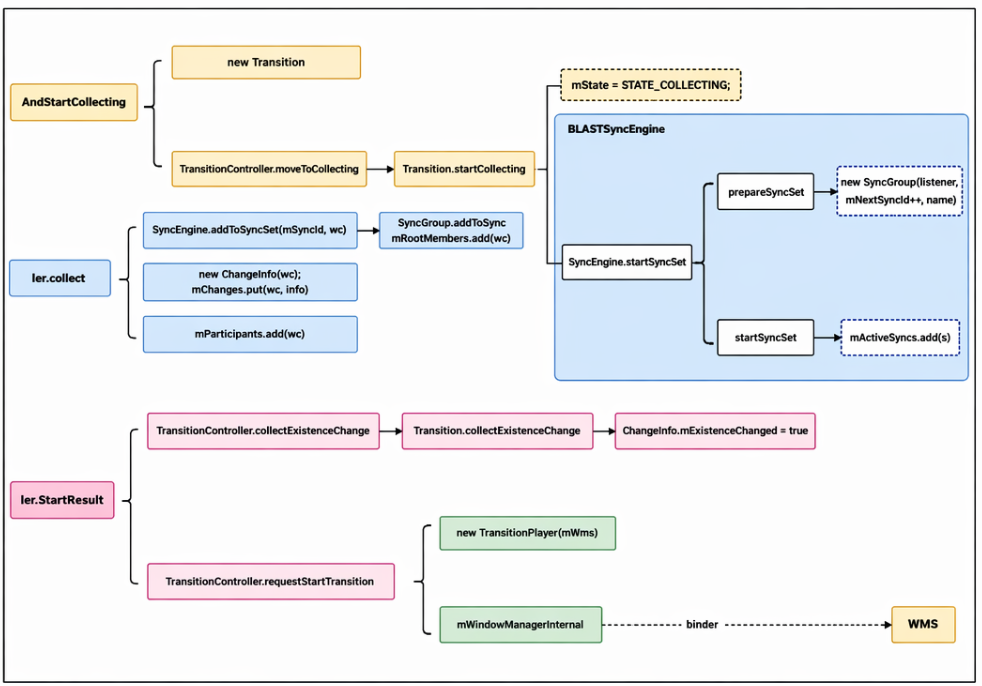

> WMS ShellTransition 学习。

<!--more-->


## ShellTransition 使能开关


WMCore 和 WMShell 常见类：

| Class                | Comments                                                     | -    |
| -------------------- | ------------------------------------------------------------ | ---- |
| TransitionController | WM Core 端过渡动画 **收集启动管理者**，主要负责管理着整个过渡动画的生命周期，比如动画参与者收集、等待、启动等 |      |
| Transitions          | WMShell 端过渡动画**播放相关管理**，主要负责相关过渡动画的具体播放相关逻辑 |      |
| Transition           | WMCore 端具体过渡动画的实体类                                |      |
| ActiveTransition     | WMShell 端具体过渡动画的实体类，靠 mToken 与 Transition 对应 |      |





ShellTransition 开始点：`ActivityStarter.startActivityUnchecked()`

Transition.startCollecting()

- 设置 `mState = STATE_COLLECTING`

- 通过 `startSyncSet()` 创建 `SyncGroup` 并返回其 ID，`startSyncSet()` 作用：

    - 通过 `prepareSyncSet()` 创建 `SyncGroup`

    - 把 `SyncGroup` 添加到 `mActiveSyncs` 集合

    - 返回 `SyncGroup.mSyncId`

相关图：第8个视频

WMCore 与 WMShell 流程图



WMCore 和 WMShell 启动流程



一次打开应用所要 Collect 的内容

- 要启动的 ActivityRecord，通过 `ActivityStarter.startActivityUnchecked()` 中调用 `collec()`

    ```scss
    ActivityStarter.startActivityUnchecked()
    	Transition.collect()
    ```

    

- 手机 Task，创建 ActivityRecord 对应的 Task 阶段调用

    ```scss
    ActivityStarter.startActivityUnchecked()
    	ActivityStarter.startActivityInner()
    		ActivityStarter.setNewTask()
    			TransitionController.collectExistenceChange()
    				Transition.collectExistenceChange()
    					Transition.collect()
    ```

    

- 重复收集

    ```scss
    ActivityStarter.startActivityUnchecked()
    	ActivityStarter.handleStartResult()
    		TransitionController.collectExistenceChange()
    			Transition.collect()
    # 这里 return 了
    if (mParticipants.contains(wc)) return;
    ```

    

- 重复收集

    ```scss
    
    ActivityRecord.setVisibility()
    	TransitionController.collect()
    		Transition.collect( )
    ```

    

- 收集 QuickStepLauncher 

    ```scss
    ActivityClientController.activityPaused()
    	ActivityRecord.activityPaused()
    		TaskFragment.completePause()
    			RootWindowContainer.ensureActivitiesVisible()
    				DisplayContent.ensureActivitiesVisible()
    					WindowContainer.forAllRootTasks()
    						Task.forAllRootTasks()
    							Task.ensureActivitiesVisible()
    								Task.forAllLeafTasks()
    									TaskFragment.updateActivityVisibilities()
    										ActivityRecord.makeInvisible()
    										ActivitySetVisibility()
    										TransitionController.collect()
    										Transition.collect()
    ```

    

- ImageWallpaper（壁纸）

    ```scss
    ActivityRecord.makeInvisible()
    	ActivityRecord.setVisibility()
    		TransitionController.collect()
    				Transition.collect()
    					WallpaperController.collectTopWallpaper()
    						Transition.collect()
    ```

    
