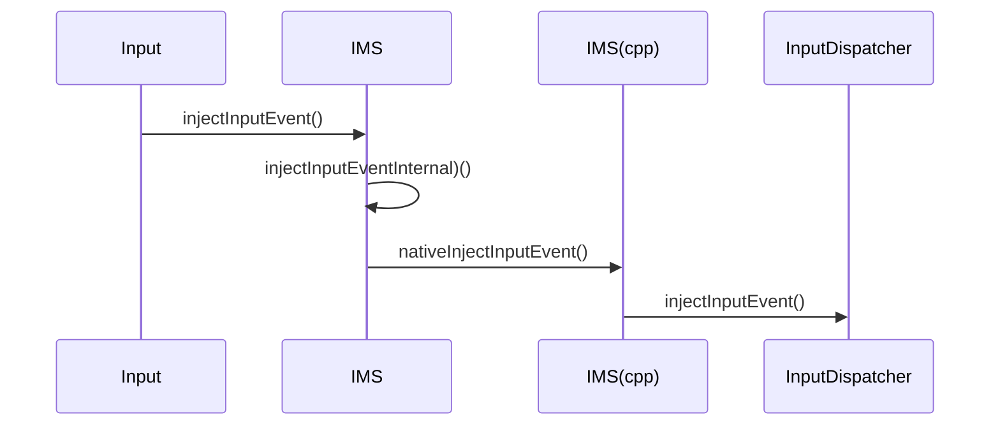
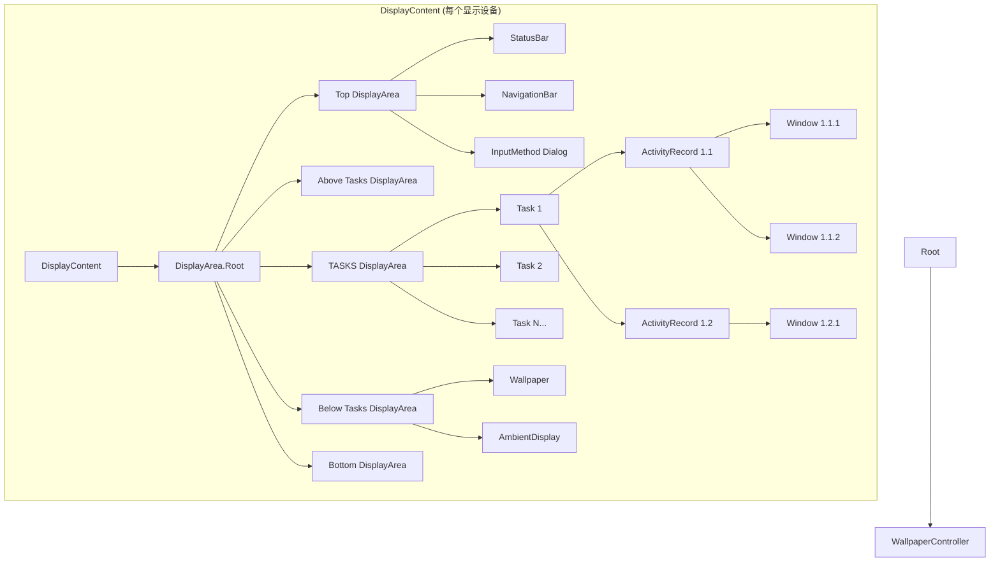
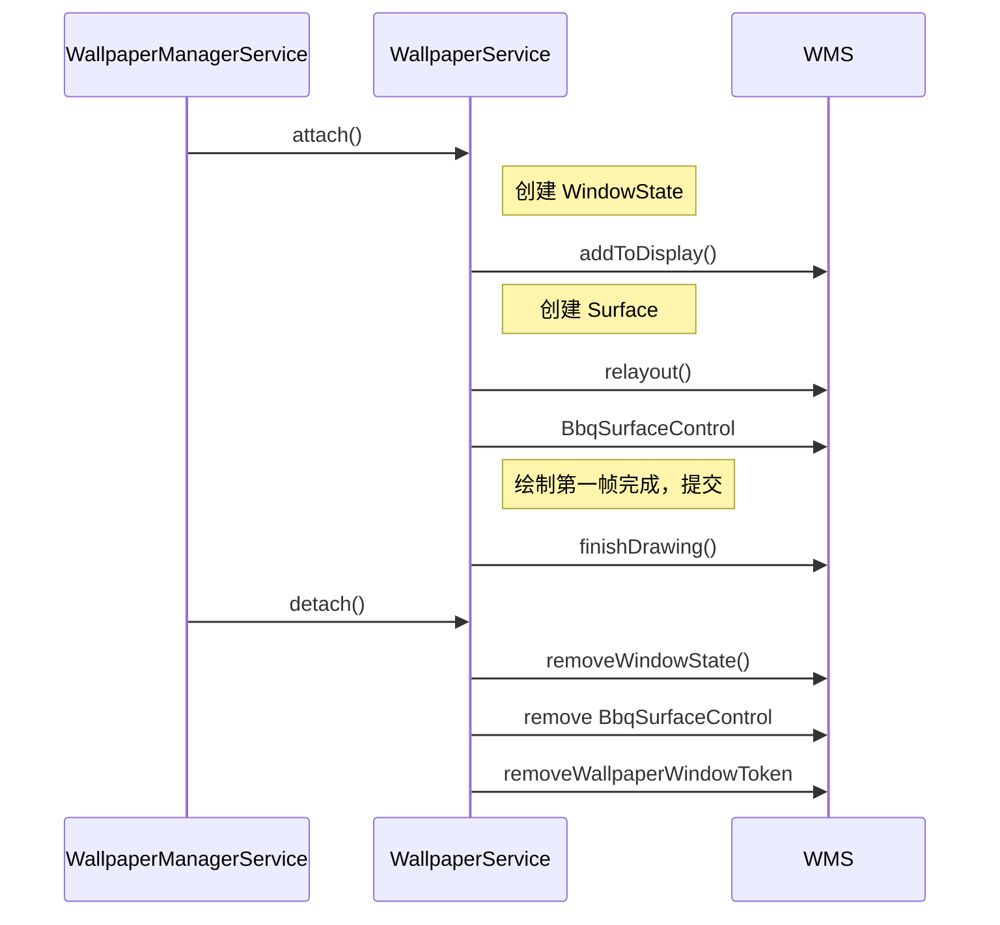

# 3 跨进程通信

## Binder 使用

常见通信方式：

- Service.bindService()
- ServiceManager.getService()

AIDL 方法参数修饰：

- in：客户端流向服务端，只有客户端可以修改，服务端修改了客户端也不会收到

- out：服务端流向客户端，只有服务端可以修改，服务端收到的会是空数据

- inout：双向都可修改

## Native -> Java 通信

Android 中 socket 代码：`system/core/libcutils/socket_local_client_unix.c`

## socket

### 普通文件系统套接字（默认方式）

``` cpp
struct sockaddr_un addr;
addr.sun_family = AF_UNIX;
strcpy(addr.sun_path, "/tmp/mysocket");  // 普通路径
// 会在文件系统中创建 /tmp/mysocket 文件
```

**特点：**

- 在文件系统中可见（`ls -l /tmp/mysocket` 可以看到）
- 有权限控制（文件权限位）
- 需要手动清理（程序退出后文件还在）
- 路径长度受限制

### 抽象套接字名（Linux 特有）

``` cpp
struct sockaddr_un addr;
addr.sun_family = AF_UNIX;
addr.sun_path[0] = 0;  // 关键操作：将第一个字节设为 '\0'
strcpy(&addr.sun_path[1], "myabstractsocket");  // 从第二个字节开始
```

**关键点：`sun_path[0] = '\0'` 的作用：**

完整示例

``` cpp
#include <sys/socket.h>
#include <sys/un.h>
#include <stdio.h>
#include <string.h>

int main() {
    int sockfd = socket(AF_UNIX, SOCK_STREAM, 0);
    
    struct sockaddr_un addr;
    memset(&addr, 0, sizeof(addr));
    addr.sun_family = AF_UNIX;
    
    // 关键：第一个字节设为 0
    addr.sun_path[0] = 0;
    
    // 套接字名从第二个字节开始
    const char* abstract_name = "my_application_socket";
    strncpy(&addr.sun_path[1], abstract_name, 
            sizeof(addr.sun_path) - 2);
    
    bind(sockfd, (struct sockaddr*)&addr, 
         sizeof(addr.sun_family) + 1 + strlen(abstract_name));
    
    // 现在可以监听、接受连接了...
    
    return 0;
}
```

两种方式对比

| 特性           | 文件系统套接字       | 抽象套接字（`sun_path[0]=0`） |
| :------------- | :------------------- | :---------------------------- |
| 文件系统可见性 | 是，创建 socket 文件 | 否，无文件系统实体            |
| 命名空间       | 全局文件系统         | 内核抽象命名空间              |
| 名称冲突       | 路径必须唯一         | 名称在系统范围内唯一即可      |
| 权限控制       | 通过文件权限         | 通过进程权限（UID/GID）       |
| 清理           | 需手动 `unlink()`    | 自动随进程结束而销毁          |
| 跨平台         | 所有 Unix 系统支持   | **仅 Linux 支持**             |
| 名称长度       | 受文件系统路径限制   | 最多约 107 字节               |

**总结：`serun.sun_path[0] = 0` 是 Linux 特有的技巧，用于创建不在文件系统中留下实体的「抽象套接字」，避免了文件系统污染和清理问题，特别适合临时或私有进程间通信。**

查看创建的 socket 状态：

``` shell
netstat -an | grep server-socket
```

## epoll

Socket 存在的问题：

涉及 IO 的 accept/read/write 都是阻塞 IO 的，如果有成千上万个 Client 需要通信

- accept 成功后，为每个 Client 开启一个线程进行读取，线程太多不可行

- accept 成功后，开启一个子线程，然后在这个子线程中使用非阻塞的 read() 循环读取（while 1）多个客户端的消息(如下代码)，但是如果没有数据就会太浪费 CPU

  ``` cpp
  // 设置成非阻塞模式
  flags = fcntl(sockfd, F_GETFL, 0); //获取文件的flags值
  fcntl(sockfd, F_SETFL, flags | O_NONBLOCK); 
  
  // 设置成阻塞模式
  flags = fcntl(sockfd,F_GETFL,0);
  fcntl(sockfd,F_SETFL,flags&~O_NONBLOCK); 
  
  // 循环调用 read 读取各个客户端的数据
  while(1) {
  	read(fd1...);//客户1
  	read(fd2...);//客户2
  	read(fd3...);//客户3
  }
  ```

如此引出 I/O 多路复用技术（I/O multiplexing），复用是指在同一个进程（线程）中，处理多路 I/O，多路指多个文件描述符。


使用流程

- epoll_create：创建一个epoll的句柄，size用来告诉内核这个监听的数目一共有多大。这个参数不同于select()中的第一个参数，给出最大监听的fd+1的值。需要注意的是，当创建好epoll句柄后，它就是会占用一个fd值，在linux下如果查看/proc/进程id/fd/，是能够看到这个fd的，所以在使用完epoll后，必须调用close()关闭，否则可能导致fd被耗尽。

  ``` cpp
  int epoll_create(int size);
  ```

- epoll_ctl：epoll的事件注册函数，注册要监听的事件类型，第一个参数是epoll_create()的返回值，第二个参数表示动作，用三个宏来表示：

  - EPOLL_CTL_ADD：注册新的fd到epfd中；
  - EPOLL_CTL_MOD：修改已经注册的fd的监听事件；
  - EPOLL_CTL_DEL：从epfd中删除一个fd；

  ``` cpp
  int epoll_ctl(int epfd, int op, int fd, struct epoll_event *event);
  ```

  第三个参数是需要监听的fd，第四个参数是告诉内核需要监听什么事，struct epoll_event结构如下：

  ``` cpp
  struct epoll_event {
    __uint32_t events;  /* Epoll events */
    epoll_data_t data;  /* User data variable */
  };
  ```

  events 类型为 EPOLLIN 表示对应的文件描述符可以读，EPOLLOUT 表示对应的文件描述符可以写；

- epoll_wait：等待事件的产生

## SocketPair

普通 socket（伪代码）：

``` cpp
// 客户端
socket();
connect();
    
// 服务端
socket();
bind();
listen();
accept()
```

使用 socketpair

``` cpp
int fd[2];
socketpair(AF_UNIX, SOCK_STREAM, 0, fd);
setsockopt()
```

IPCThreadState —— 每个 binder 线程都有一个这个对象

## Native 之间 binder 通信

Server 端

- 继承 BBinder
- 实现 onTransact
- 获取客户端 callback（也是一个 BBinder 对象）
- addService
- joinThreadPool
- callback -> transact()

客户端

- 继承 BBinder
- 实现 onTransact
- 获取服务端 Binder
- joinThreadPool
- transact()

## C++ 与 Java 之间的 binder 通信

服务端

- 和上面的服务端基本一样

``` cpp
#include <binder/IServiceManager.h>
#include <binder/IBinder.h>
#include <binder/Parcel.h>
#include <binder/ProcessState.h>
#include <binder/IPCThreadState.h>
using namespace android;
#ifdef LOG_TAG
#undef LOG_TAG
#endif

#define LOG_TAG "sampleService"
#define SAMPLE_SERIVCE_DES "sample.hello"
#define FUNC_CALLFUNCTION 1

class SampleService: public BBinder {
public:
  SampleService() {
    mydescriptor = String16(SAMPLE_SERIVCE_DES);
  }
     
  virtual ~SampleService() {
  }

  virtual const String16& getInterfaceDescriptor() const {
    return mydescriptor;
  }
     
protected:     
  void callFunction() {
    ALOGE( "Service callFunction-----------");
  }
     
  virtual status_t onTransact(uint32_t code, const Parcel& data,
			      Parcel* reply, uint32_t flags = 0) {
    ALOGD( "Service onTransact, code = %d" , code);
    switch (code) {
    case FUNC_CALLFUNCTION:
      callFunction();
      break;
    default:
      return BBinder::onTransact(code, data, reply, flags);
    }
    return 0;
  }

private:
  String16 mydescriptor;
};

int main() {
  sp < IServiceManager > sm = defaultServiceManager();
  SampleService* samServ = new SampleService();
  status_t ret = sm->addService(String16(SAMPLE_SERIVCE_DES), samServ);
  ALOGD("Service main addservice ");
  ProcessState::self()->startThreadPool();
  IPCThreadState::self()->joinThreadPool( true);
  return 0;
}
```

客户端

- java 实现的客户端，也基本上一样，只不过是写法不一样

## Binder 系统中的对象

详解 BinderProxy/BpBinder/BBinder/JavaBBinder/Binder 之间的关系

### BinderProxy 和 BpBinder 的关系

通过 asInterface(BpBinder) 把 BpBinder 转换为 BinderProxy，实际上是 `javaObjectForIBinder()` 函数，BinderProxy 中有个 mNativeData，其中的 mObject 指向 BpBinder

AIDL 生成的 Proxy.mRemote 就是指向 BpBinder，

mRemote 来源

驱动层把 Server 端的 Binder 对象发来之后，客户端要通过 Parcel readStrongBinder() 读取， readStrongBinder() -> unflatten_binder() -> getStrongProxyForHandle() -> javaObjectForIBinder()，把 BpBinder 转换为了 BinderProxy，然后 mRemote.transact() -> BinderProxy.transact() -> transactNative() -> BpBinder.transact() -> android_os_Proxy_transact() -> IPCThreadState.transact()

### JavaBBinder 和 Binder 之间的关系

#### Android 9 以前版本

Binder 就是 Java 层创建的一个继承了 Stub 的 Service 对象：

``` java
public class MyService extends IMyService.Stub { }
```

调用其父类 Binder 的构造函数:

``` java
public Binder() {
    init(); // 调用 native init()
}
```

init() 会自动把 **this 对象** 作为第一个参数传给 JNI 层，this 即 Binder 对象，JNI 函数在哪里？

``` cpp
// android_util_Binder.cpp
static void android_os_Binder_init(JNIEnv* env, jobject obj)
{
    JavaBBinderHolder* jbh = new JavaBBinderHolder();
    env->SetLongField(obj, gBinderOffsets.mObject, (jlong)jbh);
}

 class JavaBBinderHolder : public RefBase
  {
  public:
      sp<JavaBBinder> get(JNIEnv* env, jobject obj)
      {
          AutoMutex _l(mLock);
          sp<JavaBBinder> b = mBinder.promote();
          if (b == NULL) {
              b = new JavaBBinder(env, obj);
              mBinder = b;
              ...
          }
  
          return b;
      }
```

这里 `android_os_Binder_init()` 的 obj 参数就是传入的 Binder 对象了，即 MyService 对象，然后把常见的 jbh 的指针存入 obj.mObject 变量中，即存入 Java Binder 的 mObject 变量中，这样以后 java 层访问 mObject，就能拿到对应的 native 对象；

#### Android 9 及之后的版本

从 Android 9 开始，Binder 的构造方法中没有了 `init()`，取而代之的是 `getNativeBBinderHolder()` 这个 native 方法，

``` java
// Binder.java
public Binder(@Nullable String descriptor) {
     mObject = getNativeBBinderHolder();
// android_util_Binder.cpp
static jlong android_os_Binder_getNativeBBinderHolder(JNIEnv* env, jobject clazz)
{
    JavaBBinderHolder* jbh = new JavaBBinderHolder();
    return (jlong) jbh;
}
```

这里 native 层没有了把 jbh 指针传入 `Binder.mObject` 的操作了，而是直接返回 jbh 的指针给到 `Binder.mBoject` 变量，所以 Holder 指针还是最终存入了 `mObject`，区别在于写入操作从 native 层移动到了 Java 层；

#### 总结

- Android 9 以前：构造 Binder 的时候，通过 `init()` 调用到 native 层的 `android_os_Binder_init(JNIEnv* env, jobject obj)`，在其中传入 Java Binder 对象 obj 构造 JavaBBinderHolder 对象（当 jbh 的 get() 被调用时，就会创建 JavaBBinder 对象），并把 jbh 的指针传给 Java 层的 Binder.mObject 变量，这样 Java Binder 就可以通过 jbh 指针获取到 JavaBBinder，而 JavaBBinder 也持有了 Java 层的 Binder obj
- Android 9 及之后：构造 Binder 的时候，通过  `getNativeBBinderHolder()` 获取 jbh 的指针
- **JavaBBinder 包含 Java Binder 对象（把 obj 传入 JavaBBinder）** → Native 层可以随时调用 Java Binder 方法
- **Java Binder 保存 JavaBBinder 指针（把持有 JavaBBinder 的 jbh 指针传给 Binder.mObject）** → Java 层可以通过 JNI 调用 native 逻辑


``` mermaid
flowchart TD
    subgraph Android8
        A[Java Binder obj] --> B[Binder.init()]
        B --> C[JavaBBinderHolder* jbh = new JavaBBinderHolder()]
        C --> D[env->SetLongField(obj.mObject, jbh)]
    end

    subgraph Android15
        E[Java Binder obj] --> F[mObject = nativeGetNativeBBinderHolder()]
        F --> G[JavaBBinderHolder* jbh = new JavaBBinderHolder()]
        G --> E.mObject  // Java 层写入 mObject
    end

```


111

``` mermaid
flowchart TD

    %% ================= Java Layer =================
    subgraph J[Java Layer]
        JB[Java Binder (Stub extends Binder)]
        JP[BinderProxy]
    end

    %% ================ JNI Layer ====================
    subgraph N1[JNI Layer]
        JN_init[android_os_Binder_init(obj)]
        JN_proxy[android_os_BinderProxy_transact]
    end

    %% ================ Native Layer =================
    subgraph N2[Native Layer]
        NB[BBinder]
        JBB[JavaBBinder<br/>mObject = globalRef(Java Binder)]
        BP[BpBinder<br/>handle → binder_ref<br/>pointer held by mNativePtr]
    end

    %% ================ Kernel Layer =================
    subgraph K[Kernel (Binder Driver)]
        BN[binder_node<br/>Service object]
        BR[binder_ref<br/>Client reference]
    end


    %% ===== Java Binder → Native JavaBBinder =====
    JB -->|init() calls native<br/>obj = this| JN_init
    JN_init -->|new JavaBBinder(env, obj)| JBB
    JBB --> NB
    NB --> BN

    %% ===== Java BinderProxy → Native BpBinder =====
    JP -->|mNativePtr (long)<br/>stores (BpBinder*)| JN_proxy
    JN_proxy --> BP
    BP --> BR
    BR --> BN

    %% ===== Remote Transact Path (Client → Server) =====
    JP -->|transact()| JN_proxy
    JN_proxy -->|BpBinder.transact()| BP
    BP -->|binder_write_read| K
    BR -->|refers to| BN
    BN -->|deliver to BBinder| NB
    NB -->|if Java service| JBB
    JBB -->|JNI callback<br/>execTransact()| JB

```

## Binder bug 分析

使用 `adb logcat -b all` 抓取其中的 kernel 日志，<font color=red>**kernel 在日志中的表现是进程号和线程号都是 0；**</font>

在 binder 通信中，驱动层的 `binder_transaction()` 中的 `binder_alloc_new_buf()` 会在 **服务端（Server）进程** 的地址空间中为服务端申请内存，用于存放 IPC 的数据，而在 IPC 结束时释放内存，问题发生的原因是客户端调用的跨进程通信方法为 `oneway` 方法，然后客户端短时间内频繁调用多次，而内存还没来得及释放，因为前面的还在 async_todo 队列没有处理，导致内存被耗尽；

## Binder 传输大文件的方法

- 共享内存(适用于 Bitmap/大图像)
- 文件描述符(适用于任何大文件)
- 分块传输
- ContentProvider

### 使用共享内存（Ashmem）

```java
// Android 原生支持 Bitmap 通过共享内存传输
public void sendLargeBitmap(Bitmap bitmap) {
    // Bitmap 默认使用 Ashmem 时，Binder 只传递文件描述符
    bitmap.setHasAlpha(true);
    
    // 配置为使用 Ashmem
    BitmapFactory.Options options = new BitmapFactory.Options();
    options.inPreferredConfig = Bitmap.Config.ARGB_8888;
    options.inPurgeable = true;  // 可清除，使用共享内存
    
    // 或者直接创建 Ashmem Bitmap
    Bitmap ashmemBitmap = Bitmap.createBitmap(
        width, height, Bitmap.Config.ARGB_8888, 
        true,  // isMutable
        false  // 不使用共享内存？实际会自动使用
    );
    
    Parcel parcel = Parcel.obtain();
    bitmap.writeToParcel(parcel, 0);  // 自动使用 Ashmem 优化
    parcel.setDataPosition(0);
    
    // 传输 Parcel（实际只传 fd）
    service.receiveBitmapParcel(parcel);
}
```

验证是否使用共享内存

``` java
Bitmap bitmap = ...;
if (bitmap.isMutable() && NativeAllocationRegistry.isNativeAllocation(bitmap)) {
    Log.d("Bitmap", "使用共享内存分配");
}
```

### 文件描述符

``` java
// AIDL 接口定义
interface IFileService {
    // 传递文件描述符，而不是文件数据
    oneway void sendLargeFile(in ParcelFileDescriptor pfd, long fileSize);
}

// 客户端实现
public void sendLargeFile(File largeFile) {
    try (ParcelFileDescriptor pfd = ParcelFileDescriptor.open(
            largeFile, ParcelFileDescriptor.MODE_READ_ONLY)) {
        
        // 只传递 fd，不传递文件内容
        service.sendLargeFile(pfd, largeFile.length());
    }
}

// 服务端接收
@Override
public void sendLargeFile(ParcelFileDescriptor pfd, long fileSize) {
    try (FileInputStream fis = new FileInputStream(pfd.getFileDescriptor())) {
        // 从文件描述符读取数据
        byte[] buffer = new byte[8192];
        int read;
        while ((read = fis.read(buffer)) != -1) {
            // 处理数据...
        }
    }
}
```

### 分块传输

``` java
// AIDL 定义分块接口
interface IChunkTransfer {
    void startTransfer(String fileName, long totalSize);
    oneway void sendChunk(in byte[] chunk, int chunkId);
    void endTransfer(String fileName, boolean success);
}

// 客户端分块发送
public void sendFileInChunks(File file, int chunkSize) {
    String fileName = file.getName();
    long totalSize = file.length();
    
    service.startTransfer(fileName, totalSize);
    
    try (FileInputStream fis = new FileInputStream(file)) {
        byte[] buffer = new byte[chunkSize];  // 例如 64KB
        int chunkId = 0;
        int read;
        
        while ((read = fis.read(buffer)) != -1) {
            if (read < buffer.length) {
                // 最后一块可能不满
                byte[] lastChunk = Arrays.copyOf(buffer, read);
                service.sendChunk(lastChunk, chunkId++);
            } else {
                service.sendChunk(buffer, chunkId++);
            }
        }
        
        service.endTransfer(fileName, true);
    }
}
```

### **ContentProvider + Uri**

``` java
// 1. 将文件保存到 ContentProvider
public Uri saveBitmapToProvider(Context context, Bitmap bitmap) {
    File cacheDir = context.getExternalCacheDir();
    File tempFile = new File(cacheDir, "temp_" + System.currentTimeMillis() + ".jpg");
    
    try (FileOutputStream fos = new FileOutputStream(tempFile)) {
        bitmap.compress(Bitmap.CompressFormat.JPEG, 85, fos);
        
        // 生成可共享的 Uri
        return FileProvider.getUriForFile(
            context,
            context.getPackageName() + ".fileprovider",
            tempFile
        );
    }
}

// 2. 只传递 Uri
service.processImageUri(uri.toString());

// 3. 服务端读取 Uri
@Override
public void processImageUri(String uriString) {
    Uri uri = Uri.parse(uriString);
    try (InputStream is = getContentResolver().openInputStream(uri)) {
        Bitmap bitmap = BitmapFactory.decodeStream(is);
        // 处理 bitmap...
    }
}
```

# 4 Input 系统专题

inotify：动态监听文件夹下的文件变化

``` shell
# 使用 getevent 命令可以显示当前的触摸事件
$ adb shell getevent -lrt
```


## 1 示例：

### 单指触摸事件流

``` shell
# 1. 手指按下
{type: EV_ABS, code: ABS_MT_TRACKING_ID, value: 0}  # 分配触摸点ID
{type: EV_ABS, code: ABS_MT_POSITION_X,  value: 100} # X坐标
{type: EV_ABS, code: ABS_MT_POSITION_Y,  value: 200} # Y坐标
{type: EV_ABS, code: ABS_MT_PRESSURE,    value: 50}  # 压力值
{type: EV_SYN, code: SYN_REPORT,         value: 0}   # 同步帧结束

# 2. 手指移动
{type: EV_ABS, code: ABS_MT_POSITION_X,  value: 150}
{type: EV_ABS, code: ABS_MT_POSITION_Y,  value: 250}
{type: EV_SYN, code: SYN_REPORT,         value: 0}

# 3. 手指抬起
{type: EV_ABS, code: ABS_MT_TRACKING_ID, value: -1}  # 释放触摸点
{type: EV_SYN, code: SYN_REPORT,         value: 0}
```

### 按键事件示例

``` shell
# 音量+键按下
{type: EV_KEY, code: KEY_VOLUMEUP, value: 1}  # 按下
{type: EV_SYN, code: SYN_REPORT,   value: 0}

# 音量+键释放  
{type: EV_KEY, code: KEY_VOLUMEUP, value: 0}  # 释放
{type: EV_SYN, code: SYN_REPORT,   value: 0}
```

## 2 `/dev/input/eventX` 中的原始内容

#### **数据结构（Linux input_event）**

``` c
struct input_event {
    struct timeval time;  // 时间戳
    __u16 type;           // 事件类型
    __u16 code;           // 事件代码
    __s32 value;          // 事件值
};
```

## 3 EventHub 读取的原始设备

``` shell
/dev/input/event0    # 通常是触摸屏
/dev/input/event1    # 可能是音量键
/dev/input/event2    # 可能是电源键
/dev/input/event3    # 可能是加速度传感器
...
```

- 每个设备对应一个 eventX 文件
- 通过 `ioctl` 和 `epoll` 机制监控变化

## 4 InputReader 解析后的结果

**从原始事件 → Android 标准事件**

``` java
// 原始事件流（多个input_event）
[
  {type:EV_ABS, code:ABS_MT_POSITION_X, value:100},
  {type:EV_ABS, code:ABS_MT_POSITION_Y, value:200},
  {type:EV_SYN, code:SYN_REPORT, value:0}
]

// ↓ InputReader 解析转换 ↓

// 生成标准 Android MotionEvent
MotionEvent.obtain(
    downTime: 123456789,
    eventTime: 123456790,
    action: ACTION_DOWN,      // 动作类型
    pointerCount: 1,          // 触摸点数
    pointerProperties: [...], // 触摸点属性
    pointerCoords: [{x:100, y:200}], // 坐标
    metaState: 0,
    buttonState: 0,
    xPrecision: 1.0,
    yPrecision: 1.0,
    deviceId: 3,              // 输入设备ID
    edgeFlags: 0,
    source: SOURCE_TOUCHSCREEN, // 事件来源
    flags: 0
)
```

### **解析的关键转换**

1. **坐标转换**：原始坐标 → 屏幕坐标（考虑旋转、缩放）
2. **多指处理**：合并多个触摸点的原始数据
3. **手势识别**：点击、长按、滑动等
4. **设备识别**：判断是触摸屏、鼠标、键盘等
5. **时间同步**：硬件时间戳 → 系统时间

完整流程示例

``` text
硬件触摸 → 驱动产生原始事件 → /dev/input/event0
                                    ↓
EventHub 读取: {EV_ABS, ABS_MT_POSITION_X, 100}
              {EV_ABS, ABS_MT_POSITION_Y, 200}  
              {EV_SYN, SYN_REPORT, 0}
                                    ↓
InputReader 解析: 识别为单指触摸DOWN事件
                                    ↓
生成 Android MotionEvent(ACTION_DOWN, x=100, y=200)
                                    ↓
放入 InputDispatcher 队列 → 分发到应用
```


## 5 InputDispatcher

## 6 SocketPair 创建和传递的完整流程

### **1. 创建时机：窗口创建时**

```java
// 在应用进程创建窗口时触发
public final class ViewRootImpl {
    public ViewRootImpl(Context context, Display display) {
        // 窗口创建时建立 InputChannel
        mInputChannel = new InputChannel();
        
        // 通过 WindowManagerService 注册窗口
        mWindowSession.addToDisplay(mWindow, ..., mInputChannel);
    }
}
```

### **2. 核心创建过程**

#### **步骤1：应用端发起创建请求**
```java
// 应用进程调用
public int addToDisplay(IWindow window, ..., InputChannel outInputChannel) {
    // outInputChannel 是输出参数
    // 将通过Binder跨进程传递
}
```

#### **步骤2：在 WindowManagerService（system_server）中创建**
```java
// WMS 在 system_server 进程中
public class WindowManagerService {
    public int addWindow(Session session, IWindow client, ...,
                         InputChannel outInputChannel) {
        
        // 创建一对 socket
        InputChannel[] inputChannels = InputChannel.openInputChannelPair(
            "window_" + window.hashCode());
        // 现在有：
        // inputChannels[0] - serverChannel (system_server端)
        // inputChannels[1] - clientChannel (应用端)
        
        // 关键：将 clientChannel 通过Binder传回应用
        outInputChannel.transferTo(inputChannels[1]);
        
        // system_server 保留 serverChannel
        mInputManager.registerInputChannel(
            serverChannel, windowState);
    }
}
```

### **3. FileDescriptor 的跨进程传递机制**

#### **核心类：ParcelFileDescriptor**
```java
// InputChannel 内部实现
public class InputChannel implements Parcelable {
    private FileDescriptor mFd;
    
    // 关键方法：跨进程传递FD
    public void transferTo(InputChannel outParameter) {
        // 通过 ParcelFileDescriptor 传递
        ParcelFileDescriptor fd = ParcelFileDescriptor.fromFd(mFd);
        outParameter.readFromParcel(Parcel.obtain().writeParcelable(fd, 0));
    }
    
    // Parcelable 实现
    public void writeToParcel(Parcel dest, int flags) {
        // 将FD写入Parcel
        dest.writeFileDescriptor(mFd);
    }
}
```

#### **Binder 传递 FD 的原理**
```cpp
// Linux 内核机制
struct binder_transaction_data {
    int fd;  // Binder事务可以包含文件描述符
};

// 传递过程：
// 1. 发送进程：fd=5
// 2. 内核：记录fd引用，分配新的fd号给接收进程
// 3. 接收进程：收到新的fd（比如fd=7），指向同一个内核对象
```

### **4. 完整流程示例**

#### **时序图**
```
应用进程                     Binder                      system_server
   |                           |                              |
   | 1. addToDisplay()         |                              |
   |-------------------------->|                              |
   |                           | 2. 创建socketpair            |
   |                           |    [serverFd, clientFd]      |
   |                           |                              |
   |                           | 3. 通过Binder返回clientFd    |
   |<--------------------------|                              |
   | 4. 收到clientFd           |                              |
   |    (指向socket另一端)      |                              |
   |                           | 5. 保留serverFd              |
   |                           |    注册到InputDispatcher     |
   |                           |                              |
```

#### **代码流程详解**
```java
// 详细步骤：
// 步骤1：应用调用 WindowSession.addToDisplay()
IWindowSession.addToDisplay(window, ..., outInputChannel);

// 步骤2：调用进入 system_server（WMS）
public int addWindow(...) {
    // 创建socketpair
    InputChannel[] channels = InputChannel.openInputChannelPair(name);
    // channels[0] - system_server端
    // channels[1] - 应用端
    
    // 通过Binder传回应用端
    channels[1].transferTo(outInputChannel);
    
    // 注册到InputManager
    mInputManager.registerInputChannel(
        channels[0].getFd(), windowState);
}

// 步骤3：Binder机制传递FileDescriptor
// outInputChannel.writeToParcel() 将FD写入Parcel
// Parcel跨进程传递，内核复制FD

// 步骤4：应用收到FD
// InputChannel.readFromParcel() 从Parcel读取FD
// 现在应用有了socket的另一端
```

### **5. SocketPair 的生命周期管理**

#### **创建 SocketPair**
```cpp
// native 层实现
status_t InputChannel::openInputChannelPair(
        const String& name,
        sp<InputChannel>& outServerChannel,
        sp<InputChannel>& outClientChannel) {
    
    int sockets[2];
    // 创建UNIX域socket对
    if (socketpair(AF_UNIX, SOCK_SEQPACKET, 0, sockets) != 0) {
        return UNKNOWN_ERROR;
    }
    
    // 设置非阻塞
    fcntl(sockets[0], F_SETFL, O_NONBLOCK);
    fcntl(sockets[1], F_SETFL, O_NONBLOCK);
    
    // 创建两个InputChannel对象
    outServerChannel = new InputChannel(name, sockets[0]);
    outClientChannel = new InputChannel(name, sockets[1]);
    
    return OK;
}
```

#### **FD 编号变化**
```
创建时（在system_server进程）：
  serverFd = 5 (sockets[0])
  clientFd = 6 (sockets[1])

通过Binder传递后：
  system_server: 仍然持有 fd=5
  应用进程: 收到新的 fd，比如 fd=3，但指向同一个socket
  
内核视图：
  ┌─────────────────────┐
  │     Socket Pair     │
  │  ┌───────────────┐  │
  │  │ 内核socket对象  │  │
  │  └───────────────┘  │
  │         │           │
  │   fd=5  │    fd=6   │
  └─────────┼───────────┘
            │
      跨进程复制
            │
      应用进程fd=3
```

### **6. 验证 FD 传递**

#### **查看进程的 FD**
```bash
# 查看 system_server 的 FD
adb shell ls -l /proc/$(pidof system_server)/fd | grep socket

# 查看应用进程的 FD
adb shell ls -l /proc/$(pidof com.example.app)/fd | grep socket
```

#### **调试代码**
```java
// 在应用端打印 FD 信息
Log.d("InputChannel", "FD: " + mInputChannel.getFd());

// 在 InputDispatcher 中打印
ALOGD("Registered channel FD: %d", channel->getFd());
```

### **7. 关键设计要点**

1. **一次创建，两端使用**：socketpair 创建时两端就在同一个内核对象
2. **FD 是进程局部**：每个进程有自己的 FD 编号
3. **Binder 传递的是引用**：传递的是内核对象引用，不是 FD 值本身
4. **自动关闭机制**：进程退出时内核自动清理 FD
5. **权限控制**：只有 system_server 能创建和分发 InputChannel

### **8. 异常处理**
```java
// 如果应用进程异常退出
// system_server 会检测到 socket 关闭
void InputDispatcher::unregisterInputChannelLocked(...) {
    // 清理对应的 InputChannel
    close(serverFd);
}

// 如果 system_server 重启
// 所有 socket 重新创建，应用需要重新注册窗口
```

这种设计确保了：
1. **安全性**：只有 system_server 控制 InputChannel 的创建和分发
2. **性能**：一旦建立，通信是直接的 socket 通信
3. **可靠性**：Binder 只用于建立连接，不用于高频数据传输
4. **清理简便**：进程退出时自动清理资源


## 总结

### 1. InputReader 阶段（读取）

- **硬件中断**：触摸屏/按键产生原始事件
- **EventHub**：从 `/dev/input/` 读取原始事件
- **InputReader**：
  - 解析原始数据 → 标准 Android 事件
  - 处理多指触摸、手势识别
  - 创建 `InputEvent`（KeyEvent/MotionEvent）

### 2. 队列传递阶段

``` java
InputReader.process() → 
生成 InputEvent → 
放入 InputDispatcher 的 inboundQueue →
唤醒 InputDispatcher 线程
```

### 3. InputDispatcher 阶段（分发）

- **查找目标窗口**：根据坐标找到焦点应用/窗口
- **出队处理**：从 inboundQueue 取出事件
- **分发策略**：
  - 应用焦点检查（前台/后台）
  - ANR 监控（5秒超时）
  - 权限检查（触摸注入等）
- **发送给应用**：
  - 通过 Socket 通道发送到应用 UI 线程
  - 应用处理完后返回完成信号

### 关键特点

- **双线程模型**：Reader线程 + Dispatcher线程，避免阻塞
- **队列缓冲**：inboundQueue（待分发） + outboundQueue（已分发待确认）
- **ANR 保护**：分发超时（5秒）触发 ANR
- **VSync 同步**：可配置与屏幕刷新同步，避免卡顿

## 禁用屏幕实战

通过 `adb shell dumpsys inputflinger disable` 即可禁用，具体实现：

修改 InputManager.cpp，重写 `dump()` 函数，接收到 disable 参数后设置 InputReader::gDisable = false，

``` cpp
// InputManager.cpp
#define LOG_NDEBUG 0

status_t InputManager::dump(int fd, const Vector<String16>& args) {
    if (args.size() > 0 ) {
        ALOGW("InputManager::dump args = %s",std::string(String8(args[0]).string()).c_str());
        String8 result;
        result.append("InputManager diable state:\n");
        if (args[0] == String16("disable")) {
            InputReader::gDisable = true;
            result.append("state: disable \n");
        } else {
            InputReader::gDisable = false;
            result.append("state: enable \n");
        }
        write(fd, result.string(), result.size());
    }
    return 0;
}

// InputManager.h
#include <utils/String16.h>
#include <utils/String8.h>
    
    virtual status_t dump(int fd, const Vector<String16>& args);
```


修改 InputReader.cpp，使用 gDisable 变量控制

``` cpp
// InputReader.cpp
+bool InputReader::gDisable = false;
 void TouchInputMapper::processRawTouches(bool timeout) {
-    if (mDeviceMode == DEVICE_MODE_DISABLED) {
+    if (InputReader::gDisable  || mDeviceMode == DEVICE_MODE_DISABLED) {
         // Drop all input if the device is disabled.
         mCurrentRawState.clear();
         mRawStatesPending.clear();
+         ALOGD("Drop all input processRawTouches InputReader::gDisable = %d",InputReader::gDisable);
         return;
     }
// InputReader.h
+    static bool gDisable;
```

## 7 dumpsys 分析 input

``` shell
$ adb shell dumpsys input
```

## 8 ANR 产生源码分析

- IQ(InboundQueue)：InputReader 读取原始事件后的入队（所有输入事件的 “系统总收件箱”）
  - 是 InputDispatcher 全局唯一的 “总接收队列”，事件是 InputReader 加工后的 `EventEntry`（非原始硬件事件），入队后唤醒 InputDispatcher 线程处理

- OQ(OutboundQueue)：InputDispatcher 已入队，等待通过 socketpair 发送给 APP 的队列（单个 APP 的 “待发送件箱”）
  - 与单个 APP 的 `Connection` 绑定（每个 APP 专属），事件是 `DispatchEntry`，等待 InputDispatcher 主动发起 `socketpair` 发送流程

- WQ(WaitQueue)：已发送到 APP，但是还没有收到 APP 回调 finish 的队列（单个 APP 的 “已发出但未签收件箱”（签收 = APP 回调 finish））
  - 同样绑定 APP 的 `Connection`，事件发送后立即转入此队列，系统会为队列中事件启动 ANR 超时计时；APP 回调 `finish` 本质是调用 `InputDispatcher` 的 `finishInputEvent`，触发事件从 WQ 移除

IQ 是 InputDispatcher 进程内唯一的，所有 APP 的输入事件都先进入 IQ；而 OQ/WQ 是每个 APP 的 `Connection` 实例下的专属队列，不同 APP 的 OQ/WQ 相互隔离。

ANR 发生原理：

- InputReader 读取原始事件放入 IQ，唤醒 InputDispatcher，InputDispatcher 把它放入 OQ，准备通过 socket 发送给 APP，把交付给 APP 的事件放入 WQ，APP 处理完毕后回调 finish 后把 WQ 对应的事件移除，如果 WQ 里的事件超过5秒还没有处理，就报 ANR；

## 9 轨迹线

使用 `adb shell dumpsys SurfaceFlinger` ，通过 HWC layers 查看轨迹线和轨迹球相关信息，随后全局搜索其所在源码位置；

显示原理：


## 10 轨迹球

使用 `adb shell dumpsys SurfaceFlinger` ，通过 HWC layers 查看轨迹线和轨迹球相关信息，随后全局搜索其所在源码位置；

显示原理：


## 11 ANR 实战

重点：

- `onCreate()` 中 sleep 10 秒钟不会发生 ANR（不管 sleep 时是否触摸都不会 ANR），因为在 `onCreate()` 阶段，InputDispatcher 和应用之间的 connection 还没有建立，所以不在 ANR 发生的流程中，就不会发生 ANR 了；
- 在 onTouchEvent() 中 sleep 10 秒钟也不会发生 ANR，除非在 sleep 的过程中触摸了屏幕，发生了 input 事件，才会导致 WQ 中的事件超过 5 秒未处理报 ANR；

## 12 过滤窗口不接受触摸

查看 HWC layers 信息：

``` shell
adb shell dumpsys SurfaceFlinger
```

`findTouchedWindowAtLocked()` 中修改：

``` cpp
if(windowHandle->getName().find("xxx") != std::string::npos) {
    continue;
}
```

## 13 触摸事件注入（模拟触摸事件）

### adb shell 命令

``` shell
adb shell input swipe 100 400 300 400 # 向右滑动
adb shell input tab 500 400 # 点击
adb shell input keyevent 24 # 音量+
```


### 注入事件源码分析

源码路径：`frameworks/base/cmds/input`

在执行 shell 命令时，input 程序会通过 JNI 调用到 InputManagerService.injectInputEvent




### 注入事件使用方式

普通 APP 注入事件

注入方法

- 反射 InputManager，然后 `InputManager.injectInputEvent()`

- Instrumentation 方案

  ``` java
  Instrumentation instrumentation  = new Instrumentation ();
  final long now = SystemClock.uptimeMillis();
  float x =100;
  float y = 500;
  MotionEvent clickDown = MotionEvent.obtain(now, now, MotionEvent.ACTION_DOWN, x, y, 0);
  instrumentation.sendPointerSync(clickDown);
  MotionEvent clickUp = MotionEvent.obtain(now, now, MotionEvent.ACTION_UP, x, y, 0);
  instrumentation.sendPointerSync(clickUp);
  ```

  - 声明权限 `android.permission.INJECT_EVENTS`，不声明这个权限的话，只能在应用内部注入
  - Android.mk 中声明 platform

## 14 Native 独立触摸识别

改写 getevent 源码，根据 Type/Code/Value 重新输出打印；

## 15 APP 后台监听触摸

调用 InputManager.monitorGestureInput()，同样有系统权限问题，和触摸事件注入一样

以 inputMonitor.getInputChannel 为参数，创建一个 InputEventReceiver 对象，其中有 onInputEvent() 函数，再到 EdgeBackGestureHandler.onInputEvent() -> onMotionEvent()，就可以监听到 ACTION_DOWN 等事件（可以参考 SystemUI 对 monitorGestureInput() 的使用）；

## 16 ACTION_CANCEL

当父容器在 onInterceptTouchEvent() 先给子 view 派发了事件，比如 DOWN，然后在 MOVE 事件的时候被父容器拦截了，ACTION_MOVE 就会变成 ACTION_CANCEL 给到子 View 让子 View 知晓；

由 system_server 传递 ACTION_CANCEL：

- 按着 ACTIVITY 任意地方，然后按 HOME 键，应用就会直接收到 ACTION_CANCEL

# 6 WMS/AMS

## 1 窗口层级树

``` shell
adb shell dumpsys activity containers
```

DisplayAreaPolicy.java



## 2 层级结构树和 SF 映射

从 `SurfaceControl.setName()` 入手

## 3 窗口添加

FLAG_NOT_TOUCH_MODAL

WM.addView -> WMG.addView -> ViewRootImpl.seView -> WindowSession.addToDisplayAsUser -> **Sesion.addToDisplayAsUser -> WMS.addWindow**

Server 端

- new WindowToken并且挂载到对应的层级节点

- new WindowState并初始化和Window相关的变量

- 调用 OpenInputChannel，初始化相关的触摸通路

- WindowState 挂载到 WindowToken

https://blog.csdn.net/learnframework/article/details/129236971

## 4 relayoutWindow

WMS 创建 Surface 给到 APP

NO_SURFACE/DRAW_PENDING/COMMIT_DRAW_PENDING/READY_TO_SHOW/HAS_SHOW

setView 中的 requestLayout() 触发

performSurfacePlacement()

forAllWindows()

## 5 finishDrawing()

reportDrawFinished()

adb shell dumpsys window windows

## 6 闪黑

### 窗口绘制

adb shell dumpsys window windows 查看壁纸 window 状态，最底层一般在 dumpsys 信息最下面，查看到 ImageWallpaper

ImageWallpaper 中查找 addView() 没有找到，，ImageWallpaper 父类是 WallpaperService，在其中看到 `mSession.addToDisplay()` 方法（让 WMS 创建 window），mLayout 参数，mLayout 赋值了 Token，Token 是通过 `WallpaperService.attach()` 赋值的，`attach()` 被 `Engine.attac()` 调用，IWallpaperEngineWrapper 又是在另一个 attach() 中被构造，而这个 attach() 属于 IWallpaperServiceWrapper，IWallpaperServiceWrapper 继承自 IWallpaperService.Stub()，是一个服务端，接下来查找客户端，直接搜索 IWallpaperService，找到 WallpaperManagerService 通过 IWallpaperService.Stub.asInterface() 获取 IWallpaperService 对象，

所以针对 IWallpaperService，WallpaperManagerService(system_server) 属于客户端，ImageWallpaper(SystemUI) 属于服务端，

WallpaperConnection 又是一个 IWallpaperConnection 服务端，而客户端是 SystemUI，Connection 通过 attach 传递到 SystemUI，如此一来 system_server 和 SystemUI 就可以双向通信了

`attach()` 中的 token 和 type 参数，是直接在调用的时候传入的，即直接从 system_server 传递的，Type 是 TYPE_WALLPAPER，在 attach 之前先做了 `addWindowToken()`，调用到 WMS.addWindowToken()，针对 TYPE_WALLPAPER 做了处理，最终找到 DisplayArea 并创建 WallpaperWindowToken，也挂载到了窗口层级树中，

随后 WallpaperService.Engine.updateSurface() 中调用了 addToDisplay()，这里和之前的 addWindow 一样，结果就是创建了 WindowState 并且挂在到了 WallpaperWindowToken 下面，这里 addToDisplay() 也传入了 InputChannel，说明壁纸可以接收触摸事件，

然后在 updateSurface() 中继续调用 mSession.relayout()，relayout() 主要就是获取 SFC，即 WindowState 会创建 对应的 SurfaceControl，利用这个 SFC 画图，但是针对壁纸多了一层 `mBbqSurfaceControl(名字 Wallpaper BBQ wrapper)`，可以通过 dumpsys SurfaceFlinger 看出来（查看 HWC layers - Wallpaper BBQ wrapper，查看 BufferStateLayer，parent = ImageWallpaper， 这个 ImageWallpaper 也是一个 BufferStateLayer，而这个 BSL 的 parent 也是 ImageWallpaper，但是这个 ImageWallpaper 是 ContainerLayer，即是一个 WindowState，然后它的 parent 是 WallpaperWindowToken ），

在 SurfaceFlinger 中的层级结构：

WallpaperWindowToken - ImageWallpaper(Container，WindowState) - ImageWallpaper(BufferState) - Wallpaper BBQ wrapper，

随后再经过一系列的转换，把 mBbqSurfaceControl 转换为 mSurfaceHolder，再调用 onSurfaceCreated(这样应用端就可以收到回调了)，再到 onSurfaceRedrawNeeded()，这里会跳转到 SystemUI 中实现的方法绘制完成，再调用 WallpaperService.finishDrawing()，即告知系统我已经绘制完成，可以展示了

总体流程：WallpaperManagerService(system_server) 先通过 bindService() 绑定客户端的 Wall paper Service，然后调用 attach() 触发客户端的 ImageWallpaper（WallpaperService） 创建窗口，relayout 窗口，在 ImageWallpaper 把窗口绘制完成，再调用 finishDrawing()

attach：告知 SystemUI 已经建立绑定，你可以建立窗口以及建立到哪个 token 下面，已经通过 attach() 参数传递给你了，

### 窗口移除

detach() 



## Winscope 抓取

开发者选项-

/data/misc/wmtrace

- layers_trace.winscope：Surface 相关 trace
- wm_trace.winscope：Window 相关 trace

prebuilts/misc/common/winscopewinscope.html 打开网页

发现没有壁纸的 SurfaceFlinger 图层，这是根本原因

查看 SF 的 trace，发现在壁纸图层可见之前，旧壁纸的 BBQ 不存在，所以结论就是旧壁纸的 BBQ 移除过早，而新壁纸的 BBQ 还是空数据

黑屏原因

- 没有图层
- 动画 alpha 0
- 没有 buffer
- flag 本身是 hide

解决方法

- 找到 remove 或者 hide 的地方
- 重新规划调整图层显示时许

### 源码跟踪

图层的操作是在 SuraceControl 中有 API，查看 `remove()`，打印堆栈，

WallpaperManagerService.detachWallpaperLocked() 

## 7 日志经验

### 日志打印方式

- main 日志：Log.i

- system 日志：Slog.i

- events 日志：EventLog.writeEvent（比如查看生命周期，用户 Activity 中没有打印，events 日志可以打印源码中的生命周期）

``` shell
# 默认是 main/system/crash/kernel 日志，没有 events 日志
adb logcat
# 单独抓取
adb logcat -b events
# 打印所有日志
adb logcat -b all
```

### events 查找日志对应的源码

比如 wm_stop_activity，可以尝试拼凑后搜索 WmStopActivity 查找，也可以直接搜索 wm_stop_activity，但是搜索到的是一个数字，可以再次在 out 目录下 grep 数字，定义在 EventLogTags.java 中（out 目录下）

看生命周期，终端关注的是 wm_xxx 日志，而且 wm_on_xxx 一定是在应用进程中打印的，不带 on 的在 system_server 中

### ProtoLog

功能：动态开关某一个模块的日志

``` shell
# 开启：enable-text，关闭：disable-text
adb shell wm logging enable-text WM_DEBUG_STATES
adb logcat -s WindowManager | grep "Moving to STOPPING"
```

这里的 WM_DEBUG_STATES 可以搜索 ProtoLog.v() 查看传入的具体是什么，比如：
``` java
// ActiityRecord.java
ProtoLog.v(WM_DEBUG_STATES, "Moving to STOPPING:xxx")
```

Andrid 开启方式变更：https://blog.csdn.net/learnframework/article/details/140121485

## 8 窗口动画专题

### WMS 动画类型

- 远端动画：动画运行在非 system_server 进程，而是在 Launcher/SystemUI 进程
    - **远程动画**是 WindowManager 将窗口 Surface 通过 Binder 暴露给外部进程，由 Launcher/SystemUI 通过 RemoteAnimationRunner 自行驱动动画，灵活性极高，适合复杂交互和系统定制。
    - system_server 不定义远程动画“怎么动”，只定义“什么时候开始、哪些 Surface 参与”
    - system_server 做的事情只有三类：
        1. 判断是否使用远程动画
        2. 准备好参与动画的 Surface
        3. 通过 Binder 回调远端
    - 远端进程决定：
        - 动画持续多久
        - 用什么插值器 / 物理模型
        - Surface 如何缩放、平移、裁剪
        - 是否跟随手势
    - 场景
        - 从 Launcher 启动 App
            - 从点击图标到 APP 窗口放大
            - 圆角裁剪
    
        - 返回桌面 / Home
            - App 窗口缩回图标
            - 手势返回桌面
    
        - 最近任务（Recents / Overview）
            - Task 卡片滑动
            - 多窗口预览
            - 手势拖拽
    
        - 分屏 / 自由窗口
            - Task resize
            - 边界拖动
            - 同步跟手
    
- 本地动画：动画运行在 system_server 进程，在 WindowState.startAnimation() 中调用 `new LocalAnimationAdapter()`
    - **本地动画**是 WindowManager 内部基于 SurfaceControl 驱动的动画，执行在 system_server 中，稳定但受限。
    - 动画的“剧本”和“执行器”仍然在 system_server
    - systemserver 自己在 WindowAnimator 类进行动画播放控制
    - Animator 对 Surface 进行动画，控制 Matrix，alpha，圆角等
    - 场景
        - 普通 Activity / Task 切换
            - startActivity()
            - finish()
            - startActivityForResult()

        - 非 Launcher 触发的窗口变化
            - 应用内跳转
            - 设置页面切换
            - 系统对话框弹出/消失
            - Toast / 非系统级浮层


> **Android 中“本地动画 / 远程动画”，
>  是以 `system_server（WindowManager）` 为唯一参照系定义的。**
>
> **system_server 自己执行动画 → 本地动画**
>  **system_server 把动画执行权交给 Launcher/SystemUI → 远程动画**


有动画的话，在 SF 的 winscope 中会有 leash 的 Surface，等动画完成，WMS 就松开这个狗绳(leash)

leash 的 surface 图层特点

- 把要进行动画的子节点都挂到这个 leash 节点

### 源码分析

SurfaceAnimator.java 查找 “animation-leash” 日志

commitFinishDrawingLocked()

SurfaceAnimator.createAnimationLeash()

- 把 leash 的父亲设置为 WindowToken
- 把 WindowState 的父亲设置为 leash
- removeLeash() 时会把 windowstate 重新挂载到 windowtoken

 移除

- startAnimation() 的时候，传入了一个回调，当动画完成的时候，通过 Handler 通知执行回调进行移除

### 总结

课程 31

https://blog.csdn.net/learnframework/article/details/129602356

## 9 Activity 启动流程

ATMS 创建 ActivityRecord/Task

看源码方式：dumpsys activity containers，打印堆栈，反推调用流程

WindowContainer.addChild() 中打印堆栈，从堆栈中看出来 Task 和 ActivityRecord 的创建和添加到层级树中，

[Launcher/system_server/app 启动图](https://blog.csdn.net/learnframework/article/details/130065473)

## 10 SplashScreen

``` shell
adb shell dumpsys window windows
```

在 SplashScreen 出现时使用 dumpsys 命令抓取窗口信息（从底部向上看），找到类似如下信息：

``` shell
Window #9 Window{9d1w325 u0 Splash Screen com.android.gallery3d}
    mDrawState=HAS_DRAWN
```

frameworks 目录搜索 ”Splash Screen“

> dumpsys 信息显示的包名，并不一定就说明这里的信息是这个报名所属进程打印的，从 dumpsys 的 mSession 可以判定所属进程

``` shell
adb shell dumpsys activity containers
```

这个 dumpsys 可以显示挂载顺序

应用定制 splashscreen logo，在 style 中添加 <item>，

``` xml
<item name="android:windowSplashScreenBackground">#ffffffff</item>
<item name="android:windowSplashScreenAnimatedIcon">@drawable/news_avd_v02</item>
<item name="android:windowSplashScreenIconBackgroundColor">#ffffffff</item>
<item name="android:windowSplashScreenAnimationDuration">1000</item>
```

然后 StartingSurfaceDrawer.java 中就会获取主题，更具体的是 `SplashscreenContentDrawer.getWindowAttrs()`，

logo往下，主Activity向上的动画方案：把 SplashScreen 最后一帧传递给应用，应用进程再做动画处理

触发 SystemUI 帮我们拷贝最后一帧到应用：

``` java
SplashScreen.setOnExitAnimationListener(this::onSplashScreenExit)
```

### 总结

APP 没有定制动画的情况

- onFirstWindowDrawn -> removeStartingWindow() -> removeStartingWindowAnimation() -> StartSurfaceController.remove() -> TaskOrganizerController.removeStartingWindow() -> SystemUI 进行 remove

APP 定制动画的情况

- transferSplashScreenIfNeeded() -> SystemUI copySplashView --> copySplashViewComplete -> app createSplashScreen -> onSplashScreenAttachComplete() -> onFirstWindowDrawn() 后续和定制的情况一样


### 实战移除闪屏 logo

方案1：TaskFragment.SHOW_APP_STARTING_PREVIEW 改为 false

方案2：ActivityRecord.addStartingWindow() 中修改，判断个条件让它直接 return

缺点：点击图标后，会卡一会儿

方案3：在 `SplashscreenContentDrawer.getWindowAttrs()` 中直接设置 Icon 为透明 ColorDrawable

``` java
// 这里判空是为了不对第三方想定制 logo 的 APP 产生影响
if(attrs.mSplashScreenIcon == null) {
    attrs.mSplashScreenIcon = new ColorDrawable(Color.TRANSPARENT);
}
```

这种方案只是替换了 logo，logo 后面的大背景还是会正常显示

## 11 应用动画

应用切换动画

查看 Proto 日志 "createAnimationLeash type ="

有 5 个动画：Wallpaper/Launcher/SplashWindow 移除/ActivityRecord reveal/SystemDialogActivity

## 12 远程动画

- Launcher 端创建 Runner，创建 Adapter 传递到 system_server
- system_server 端经过 gootToGo 后，再通过 adapter.getRUNNER() 获取到 runner，通过 IPC 又到了 Launcher 进程，会把 Target/Surface(Leash) 传给 Launcher，还传递了 FinishedCallback，以便 Launcher 动画执行完成后回调到 system_server
- Launcher 进程调用 onAnimationStart() -> onUpdate() 进行动画执行，执行完成后，通过 FnishedCallback 到 system_server 进程
- system_server 通过 FinishedCallback.onAnimationFinished() 进行扫尾工作

总结：47


## 13 Activity 的 window 添加

 https://852988.xyz/2022/02/20/Android/AndroidDevelop_017_CreateActivity_WindowDisplay/#comment-gitalk

## 14 FocusedWindow

### Focused Window ANR 场景

``` shell
# ANR 常见类型
Input dispatching timed out(Application does not have a focused window)
```

- 没有焦点窗口 FocusedWindow 导致
- Focused ANR 只会发生在 key 事件的派发，触摸事件不会产生，因为 key 事件找不到焦点窗口会立即触发 ANR，而触摸事件通过 `findTouchedWindow()` 找不到窗口只会丢弃事件，不会触发 ANR，可以通过 events 日志看出：

``` shell
# key_back_press 按键事件
sysui_multi_action: [777,802,444,key_back_press,803,1]
am_anr:xxx
```

- **Key 事件**：系统级关键输入（返回键、Home键、音量键）
    - 必须要有接收者
    - 无法确定目标 = 系统状态异常
- **Touch 事件**：应用级交互
    - 允许无目标（点到状态栏、导航栏外）
    - 可能是正常情况（点击区域无控件）

### 查看焦点窗口命令

```shell
# 两种方式
dumpsys window | grep mFocused
dumpsys window lastanr # 查看 ANR 信息
dumpsys SurfaceFlinger
dumpsys input # 如果发生 ANR，以这个命令为准
```

dumpsys window 

- mCurrentFocus：指明 window，focused ANR 的时候，就是因为这里为 null
- mFocusedApp：指明  ActivityRecord，不一定指向同一个进程，比如下拉通知栏的时候 dumpsys window

- LAST ANR：显示 ANR 相关信息

dumpsys SurfaceFlinger

- 查看 HWC layers，后面有标记 [*] 的是焦点

dumpsys input

- FocusedApplications
- FocusedWindows
- last ANR：ANR 信息

### 分析方法

查看 input_focus 信息

``` shell
logcat -b events | grep input_focus
```

- Focus request
- Focus leaving：wms 发了一个请求焦点
- Focus entering：说明已经有焦点了，如果发生 ANR 时出现这个日志，可以考虑查看是否 input 那边有问题，如果没有这条日志，考虑 WMS/SurfaceFlinger 的问题

### 源码分析

在 dumpsys window 的时候，mFocusedApp 是在 `dumpsys window displays` 信息中输出的，可以在 RootWindowContainer.java 中搜索到 “dumpsys window displays”，查看 mFocusedApp 的赋值

使用同样方法查看 mCurrentFocus 的赋值

### 总结

## 15 横竖屏旋转

Surface 旋转（逆时针旋转）

- ROTATION 0
- ROTATION_90
- ROTATION_180
- ROTATION_270

## 16 多屏互动


### 全局双指移动策略监听

``` java

ValueAnimator animotor = ValueAnimator.ofInt(start, end);
animator.addUpdateListener(new ValueAnimator.AnimatorUpdateListener() {
    @Override
    public void onAnimationUpdate(ValueAnimator animation) {
        int currentX = animation.getAnimatedValue();
    }
});
animator.setInterpolator(new AccelerateInterpolator(1.0f));
animator.setDuration(500);
animator.start();
```


### 问题

#### 黑屏 - 8

#### 松手自动移动 - 9

#### 部分冻屏 - 10

dumpsys SurfaceFlinger 没有看到图层覆盖，继续看 dumpsys input(查看  Input dispatcher state 部分)

查看 Windows 信息看到有我们自己的图层

查看 InputDispatcher 的日志，findTouchedWindowTargets() 中的日志

[FWK 面经](https://bbs.csdn.net/topics/616075900)


