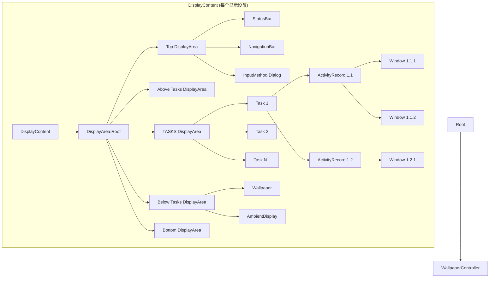
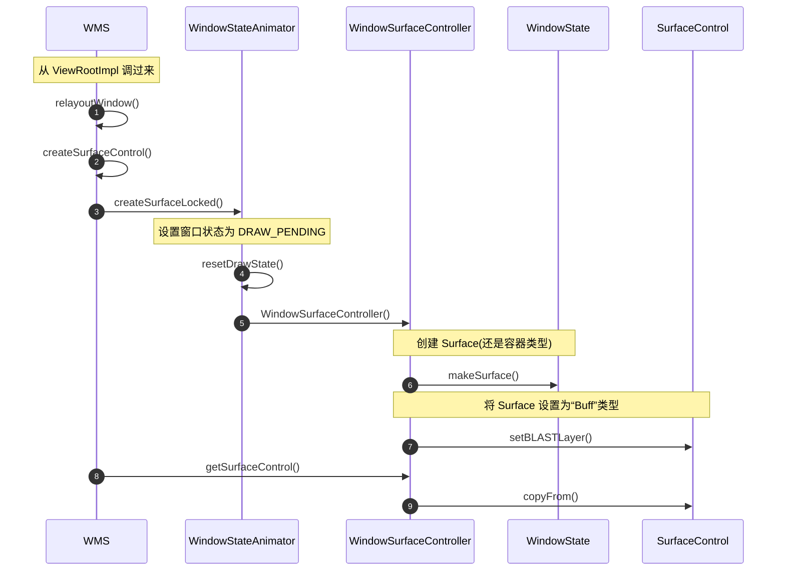
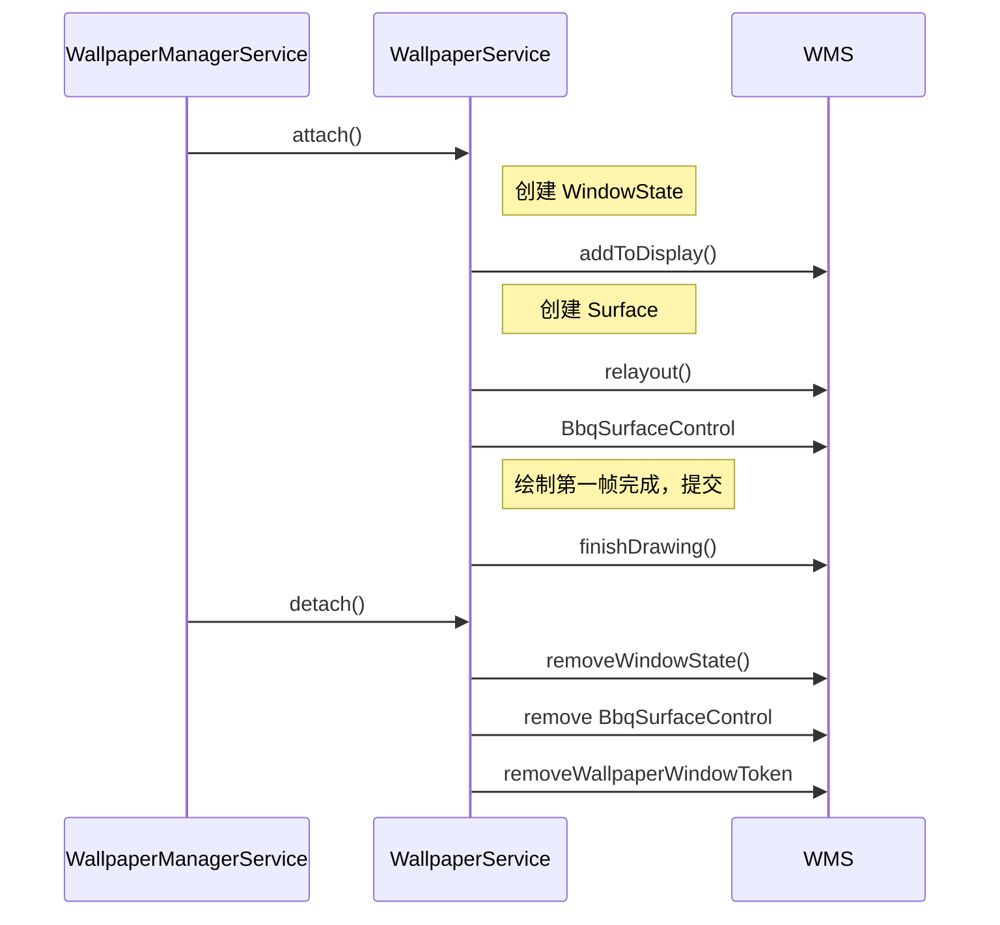

# 4 Input 系统专题

inotify：动态监听文件夹下的文件增加和删除

epoll：监听 fd，当可读时 epoll_wait 会继续执行

对于 Input 系统，EventHub 使用 inotify 监听 `/dev/input/` 目录下的文件的增加和删除，当增加一个文件时，`mInotifyFd` 变得可读，源码中就会打开对应的设备文件获取 fd，然后 epoll 对其进行监听，从而监听到 `/dev/input/` 目录下的所有设备节点。

``` shell
# 使用 getevent 命令可以显示当前的触摸事件
$ adb shell getevent -lrt
```

[触摸事件起源](https://juejin.cn/post/7171130176158302245?searchId=20260106145732A10DB23F9AC158009754)

## 1 示例：

### 单指触摸事件流

``` shell
# 1. 手指按下
{type: EV_ABS, code: ABS_MT_TRACKING_ID, value: 0}  # 分配触摸点ID
{type: EV_ABS, code: ABS_MT_POSITION_X,  value: 100} # X坐标
{type: EV_ABS, code: ABS_MT_POSITION_Y,  value: 200} # Y坐标
{type: EV_ABS, code: ABS_MT_PRESSURE,    value: 50}  # 压力值
{type: EV_SYN, code: SYN_REPORT,         value: 0}   # 同步帧结束

# 2. 手指移动
{type: EV_ABS, code: ABS_MT_POSITION_X,  value: 150}
{type: EV_ABS, code: ABS_MT_POSITION_Y,  value: 250}
{type: EV_SYN, code: SYN_REPORT,         value: 0}

# 3. 手指抬起
{type: EV_ABS, code: ABS_MT_TRACKING_ID, value: -1}  # 释放触摸点
{type: EV_SYN, code: SYN_REPORT,         value: 0}
```

### 按键事件示例

``` shell
# 音量+键按下
{type: EV_KEY, code: KEY_VOLUMEUP, value: 1}  # 按下
{type: EV_SYN, code: SYN_REPORT,   value: 0}

# 音量+键释放  
{type: EV_KEY, code: KEY_VOLUMEUP, value: 0}  # 释放
{type: EV_SYN, code: SYN_REPORT,   value: 0}
```

## 2 `/dev/input/eventX` 中的原始内容

#### **数据结构（Linux input_event）**

``` c
struct input_event {
    struct timeval time;  // 时间戳
    __u16 type;           // 事件类型
    __u16 code;           // 事件代码
    __s32 value;          // 事件值
};
```

## 3 EventHub 读取的原始设备

``` shell
/dev/input/event0    # 通常是触摸屏
/dev/input/event1    # 可能是音量键
/dev/input/event2    # 可能是电源键
/dev/input/event3    # 可能是加速度传感器
...
```

- 每个设备对应一个 eventX 文件
- 通过 `ioctl` 和 `epoll` 机制监控变化

## 4 InputReader 解析后的结果

**从原始事件 → Android 标准事件**

``` java
// 原始事件流（多个input_event）
[
  {type:EV_ABS, code:ABS_MT_POSITION_X, value:100},
  {type:EV_ABS, code:ABS_MT_POSITION_Y, value:200},
  {type:EV_SYN, code:SYN_REPORT, value:0}
]

// ↓ InputReader 解析转换 ↓

// 生成标准 Android MotionEvent
MotionEvent.obtain(
    downTime: 123456789,
    eventTime: 123456790,
    action: ACTION_DOWN,      // 动作类型
    pointerCount: 1,          // 触摸点数
    pointerProperties: [...], // 触摸点属性
    pointerCoords: [{x:100, y:200}], // 坐标
    metaState: 0,
    buttonState: 0,
    xPrecision: 1.0,
    yPrecision: 1.0,
    deviceId: 3,              // 输入设备ID
    edgeFlags: 0,
    source: SOURCE_TOUCHSCREEN, // 事件来源
    flags: 0
)
```

### **解析的关键转换**

1. **坐标转换**：原始坐标 → 屏幕坐标（考虑旋转、缩放）
2. **多指处理**：合并多个触摸点的原始数据
3. **手势识别**：点击、长按、滑动等
4. **设备识别**：判断是触摸屏、鼠标、键盘等
5. **时间同步**：硬件时间戳 → 系统时间

完整流程示例

``` text
硬件触摸 → 驱动产生原始事件 → /dev/input/event0
                                    ↓
EventHub 读取: {EV_ABS, ABS_MT_POSITION_X, 100}
              {EV_ABS, ABS_MT_POSITION_Y, 200}  
              {EV_SYN, SYN_REPORT, 0}
                                    ↓
InputReader 解析: 识别为单指触摸DOWN事件
                                    ↓
生成 Android MotionEvent(ACTION_DOWN, x=100, y=200)
                                    ↓
放入 InputDispatcher 队列 → 分发到应用
```


## 5 InputDispatcher

## 6 SocketPair 创建和传递的完整流程

### **1. 创建时机：窗口创建时**

```java
// 在应用进程创建窗口时触发
public final class ViewRootImpl {
    public ViewRootImpl(Context context, Display display) {
        // 窗口创建时建立 InputChannel
        mInputChannel = new InputChannel();
        
        // 通过 WindowManagerService 注册窗口
        mWindowSession.addToDisplay(mWindow, ..., mInputChannel);
    }
}
```

### **2. 核心创建过程**

#### **步骤1：应用端发起创建请求**
```java
// 应用进程调用
public int addToDisplay(IWindow window, ..., InputChannel outInputChannel) {
    // outInputChannel 是输出参数
    // 将通过Binder跨进程传递
}
```

#### **步骤2：在 WindowManagerService（system_server）中创建**
```java
// WMS 在 system_server 进程中
public class WindowManagerService {
    public int addWindow(Session session, IWindow client, ...,
                         InputChannel outInputChannel) {
        
        // 创建一对 socket
        InputChannel[] inputChannels = InputChannel.openInputChannelPair(
            "window_" + window.hashCode());
        // 现在有：
        // inputChannels[0] - serverChannel (system_server端)
        // inputChannels[1] - clientChannel (应用端)
        
        // 关键：将 clientChannel 通过Binder传回应用
        outInputChannel.transferTo(inputChannels[1]);
        
        // system_server 保留 serverChannel
        mInputManager.registerInputChannel(
            serverChannel, windowState);
    }
}
```

### **3. FileDescriptor 的跨进程传递机制**

#### **核心类：ParcelFileDescriptor**
```java
// InputChannel 内部实现
public class InputChannel implements Parcelable {
    private FileDescriptor mFd;
    
    // 关键方法：跨进程传递FD
    public void transferTo(InputChannel outParameter) {
        // 通过 ParcelFileDescriptor 传递
        ParcelFileDescriptor fd = ParcelFileDescriptor.fromFd(mFd);
        outParameter.readFromParcel(Parcel.obtain().writeParcelable(fd, 0));
    }
    
    // Parcelable 实现
    public void writeToParcel(Parcel dest, int flags) {
        // 将FD写入Parcel
        dest.writeFileDescriptor(mFd);
    }
}
```

#### **Binder 传递 FD 的原理**
```cpp
// Linux 内核机制
struct binder_transaction_data {
    int fd;  // Binder事务可以包含文件描述符
};

// 传递过程：
// 1. 发送进程：fd=5
// 2. 内核：记录fd引用，分配新的fd号给接收进程
// 3. 接收进程：收到新的fd（比如fd=7），指向同一个内核对象
```

### **4. 完整流程示例**

#### **时序图**
```
应用进程                     Binder                      system_server
   |                           |                              |
   | 1. addToDisplay()         |                              |
   |-------------------------->|                              |
   |                           | 2. 创建socketpair            |
   |                           |    [serverFd, clientFd]      |
   |                           |                              |
   |                           | 3. 通过Binder返回clientFd    |
   |<--------------------------|                              |
   | 4. 收到clientFd           |                              |
   |    (指向socket另一端)      |                              |
   |                           | 5. 保留serverFd              |
   |                           |    注册到InputDispatcher     |
   |                           |                              |
```

#### **代码流程详解**
```java
// 详细步骤：
// 步骤1：应用调用 WindowSession.addToDisplay()
IWindowSession.addToDisplay(window, ..., outInputChannel);

// 步骤2：调用进入 system_server（WMS）
public int addWindow(...) {
    // 创建socketpair
    InputChannel[] channels = InputChannel.openInputChannelPair(name);
    // channels[0] - system_server端
    // channels[1] - 应用端
    
    // 通过Binder传回应用端
    channels[1].transferTo(outInputChannel);
    
    // 注册到InputManager
    mInputManager.registerInputChannel(
        channels[0].getFd(), windowState);
}

// 步骤3：Binder机制传递FileDescriptor
// outInputChannel.writeToParcel() 将FD写入Parcel
// Parcel跨进程传递，内核复制FD

// 步骤4：应用收到FD
// InputChannel.readFromParcel() 从Parcel读取FD
// 现在应用有了socket的另一端
```

### **5. SocketPair 的生命周期管理**

#### **创建 SocketPair**
```cpp
// native 层实现
status_t InputChannel::openInputChannelPair(
        const String& name,
        sp<InputChannel>& outServerChannel,
        sp<InputChannel>& outClientChannel) {
    
    int sockets[2];
    // 创建UNIX域socket对
    if (socketpair(AF_UNIX, SOCK_SEQPACKET, 0, sockets) != 0) {
        return UNKNOWN_ERROR;
    }
    
    // 设置非阻塞
    fcntl(sockets[0], F_SETFL, O_NONBLOCK);
    fcntl(sockets[1], F_SETFL, O_NONBLOCK);
    
    // 创建两个InputChannel对象
    outServerChannel = new InputChannel(name, sockets[0]);
    outClientChannel = new InputChannel(name, sockets[1]);
    
    return OK;
}
```

#### **FD 编号变化**
```
创建时（在system_server进程）：
  serverFd = 5 (sockets[0])
  clientFd = 6 (sockets[1])

通过Binder传递后：
  system_server: 仍然持有 fd=5
  应用进程: 收到新的 fd，比如 fd=3，但指向同一个socket
  
内核视图：
  ┌─────────────────────┐
  │     Socket Pair     │
  │  ┌───────────────┐  │
  │  │ 内核socket对象  │  │
  │  └───────────────┘  │
  │         │           │
  │   fd=5  │    fd=6   │
  └─────────┼───────────┘
            │
      跨进程复制
            │
      应用进程fd=3
```

### **6. 验证 FD 传递**

#### **查看进程的 FD**
```bash
# 查看 system_server 的 FD
adb shell ls -l /proc/$(pidof system_server)/fd | grep socket

# 查看应用进程的 FD
adb shell ls -l /proc/$(pidof com.example.app)/fd | grep socket
```

#### **调试代码**
```java
// 在应用端打印 FD 信息
Log.d("InputChannel", "FD: " + mInputChannel.getFd());

// 在 InputDispatcher 中打印
ALOGD("Registered channel FD: %d", channel->getFd());
```

### **7. 关键设计要点**

1. **一次创建，两端使用**：socketpair 创建时两端就在同一个内核对象
2. **FD 是进程局部**：每个进程有自己的 FD 编号
3. **Binder 传递的是引用**：传递的是内核对象引用，不是 FD 值本身
4. **自动关闭机制**：进程退出时内核自动清理 FD
5. **权限控制**：只有 system_server 能创建和分发 InputChannel

### **8. 异常处理**
```java
// 如果应用进程异常退出
// system_server 会检测到 socket 关闭
void InputDispatcher::unregisterInputChannelLocked(...) {
    // 清理对应的 InputChannel
    close(serverFd);
}

// 如果 system_server 重启
// 所有 socket 重新创建，应用需要重新注册窗口
```

这种设计确保了：
1. **安全性**：只有 system_server 控制 InputChannel 的创建和分发
2. **性能**：一旦建立，通信是直接的 socket 通信
3. **可靠性**：Binder 只用于建立连接，不用于高频数据传输
4. **清理简便**：进程退出时自动清理资源


## 总结

### 1. InputReader 阶段（读取）

- **硬件中断**：触摸屏/按键产生原始事件
- **EventHub**：从 `/dev/input/` 读取原始事件
- **InputReader**：
  - 解析原始数据 → 标准 Android 事件
  - 处理多指触摸、手势识别
  - 创建 `InputEvent`（KeyEvent/MotionEvent）

### 2. 队列传递阶段

``` java
InputReader.process() → 
生成 InputEvent → 
放入 InputDispatcher 的 inboundQueue →
唤醒 InputDispatcher 线程
```

### 3. InputDispatcher 阶段（分发）

- **查找目标窗口**：根据坐标找到焦点应用/窗口
- **出队处理**：从 inboundQueue 取出事件
- **分发策略**：
  - 应用焦点检查（前台/后台）
  - ANR 监控（5秒超时）
  - 权限检查（触摸注入等）
- **发送给应用**：
  - 通过 Socket 通道发送到应用 UI 线程
  - 应用处理完后返回完成信号

### 关键特点

- **双线程模型**：Reader线程 + Dispatcher线程，避免阻塞
- **队列缓冲**：inboundQueue（待分发） + outboundQueue（已分发待确认）
- **ANR 保护**：分发超时（5秒）触发 ANR
- **VSync 同步**：可配置与屏幕刷新同步，避免卡顿

## 禁用屏幕实战

通过 `adb shell dumpsys inputflinger disable` 即可禁用，具体实现：

修改 InputManager.cpp，重写 `dump()` 函数，接收到 disable 参数后设置 InputReader::gDisable = false，

``` cpp
// InputManager.cpp
#define LOG_NDEBUG 0

status_t InputManager::dump(int fd, const Vector<String16>& args) {
    if (args.size() > 0 ) {
        ALOGW("InputManager::dump args = %s",std::string(String8(args[0]).string()).c_str());
        String8 result;
        result.append("InputManager diable state:\n");
        if (args[0] == String16("disable")) {
            InputReader::gDisable = true;
            result.append("state: disable \n");
        } else {
            InputReader::gDisable = false;
            result.append("state: enable \n");
        }
        write(fd, result.string(), result.size());
    }
    return 0;
}

// InputManager.h
#include <utils/String16.h>
#include <utils/String8.h>
    
    virtual status_t dump(int fd, const Vector<String16>& args);
```


修改 InputReader.cpp，使用 gDisable 变量控制

``` cpp
// InputReader.cpp
+bool InputReader::gDisable = false;
 void TouchInputMapper::processRawTouches(bool timeout) {
-    if (mDeviceMode == DEVICE_MODE_DISABLED) {
+    if (InputReader::gDisable  || mDeviceMode == DEVICE_MODE_DISABLED) {
         // Drop all input if the device is disabled.
         mCurrentRawState.clear();
         mRawStatesPending.clear();
+         ALOGD("Drop all input processRawTouches InputReader::gDisable = %d",InputReader::gDisable);
         return;
     }
// InputReader.h
+    static bool gDisable;
```

## 7 dumpsys 分析 input

``` shell
$ adb shell dumpsys input
```

## 8 ANR 产生源码分析

- IQ(InboundQueue)：InputReader 读取原始事件后的入队（所有输入事件的 “系统总收件箱”）
  - 是 InputDispatcher 全局唯一的 “总接收队列”，事件是 InputReader 加工后的 `EventEntry`（非原始硬件事件），入队后唤醒 InputDispatcher 线程处理

- OQ(OutboundQueue)：InputDispatcher 已入队，等待通过 socketpair 发送给 APP 的队列（单个 APP 的 “待发送件箱”）
  - 与单个 APP 的 `Connection` 绑定（每个 APP 专属），事件是 `DispatchEntry`，等待 InputDispatcher 主动发起 `socketpair` 发送流程

- WQ(WaitQueue)：已发送到 APP，但是还没有收到 APP 回调 finish 的队列（单个 APP 的 “已发出但未签收件箱”（签收 = APP 回调 finish））
  - 同样绑定 APP 的 `Connection`，事件发送后立即转入此队列，系统会为队列中事件启动 ANR 超时计时；APP 回调 `finish` 本质是调用 `InputDispatcher` 的 `finishInputEvent`，触发事件从 WQ 移除

IQ 是 InputDispatcher 进程内唯一的，所有 APP 的输入事件都先进入 IQ；而 OQ/WQ 是每个 APP 的 `Connection` 实例下的专属队列，不同 APP 的 OQ/WQ 相互隔离。

ANR 发生原理：

- InputReader 读取原始事件放入 IQ，唤醒 InputDispatcher，InputDispatcher 把它放入 OQ，准备通过 socket 发送给 APP，把交付给 APP 的事件放入 WQ，APP 处理完毕后回调 finish 后把 WQ 对应的事件移除，如果 WQ 里的事件超过5秒还没有处理，就报 ANR；

## 9 轨迹线

使用 `adb shell dumpsys SurfaceFlinger` ，通过 HWC layers 查看轨迹线和轨迹球相关信息，随后全局搜索其所在源码位置；

显示原理：


## 10 轨迹球

使用 `adb shell dumpsys SurfaceFlinger` ，通过 HWC layers 查看轨迹线和轨迹球相关信息，随后全局搜索其所在源码位置；

显示原理：


## 11 ANR 实战

重点：

- `onCreate()` 中 sleep 10 秒钟不会发生 ANR（不管 sleep 时是否触摸都不会 ANR），因为在 `onCreate()` 阶段，InputDispatcher 和应用之间的 connection 还没有建立，所以不在 ANR 发生的流程中，就不会发生 ANR 了；
- 在 onTouchEvent() 中 sleep 10 秒钟也不会发生 ANR，除非在 sleep 的过程中触摸了屏幕，发生了 input 事件，才会导致 WQ 中的事件超过 5 秒未处理报 ANR；

## 12 过滤窗口不接受触摸

查看 HWC layers 信息：

``` shell
adb shell dumpsys SurfaceFlinger
```

`findTouchedWindowAtLocked()` 中修改：

``` cpp
if(windowHandle->getName().find("xxx") != std::string::npos) {
    continue;
}
```

## 13 触摸事件注入（模拟触摸事件）

### adb shell 命令

``` shell
adb shell input swipe 100 400 300 400 # 向右滑动
adb shell input tab 500 400 # 点击
adb shell input keyevent 24 # 音量+
```


### 注入事件源码分析

源码路径：`frameworks/base/cmds/input`

在执行 shell 命令时，input 程序会通过 JNI 调用到 `InputManagerService.injectInputEvent`


### 注入事件使用方式

普通 APP 注入事件

注入方法

- 反射 InputManager，然后 `InputManager.injectInputEvent()`

- Instrumentation 方案

  ``` java
  Instrumentation instrumentation  = new Instrumentation ();
  final long now = SystemClock.uptimeMillis();
  float x =100;
  float y = 500;
  MotionEvent clickDown = MotionEvent.obtain(now, now, MotionEvent.ACTION_DOWN, x, y, 0);
  instrumentation.sendPointerSync(clickDown);
  MotionEvent clickUp = MotionEvent.obtain(now, now, MotionEvent.ACTION_UP, x, y, 0);
  instrumentation.sendPointerSync(clickUp);
  ```

  - 声明权限 `android.permission.INJECT_EVENTS`，不声明这个权限的话，只能在应用内部注入
  - Android.mk 中声明 platform

## 14 Native 独立触摸识别

改写 getevent 源码，根据 Type/Code/Value 重新输出打印；

## 15 APP 后台监听触摸

调用 InputManager.monitorGestureInput()，同样有系统权限问题，和触摸事件注入一样

以 inputMonitor.getInputChannel 为参数，创建一个 InputEventReceiver 对象，其中有 onInputEvent() 函数，再到 EdgeBackGestureHandler.onInputEvent() -> onMotionEvent()，就可以监听到 ACTION_DOWN 等事件（可以参考 SystemUI 对 monitorGestureInput() 的使用）；

## 16 ACTION_CANCEL

当父容器在 onInterceptTouchEvent() 先给子 view 派发了事件，比如 DOWN，然后在 MOVE 事件的时候被父容器拦截了，ACTION_MOVE 就会变成 ACTION_CANCEL 给到子 View 让子 View 知晓；

由 system_server 传递 ACTION_CANCEL：

- 按着 ACTIVITY 任意地方，然后按 HOME 键，应用就会直接收到 ACTION_CANCEL

# 6 WMS/AMS

## 1 窗口层级树

``` shell
adb shell dumpsys activity containers
```

DisplayAreaPolicy.java



### 窗口层级树的构建


## 2 层级结构树和 SF 映射

从 `SurfaceControl.setName()` 入手


## 3 WindowToken 总结

系统窗口通常有如下类型：

| type                       | 窗口   |
| -------------------------- | ------ |
| TYPE_STATUS_BAR            | 状态栏 |
| TYPE_NAVIGATION_BAR        | 导航栏 |
| TYPE_INPUT_METHOD          | 输入法 |
| TYPE_WALLPAPER             | 壁纸   |
| TYPE_ACCESSIBILITY_OVERLAY | 无障碍 |
| TYPE_TOAST                 | Toast  |
| TYPE_QS_DIALOG             | QS     |


| 窗口类型                                    | type 区间 | token 来源                         |
| ------------------------------------------- | --------- | ---------------------------------- |
| Activity 主窗口                             | 1–99      | ATMS 通过 ActivityRecord（预注册） |
| 子窗口                                      | 1000–1999 | parentWindow.mToken                |
| IME / Wallpaper                             | 系统 type | system_server 系统服务预创建       |
| Overlay / Alert / StatusBar / NavigationBar | 系统 type | WMS 通过`addWindow()` 中新建       |
| WindowContext                               | 系统 type | WindowContext Token                |

系统窗口特征：没有 Activity，通常 **没有 parentWindow**，token **不能是 ActivityRecord**

子窗口特征：必须有 parentWindow，复用 parentWindow 的 WindowToken，永远依附于某个 Activity

应用窗口特征：必须使用 ActivityRecord 对应的 WindowToken

## 3 窗口添加

FLAG_NOT_TOUCH_MODAL

WM.addView -> WMG.addView -> ViewRootImpl.seView -> WindowSession.addToDisplayAsUser -> **Sesion.addToDisplayAsUser -> WMS.addWindow**

Server 端

- new WindowToken并且挂载到对应的层级节点

- new WindowState并初始化和Window相关的变量

- 调用 OpenInputChannel，初始化相关的触摸通路

- WindowState 挂载到 WindowToken

https://blog.csdn.net/learnframework/article/details/129236971

## 4 relayoutWindow

WMS 创建 Surface 给到 APP

NO_SURFACE/DRAW_PENDING/COMMIT_DRAW_PENDING/READY_TO_SHOW/HAS_SHOW

setView 中的 requestLayout() 触发

performSurfacePlacement()

forAllWindows()

### 创建 Buff 类型的 Surface




Surface 创建完成后，WMS 最后通过把 Surface 返回给应用端传递过来的 outSurfaceControl


## 5 finishDrawing()

reportDrawFinished()

adb shell dumpsys window windows

## 6 闪黑

### 窗口绘制

adb shell dumpsys window windows 查看壁纸 window 状态，最底层一般在 dumpsys 信息最下面，查看到 ImageWallpaper

ImageWallpaper 中查找 addView() 没有找到，，ImageWallpaper 父类是 WallpaperService，在其中看到 `mSession.addToDisplay()` 方法（让 WMS 创建 window），mLayout 参数，mLayout 赋值了 Token，Token 是通过 `WallpaperService.attach()` 赋值的，`attach()` 被 `Engine.attac()` 调用，IWallpaperEngineWrapper 又是在另一个 attach() 中被构造，而这个 attach() 属于 IWallpaperServiceWrapper，IWallpaperServiceWrapper 继承自 IWallpaperService.Stub()，是一个服务端，接下来查找客户端，直接搜索 IWallpaperService，找到 WallpaperManagerService 通过 IWallpaperService.Stub.asInterface() 获取 IWallpaperService 对象，

所以针对 IWallpaperService，WallpaperManagerService(system_server) 属于客户端，ImageWallpaper(SystemUI) 属于服务端，

WallpaperConnection 又是一个 IWallpaperConnection 服务端，而客户端是 SystemUI，Connection 通过 attach 传递到 SystemUI，如此一来 system_server 和 SystemUI 就可以双向通信了

`attach()` 中的 token 和 type 参数，是直接在调用的时候传入的，即直接从 system_server 传递的，Type 是 TYPE_WALLPAPER，在 attach 之前先做了 `addWindowToken()`，调用到 WMS.addWindowToken()，针对 TYPE_WALLPAPER 做了处理，最终找到 DisplayArea 并创建 WallpaperWindowToken，也挂载到了窗口层级树中，

随后 WallpaperService.Engine.updateSurface() 中调用了 addToDisplay()，这里和之前的 addWindow 一样，结果就是创建了 WindowState 并且挂在到了 WallpaperWindowToken 下面，这里 addToDisplay() 也传入了 InputChannel，说明壁纸可以接收触摸事件，

然后在 updateSurface() 中继续调用 mSession.relayout()，relayout() 主要就是获取 SFC，即 WindowState 会创建 对应的 SurfaceControl，利用这个 SFC 画图，但是针对壁纸多了一层 `mBbqSurfaceControl(名字 Wallpaper BBQ wrapper)`，可以通过 dumpsys SurfaceFlinger 看出来（查看 HWC layers - Wallpaper BBQ wrapper，查看 BufferStateLayer，parent = ImageWallpaper， 这个 ImageWallpaper 也是一个 BufferStateLayer，而这个 BSL 的 parent 也是 ImageWallpaper，但是这个 ImageWallpaper 是 ContainerLayer，即是一个 WindowState，然后它的 parent 是 WallpaperWindowToken ），

在 SurfaceFlinger 中的层级结构：

WallpaperWindowToken - ImageWallpaper(Container，WindowState) - ImageWallpaper(BufferState) - Wallpaper BBQ wrapper，

随后再经过一系列的转换，把 mBbqSurfaceControl 转换为 mSurfaceHolder，再调用 onSurfaceCreated(这样应用端就可以收到回调了)，再到 onSurfaceRedrawNeeded()，这里会跳转到 SystemUI 中实现的方法绘制完成，再调用 WallpaperService.finishDrawing()，即告知系统我已经绘制完成，可以展示了

总体流程：WallpaperManagerService(system_server) 先通过 bindService() 绑定客户端的 Wall paper Service，然后调用 attach() 触发客户端的 ImageWallpaper（WallpaperService） 创建窗口，relayout 窗口，在 ImageWallpaper 把窗口绘制完成，再调用 finishDrawing()

attach：告知 SystemUI 已经建立绑定，你可以建立窗口以及建立到哪个 token 下面，已经通过 attach() 参数传递给你了，

### 窗口移除

detach() 



### 源码跟踪

图层的操作是在 SuraceControl 中有 API，查看 `remove()`，打印堆栈，

WallpaperManagerService.detachWallpaperLocked() 

## Winscope 抓取

https://blog.csdn.net/learnframework/article/details/148973403

### AOSP 13 版本

#### 1.adb 命令方式离线抓取

``` shell
# 1、启用抓取windows和sf数据
# WindowManager:
adb shell cmd window tracing start
# SurfaceFlinger：
adb shell su root service call SurfaceFlinger 1025 i32 1

# 2、停用抓取
# WindowManager: 
adb shell cmd window tracing stop
# SurfaceFlinger：
adb shell su root service call SurfaceFlinger 1025 i32 0

# 3、获取抓取pb文件
# WindowManager: 
adb pull /data/misc/wmtrace/wm_trace.pb wm_trace.pb

# SurfaceFlinger：
adb pull /data/misc/wmtrace/layers_trace.pb layers_trace.pb

```

#### 2.手机上设置开启抓取按钮

开发者选项中打开开关：

``` shell
# 打开 Show Quick Settings tile
开发者选项 - System Tracing - Show Quick Settings tile
# 打开 Winscope Trace
Quick settings developer tiles - Winscope Trace
```

打开之后下拉状态栏就有了 Winscope Trace 的图标

#### 3.html 在线抓取

打开 html，基于 AOSP 源码执行对应的 python 命令：

``` shell
python3 $ANDROID_BUILD_TOP/development/tools/winscope/adb_proxy/winscope_proxy.py
```

#### 4.查看方式

直接打开 `prebuilts/misc/common/winscope/winscope.html`

### AOSP 14 版本

抓取方式和 AOSP13 完全一致；

AOSP 14 源码不自带 Winscope 的 html 了，需要源码进行编译，编译后可以直接使用；

### AOSP 15 版本

https://blog.csdn.net/learnframework/article/details/144384808

https://mp.weixin.qq.com/s/4suK7-drFenNxiHvIeAokw

adb 抓取方式有较大差异；


/data/misc/wmtrace

- layers_trace.winscope：Surface 相关 trace
- wm_trace.winscope：Window 相关 trace

prebuilts/misc/common/winscopewinscope.html 打开网页

发现没有壁纸的 SurfaceFlinger 图层，这是根本原因

查看 SF 的 trace，发现在壁纸图层可见之前，旧壁纸的 BBQ 不存在，所以结论就是旧壁纸的 BBQ 移除过早，而新壁纸的 BBQ 还是空数据

黑屏原因

- 没有图层
- 动画 alpha 0
- 没有 buffer
- flag 本身是 hide

解决方法

- 找到 remove 或者 hide 的地方
- 重新规划调整图层显示时许


## 7 日志经验

### 日志打印方式

- main 日志：Log.i

- system 日志：Slog.i

- events 日志：EventLog.writeEvent（比如查看生命周期，用户 Activity 中没有打印，events 日志可以打印源码中的生命周期）

``` shell
# 默认是 main/system/crash/kernel 日志，没有 events 日志
adb logcat
# 单独抓取
adb logcat -b events
# 打印所有日志
adb logcat -b all
```

### events 查找日志对应的源码

比如 wm_stop_activity，可以尝试拼凑后搜索 WmStopActivity 查找，也可以直接搜索 wm_stop_activity，但是搜索到的是一个数字，可以再次在 out 目录下 grep 数字，定义在 EventLogTags.java 中（out 目录下）

看生命周期，终端关注的是 wm_xxx 日志，而且 wm_on_xxx 一定是在应用进程中打印的，不带 on 的在 system_server 中

### ProtoLog

功能：动态开关某一个模块的日志

``` shell
# 开启：enable-text，关闭：disable-text
adb shell wm logging enable-text WM_DEBUG_STATES
adb logcat -s WindowManager | grep "Moving to STOPPING"
```

这里的 WM_DEBUG_STATES 可以搜索 ProtoLog.v() 查看传入的具体是什么，比如：
``` java
// ActiityRecord.java
ProtoLog.v(WM_DEBUG_STATES, "Moving to STOPPING:xxx")
```

Andrid 开启方式变更：https://blog.csdn.net/learnframework/article/details/140121485

## 8 窗口动画专题

### WMS 动画类型

- 远端动画：动画运行在非 system_server 进程，而是在 Launcher/SystemUI 进程
    - **远程动画**是 WindowManager 将窗口 Surface 通过 Binder 暴露给外部进程，由 Launcher/SystemUI 通过 RemoteAnimationRunner 自行驱动动画，灵活性极高，适合复杂交互和系统定制。
    - system_server 不定义远程动画“怎么动”，只定义“什么时候开始、哪些 Surface 参与”
    - system_server 做的事情只有三类：
        1. 判断是否使用远程动画
        2. 准备好参与动画的 Surface
        3. 通过 Binder 回调远端
    - 远端进程决定：
        - 动画持续多久
        - 用什么插值器 / 物理模型
        - Surface 如何缩放、平移、裁剪
        - 是否跟随手势
    - 场景
        - 从 Launcher 启动 App
            - 从点击图标到 APP 窗口放大
            - 圆角裁剪
    
        - 返回桌面 / Home
            - App 窗口缩回图标
            - 手势返回桌面
    
        - 最近任务（Recents / Overview）
            - Task 卡片滑动
            - 多窗口预览
            - 手势拖拽
    
        - 分屏 / 自由窗口
            - Task resize
            - 边界拖动
            - 同步跟手
    
- 本地动画：动画运行在 system_server 进程，在 WindowState.startAnimation() 中调用 `new LocalAnimationAdapter()`
    - **本地动画**是 WindowManager 内部基于 SurfaceControl 驱动的动画，执行在 system_server 中，稳定但受限。
    - 动画的“剧本”和“执行器”仍然在 system_server
    - systemserver 自己在 WindowAnimator 类进行动画播放控制
    - Animator 对 Surface 进行动画，控制 Matrix，alpha，圆角等
    - 场景
        - 普通 Activity / Task 切换
            - startActivity()
            - finish()
            - startActivityForResult()

        - 非 Launcher 触发的窗口变化
            - 应用内跳转
            - 设置页面切换
            - 系统对话框弹出/消失
            - Toast / 非系统级浮层


> **Android 中“本地动画 / 远程动画”，
>  是以 `system_server（WindowManager）` 为唯一参照系定义的。**
>
> **system_server 自己执行动画 → 本地动画**
>  **system_server 把动画执行权交给 Launcher/SystemUI → 远程动画**


有动画的话，在 SF 的 winscope 中会有 leash 的 Surface，等动画完成，WMS 就松开这个狗绳(leash)

leash 的 surface 图层特点

- 把要进行动画的子节点都挂到这个 leash 节点

### 源码分析

SurfaceAnimator.java 查找 “animation-leash” 日志

commitFinishDrawingLocked()

SurfaceAnimator.createAnimationLeash()

- 把 leash 的父亲设置为 WindowToken
- 把 WindowState 的父亲设置为 leash
- removeLeash() 时会把 windowstate 重新挂载到 windowtoken

 移除

- startAnimation() 的时候，传入了一个回调，当动画完成的时候，通过 Handler 通知执行回调进行移除

### 总结

课程 31

https://blog.csdn.net/learnframework/article/details/129602356

## 9 Activity 启动流程

ATMS 创建 ActivityRecord/Task

看源码方式：dumpsys activity containers，打印堆栈，反推调用流程

WindowContainer.addChild() 中打印堆栈，从堆栈中看出来 Task 和 ActivityRecord 的创建和添加到层级树中，

[Launcher/system_server/app 启动图](https://blog.csdn.net/learnframework/article/details/130065473)

## 10 SplashScreen

``` shell
adb shell dumpsys window windows
```

在 SplashScreen 出现时使用 dumpsys 命令抓取窗口信息（从底部向上看），找到类似如下信息：

``` shell
Window #9 Window{9d1w325 u0 Splash Screen com.android.gallery3d}
    mDrawState=HAS_DRAWN
```

frameworks 目录搜索 ”Splash Screen“

> dumpsys 信息显示的包名，并不一定就说明这里的信息是这个报名所属进程打印的，从 dumpsys 的 mSession 可以判定所属进程

``` shell
adb shell dumpsys activity containers
```

这个 dumpsys 可以显示挂载顺序

应用定制 splashscreen logo，在 style 中添加 <item>，

``` xml
<item name="android:windowSplashScreenBackground">#ffffffff</item>
<item name="android:windowSplashScreenAnimatedIcon">@drawable/news_avd_v02</item>
<item name="android:windowSplashScreenIconBackgroundColor">#ffffffff</item>
<item name="android:windowSplashScreenAnimationDuration">1000</item>
```

然后 StartingSurfaceDrawer.java 中就会获取主题，更具体的是 `SplashscreenContentDrawer.getWindowAttrs()`，

logo往下，主Activity向上的动画方案：把 SplashScreen 最后一帧传递给应用，应用进程再做动画处理

触发 SystemUI 帮我们拷贝最后一帧到应用：

``` java
SplashScreen.setOnExitAnimationListener(this::onSplashScreenExit)
```

### 总结

APP 没有定制动画的情况

- onFirstWindowDrawn -> removeStartingWindow() -> removeStartingWindowAnimation() -> StartSurfaceController.remove() -> TaskOrganizerController.removeStartingWindow() -> SystemUI 进行 remove

APP 定制动画的情况

- transferSplashScreenIfNeeded() -> SystemUI copySplashView --> copySplashViewComplete -> app createSplashScreen -> onSplashScreenAttachComplete() -> onFirstWindowDrawn() 后续和定制的情况一样


### 实战移除闪屏 logo

方案1：TaskFragment.SHOW_APP_STARTING_PREVIEW 改为 false

方案2：ActivityRecord.addStartingWindow() 中修改，判断个条件让它直接 return

缺点：点击图标后，会卡一会儿

方案3：在 `SplashscreenContentDrawer.getWindowAttrs()` 中直接设置 Icon 为透明 ColorDrawable

``` java
// 这里判空是为了不对第三方想定制 logo 的 APP 产生影响
if(attrs.mSplashScreenIcon == null) {
    attrs.mSplashScreenIcon = new ColorDrawable(Color.TRANSPARENT);
}
```

这种方案只是替换了 logo，logo 后面的大背景还是会正常显示

## 11 应用动画

应用切换动画

查看 Proto 日志 "createAnimationLeash type ="

有 5 个动画：Wallpaper/Launcher/SplashWindow 移除/ActivityRecord reveal/SystemDialogActivity

## 12 远程动画

- Launcher 端创建 Runner，创建 Adapter 传递到 system_server
- system_server 端经过 gootToGo 后，再通过 adapter.getRUNNER() 获取到 runner，通过 IPC 又到了 Launcher 进程，会把 Target/Surface(Leash) 传给 Launcher，还传递了 FinishedCallback，以便 Launcher 动画执行完成后回调到 system_server
- Launcher 进程调用 onAnimationStart() -> onUpdate() 进行动画执行，执行完成后，通过 FnishedCallback 到 system_server 进程
- system_server 通过 FinishedCallback.onAnimationFinished() 进行扫尾工作

总结：47


## 13 Activity 的 window 添加

 https://852988.xyz/2022/02/20/Android/AndroidDevelop_017_CreateActivity_WindowDisplay/#comment-gitalk

## 14 FocusedWindow

### Focused Window ANR 场景

``` shell
# ANR 常见类型
Input dispatching timed out(Application does not have a focused window)
```

- 没有焦点窗口 FocusedWindow 导致
- Focused ANR 只会发生在 key 事件的派发，触摸事件不会产生，因为 key 事件找不到焦点窗口会立即触发 ANR，而触摸事件通过 `findTouchedWindow()` 找不到窗口只会丢弃事件，不会触发 ANR，可以通过 events 日志看出：

``` shell
# key_back_press 按键事件
sysui_multi_action: [777,802,444,key_back_press,803,1]
am_anr:xxx
```

- **Key 事件**：系统级关键输入（返回键、Home键、音量键）
    - 必须要有接收者
    - 无法确定目标 = 系统状态异常
- **Touch 事件**：应用级交互
    - 允许无目标（点到状态栏、导航栏外）
    - 可能是正常情况（点击区域无控件）

### 查看焦点窗口命令

```shell
# 两种方式
dumpsys window | grep mFocused
dumpsys window lastanr # 查看 ANR 信息
dumpsys SurfaceFlinger
dumpsys input # 如果发生 ANR，以这个命令为准
```

dumpsys window 

- mCurrentFocus：指明 window，focused ANR 的时候，就是因为这里为 null
- mFocusedApp：指明  ActivityRecord，不一定指向同一个进程，比如下拉通知栏的时候 dumpsys window

- LAST ANR：显示 ANR 相关信息

dumpsys SurfaceFlinger

- 查看 HWC layers，后面有标记 [*] 的是焦点

dumpsys input

- FocusedApplications
- FocusedWindows
- last ANR：ANR 信息

### 分析方法

查看 input_focus 信息

``` shell
logcat -b events | grep input_focus
```

- Focus request
- Focus leaving：wms 发了一个请求焦点
- Focus entering：说明已经有焦点了，如果发生 ANR 时出现这个日志，可以考虑查看是否 input 那边有问题，如果没有这条日志，考虑 WMS/SurfaceFlinger 的问题

### 源码分析

在 dumpsys window 的时候，mFocusedApp 是在 `dumpsys window displays` 信息中输出的，可以在 RootWindowContainer.java 中搜索到 “dumpsys window displays”，查看 mFocusedApp 的赋值

使用同样方法查看 mCurrentFocus 的赋值

### 总结

## 15 横竖屏旋转

Surface 旋转（逆时针旋转）

- ROTATION 0
- ROTATION_90
- ROTATION_180
- ROTATION_270

## 16 多屏互动

### 1 使用命令查看效果

``` shell
# 移动 task，旧版本中是：am display move-stack taskid displayId
adb shell am task move 87 1

# 查看 taskid, displayId
$ adb shell dumpsys activity tasks
TASK id=87
  userId=0
  displayId=1
  baseActivity=com.xxx.yyy/.MainActivity
```


https://juejin.cn/post/7306043013816860687

### 2 静态移动方案

- 监听手势，当滑动超过设定的 GAP 时开始移动 TASK

### 3 监听手势

新建一个 Listener 监听手指事件

``` java
// DoubleScreenMovePointerEventListener.java
package com.android.server.wm;

import android.view.MotionEvent;
import android.view.WindowManagerPolicyConstants;

public class DoubleScreenMovePointerEventListener implements WindowManagerPolicyConstants.PointerEventListener {
    boolean shouldBeginMove = false;
    int mPoint0FirstX = 0;
    int mPoint1FirstX = 0;

    int mPoint0LastX = 0;
    int mPoint1LastX = 0;
    int START_GAP = 20;
    private final WindowManagerService mService;

    public DoubleScreenMovePointerEventListener(WindowManagerService mService, DisplayContent mDisplayContent) {
        this.mService = mService;
        this.mDisplayContent = mDisplayContent;
    }

    private final DisplayContent mDisplayContent;

    @Override
    public void onPointerEvent(MotionEvent motionEvent) {
        switch (motionEvent.getActionMasked()) {
            case MotionEvent.ACTION_DOWN:
            case MotionEvent.ACTION_POINTER_DOWN:
                if (motionEvent.getPointerCount() > 2) {
                    shouldBeginMove = false;
                }
                if (motionEvent.getPointerCount() == 2) {
                    if (mPoint0FirstX == 0 && mPoint1FirstX == 0) {
                        mPoint0FirstX = (int)motionEvent.getX(0);
                        mPoint1FirstX = (int)motionEvent.getX(1);
                    }
                }
                break;
           case MotionEvent.ACTION_MOVE:
                // 两个点的移动距离大于 START_GAP 时则开始移动 Task
               if (motionEvent.getPointerCount() == 2) {
                   if (!shouldBeginMove && motionEvent.getX(0)  - mPoint0FirstX > START_GAP ||
                           motionEvent.getX(1)  - mPoint1FirstX > START_GAP) {
                       shouldBeginMove = true;
                       mDisplayContent.doTestMoveTaskToOtherDisplay();
                   }

                   mPoint0LastX = (int)motionEvent.getX(0);
                   mPoint1LastX = (int)motionEvent.getX(1);
               }
               break;
           case MotionEvent.ACTION_POINTER_UP:
           case MotionEvent.ACTION_UP:
               shouldBeginMove = false;
               mPoint0FirstX = mPoint1FirstX =0;
               break;
       }
    }

}
```

主要工作：

- 监听手势，按下时，记录两个点的初始坐标
- 移动时，判断移动距离是否大于 GAP，如果大于 GAP，则开始移动 Task，设置标志位为 true，并记录两个点的最后位置
- 抬起时，设置标志位为 false，并充值两个点的初始坐标为 0

### 4 移动 Task 到另一块屏幕

``` java
// frameworks/base/services/core/java/com/android/server/wm/DisplayContent.java
// 定义 Listener
final DoubleScreenMovePointerEventListener mDoubleScreenMoveListener;
// 构造函数中初始化并注册 Listener
mDoubleScreenMoveListener = new DoubleScreenMovePointerEventListener(mWmService, this);
registerPointerEventListener(mDoubleScreenMoveListener);

// 执行移动 Task
public void doTestMoveTaskToOtherDisplay() {
    DisplayContent otherDisplay = null;
    if (mRootWindowContainer.getChildCount() == 2) {
        otherDisplay = (mRootWindowContainer.getChildAt(0) == this) ? mRootWindowContainer.getChildAt(1):mRootWindowContainer.getChildAt(0);
    }
    if (otherDisplay!= this && otherDisplay!= null) {
        int rootTaskId = 0;
        try {
            Task rootTask = getTopRootTask();
            if (rootTask.isActivityTypeHome()) {
                return;
            }
            rootTaskId =rootTask.mTaskId;
            mRootWindowContainer.moveRootTaskToDisplay(rootTaskId,otherDisplay.mDisplayId,true);
        }catch (Exception e) {
            android.util.Log.i("DoubleScreen","doTestMoveTaskToOtherDisplay Exception",e);
        }
    }
}
```

主要工作：

- 执行移动操作，获取屏幕数，获取置顶的 Task，并调用 API 把 Task 移动到目标屏幕

### 5 创建镜像图层

``` java
// DisplayContent.java
SurfaceControl copyTaskRootSc = null;
SurfaceControl mirrorTaskSc = null;
SurfaceControl realTaskSc = null;
DisplayContent mOtherDisplayContent = null;

// 获取 task 的顶部 WindowState
WindowState windowState = rootTask.getTopActivity(false,false).getTopChild();
if (windowState!= null) {
    final SurfaceControl.Transaction t = mWmService.mTransactionFactory.get();
    //创建一个 copyTaskRootSc 图层主要用来放置镜像 Task 画面
    if (copyTaskRootSc == null) { 
        copyTaskRootSc =  makeChildSurface(null)
            .setName("rootTaskCopy")
            .setParent(getWindowingLayer()) // 设置父亲，要在状态栏和导航栏下面
            .build();
    }
    if (mirrorTaskSc == null) {
        mirrorTaskSc = SurfaceControl.mirrorSurface(rootTask.getSurfaceControl());
    }
    realTaskSc = rootTask.getSurfaceControl();
    t.reparent(mirrorTaskSc, copyTaskRootSc);
    t.show(copyTaskRootSc);
    t.show(mirrorTaskSc);
    t.apply();
}
ensureOtherDisplayActivityVisible(otherDisplay);
mCurrentRootTaskId = rootTaskId;
startMoveCurrentScreenTask(0,0);
```

主要工作：

- 创建一个在状态栏和导航栏之下的 SurfaceControl 图层 copyTaskRootSc（设置父亲为 getWindowingLayer() 的返回结果，这个图层满足要求）
- 使用 `mirrorSurface()` 创建当前 task 的镜像图层，并设置父亲为 copyTaskRootSc
- 显示图层

这段代码之后的结果就是手指移动 task 到另一块 display 后，原 display 还有一个镜像图层

### 6 设置图层偏移

上面做完后，会在两个屏幕都显示同样的画面，现在需要对这两个图层进行偏移

``` java
// DoubleScreenMovePointerEventListener.java
case MotionEvent.ACTION_MOVE:
...
    mPoint0LastX = (int)motionEvent.getX(0);
mPoint1LastX = (int)motionEvent.getX(1);
if (shouldBeginMove) {
    int deltaX = mPoint0LastX - mPoint0FirstX;
    mDisplayContent.startMoveCurrentScreenTask(detaX,0);
}

public void startMoveCurrentScreenTask(int x,int y) { 
    if (copyTaskBuffer!= null) {//真正调用这个moveCurrentScreenTask相关业务操作
        moveCurrentScreenTask(mWmService.mTransactionFactory.get(), mirrorTaskSc, x, y);
    }
}

void moveCurrentScreenTask(SurfaceControl.Transaction t,SurfaceControl mirrorTaskSc, int x, int y) {
    // t.setPosition(surfaceControl, x, y);
    float[] mTmpFloats = new float[9];
    Matrix outMatrix = new Matrix();

    if (realTaskSc != null) {
        outMatrix.reset(); 
        //对屏幕2的新task进行坐标平移操作，对屏幕大小一样的则直接就是在个偏移-（width - offsetX） = offsetX - width，屏幕大小不一样则需要进行对应scale操作
        outMatrix.postTranslate(x - mOtherDisplayContent.getDisplayInfo().logicalWidth, y);
        t.show(realTaskSc);
        t.setMatrix(realTaskSc, outMatrix, mTmpFloats);//给对应的task图层设置对应的matrix
    }
    outMatrix.reset();
    float offsetXMainDisplay = x + (getDisplayInfo().logicalWidth - x );//这个部分属于屏幕1镜像图层偏移坐标，这里为啥会是这样，不是应该只要x这个偏移就行么？
    //这里其实就和前面说的镜像图层实际挂了task，task再屏幕2进行了坐标改变，当然也会影响屏幕1的镜像图层效果，所以(getDisplayInfo().logicalWidth - x )是为了消除屏幕2 task的坐标偏移带来的影响，最后屏幕1上的镜像图层偏移量就只是x
    outMatrix.postTranslate(offsetXMainDisplay, y);
    t.setMatrix(mirrorTaskSc,outMatrix,mTmpFloats);
    t.show(mirrorTaskSc);
    t.apply();
}
```

- 对 realTaskSc，偏移 width - x
- 对 mirrorTaskSc，偏移 x，这里要注意，因为 mirrorSurface() 读取的是源 SurfaceControl 已经经过变换的合成输出结果，所以要先补偿前面 realTaskSc 的偏移，再加上 x，那么效果才是在屏幕 1 中真实偏移 x

### 全局双指移动策略监听

``` java

ValueAnimator animotor = ValueAnimator.ofInt(start, end);
animator.addUpdateListener(new ValueAnimator.AnimatorUpdateListener() {
    @Override
    public void onAnimationUpdate(ValueAnimator animation) {
        int currentX = animation.getAnimatedValue();
    }
});
animator.setInterpolator(new AccelerateInterpolator(1.0f));
animator.setDuration(500);
animator.start();
```


### 7 问题

#### 黑屏 - 8

当屏幕2还没有完全显示的时候，未显示的部分会黑屏

原因：task 已经移动到了屏幕2，所以会覆盖屏幕2之前的 task，

> 如果在面试中被问到“拖动一个 Task/Activity 到另一屏幕时出现半黑屏，`mLaunchTaskBehind` 可以避免”的现象，可以按照 **逻辑清晰、分步骤、突出原理** 的方式回答。下面给你一个示例结构：


**问题描述**：

> 当从屏幕1拖动一个 Task/Activity 到屏幕2时，拖动过程中屏幕2一半显示拖动的界面，另一半是黑屏，为什么？设置 `mLaunchTaskBehind=true` 后就不会黑屏了。

**回答步骤**：

1. **现象分析**
    - 拖动过程中，Task/Activity 的 Surface 正在移动到屏幕2。
    - 屏幕2上目标 Task Surface 还没有完全覆盖整个显示区域。
    - 拖动 Surface 覆盖了部分区域，剩余区域没有其他内容显示，因此呈现黑色。
2. **系统机制原理**
    - Android WMS/SurfaceFlinger 对 Task/Activity 的显示使用 **Surface 层级合成**。
    - `moveRootTaskToDisplay()` 只是把 Task 逻辑上移到目标 Display，Surface 还需要通过动画移动到最终位置。
    - 在移动过程中，未被拖动覆盖的区域没有其他可绘制内容，所以显示黑色。
3. **mLaunchTaskBehind 的作用**
    - 设置 `ActivityRecord.mLaunchTaskBehind = true` 时，Task 不会立即覆盖目标 Display。
    - 屏幕2继续显示原有界面，拖动 Surface 在其上滑动时，不会出现黑色空白。
    - 从视觉上避免半黑屏现象。
4. **总结**
    - 半黑屏是**Surface 合成和 Task 移动顺序导致的视觉效果**，不是绘制延迟。
    - 解决方法可以是：
        1. 使用 `mLaunchTaskBehind` 保留原 Task 界面；
        2. 或者拖动 Surface 覆盖整个目标显示区域。

------

### 答题技巧

- **逻辑清晰**：先现象 → 再原因 → 再原理 → 再解决方案。
- **突出理解深度**：说明这是 WMS/Surface 层级和 Task 移动顺序的问题，而不是简单的绘制延迟。
- **可适当画图辅助说明**：如果允许，可以画一个 Task/Surface 层级示意，直观显示拖动 Surface + 黑屏区域的关系。

``` java

ActivityRecord mCurrentRecord = null;
void ensureOtherDisplayActivityVisible(DisplayContent other) {//注意这个方法很关键，这里会让activity底下的activity也跟着显示出来，即2个activity同时显示不然拖动task时候底部只能黑屏体验很差
    ActivityRecord otherTopActivity = other.getTopActivity(false,false);
    if (otherTopActivity != null) {
        android.util.Log.i("test33","ensureOtherDisplayActivityVisible otherTopActivity = " + otherTopActivity);
        otherTopActivity.mLaunchTaskBehind = true;
        mCurrentRecord = otherTopActivity;
    }
}
void resetState() { //恢复正常状态，让mLaunchTaskBehind变成false
    if (mCurrentRecord != null) {
        mCurrentRecord.mLaunchTaskBehind =  false;
        mRootWindowContainer.ensureActivitiesVisible(null, 0, PRESERVE_WINDOWS);
    }
}
```


#### 松手自动移动 - 9


#### 部分冻屏 - 10

dumpsys SurfaceFlinger 没有看到图层覆盖，继续看 dumpsys input(查看  Input dispatcher state 部分)

查看 Windows 信息看到有我们自己的图层

查看 InputDispatcher 的日志，findTouchedWindowTargets() 中的日志


# 9 Perfetto

``` shell
# 下载脚本
https://github.com/google/perfetto/blob/main/tools/record_android_trace
# 或者
https://raw.githubusercontent.com/google/perfetto/master/tools/record_android_trace
# 抓取命令
record_android_trace -o /h/Android/traces/$(date +%Y%m%d_%H%M%S)_trace_file.perfetto-trace -t 5s -b 32mb sched freq idle am wm gfx view binder_driver hal dalvik camera input res memory gfx view wm am ss video camera hal res sync idle binder_driver binder_lock ss
```


## 冷启动优化

~~starting window 移除~~

点击图标时的 down 和 up

## 面试题

### Activity 启动流程


### WMS 相关

#### 层级结构树的理解

[层级结构树博客](https://juejin.cn/post/7339827208086896676)

- 对窗口层级树的理解
    - Android 的窗口层级树是 system_server 中由 WindowManagerService 维护的一套以 `WindowContainer` 为核心的层级结构，用于描述窗口在系统中的逻辑归属、层级关系和管理策略。
    - 它并不直接参与图形绘制，而是负责将 Activity、Task、Display、Window 等抽象成一棵统一的管理树，为窗口的 Z-order、动画、转场、多 Display、分屏等行为提供决策基础。
    - 真正的图形合成发生在 SurfaceFlinger 中，两者通过 SurfaceControl 建立映射，但窗口层级树本身属于逻辑管理层。
- 解决了什么问题
    - 逻辑归属问题
        - Window 属于哪个 Activity / Task / Display
        - 系统窗口与应用窗口如何区分
    - 层级与策略问题
        - Z-order 的统一决策
        - WindowType + DisplayPolicy 的集中管理
    - 跨场景一致性问题
        - 多 Display
        - Freeform / Split / PiP
        - 车载多屏、多用户
- 优点
    - 统一抽象，避免特例逻辑爆炸：所有窗口相关对象都抽象为 WindowContainer，通过父子关系表达语义，避免为 Task、Activity、SystemWindow 分别写独立逻辑。（统一抽象，可扩展性）
    -  将“逻辑管理”和“图形合成”彻底解耦：system_server 只关心窗口语义和策略，SurfaceFlinger 只关心 Layer 合成，两者通过 SurfaceControl 解耦。
    - 天然支持复杂动画和转场：通过在 Task、DisplayArea 等节点引入 SurfaceControl leash，可以在不影响子窗口 buffer 的情况下统一做动画和裁剪
- 演进方向
    - 在 Android 10-12 经历了最大的重构，引入了 WindowContainer 统一模型，引入 DisplayArea，Task，Transition 框架等，未来的方向是“能力增强”，而不是“推翻重来”，不会再频繁发生结构性变化
- 精简回答：
- Android 的窗口层级树是 system_server 中用于管理窗口逻辑关系的统一模型，以 WindowContainer 为核心，解决了窗口归属、层级决策和多窗口场景的问题。
- 它与 SurfaceFlinger 的 Layer 树解耦，通过 SurfaceControl 进行映射，从而同时保证了灵活性和性能。
- 这套模型在 Android 10 之后已经趋于稳定，未来更多是能力增强而不是结构性重构，尤其适合多 Display 和车载场景。

#### system_server 中的窗口层级树和 SF 中的层级树有什么关系

- system_server 中的窗口层级树是“逻辑窗口管理树”，用于决定窗口的归属、层级、策略和生命周期；
     SurfaceFlinger 中的层级树是“图形合成树”，用于管理 Layer 及其 buffer 的合成与显示。
- 两者并非一一对应，而是通过 SurfaceControl 建立映射关系，一个窗口容器可能对应多个或零个 SurfaceFlinger Layer。
- Winscope 中看到的 Task/ActivityRecord/WindowToken 只是 Layer 的名字，因为 system_server 在创建 SurfaceControl/Layer 时将 WindowContainer 的名字传给了 SF。

#### 什么情况、分析什么问题会看层级结构树，命令是什么

> 当问题已经超出单个 Window 或单个 Activity 的范围，而涉及“归属、层级、父子关系、跨 Display 或动画控制”时，就必须看窗口层级结构树。如果问题还能用 View 层、单窗口参数解释，一般**不需要**看层级树。
>
> 实际排查时，我通常会同时抓 WMS Trace 和 SF Trace，用 Winscope 对齐两棵树，先确认窗口在逻辑层是否在正确的位置，再确认 SurfaceControl 是否映射到正确的 Layer。
>
> 当问题已经涉及窗口的归属、层级、跨 Display 或动画控制，而不是单个窗口的绘制细节时，就必须查看窗口层级结构树；层级树问题往往决定了窗口“在哪里、被谁管理、是否能被正确显示”，这是定位复杂窗口问题的关键入口。
>
> 命令：adb shell dumpsys activity containers

核心场景

- 窗口显示异常，但并非简单“没绘制”，这类问题往往不是 buffer 问题，而是窗口被放在了**错误的父容器或 DisplayArea** 下，或者 Z-order 不符合预期。
    - 窗口存在，但不可见
    - 窗口被遮挡
    - 窗口只显示一部分
    - 拖拽或动画过程中出现黑屏 / 空洞
    - 要看什么：
        - WindowState 挂在哪个 WindowToken
        - Task 属于哪个 TaskDisplayArea
        - DisplayArea 顺序是否正确
        - 是否被错误 reparent
- System Window / App Window 层级不符合预期
    - IME 被应用遮挡
    - StatusBar / NavigationBar 显示异常
    - 悬浮窗层级不对
    - 车载 HMI 系统窗口被 App 覆盖
- 多窗口 / 分屏 / PiP 行为异常
    - 分屏后某个窗口消失
    - PiP 窗口无法置顶
    - Freeform 窗口被裁剪

- 跨 Display 问题
    - 拖拽到第二块屏出现半黑屏
    - 窗口跑到错误的屏幕

- 动画 / Transition / RemoteAnimation 异常：动画往往是挂在 **Task / DisplayArea leash** 上，如果层级不对，动画效果就会“断层”。
    - 动画只动了一半
    - 动画结束后窗口消失
    - 画面撕裂或短暂黑屏
    - leash SurfaceControl 是否存在，leash 是否在正确的父节点


#### leash 是什么

leash 层在 WMS 的窗口层级树中，对应的是某个 `WindowContainer` 自身持有的 `SurfaceControl`；
 在 SurfaceFlinger 的层级树中，对应的是一个 `ContainerLayer`，用于承载该 WindowContainer 及其子窗口的统一动画与变换。（注意这里说的是 WindowLayer，所以 WindowState 没有 leash）

#### 有哪些调试方法及命令

windowstate 状态，窗口是否存在/可见，焦点

``` shell
dumpsys window windows
# 重点关注字段
mCurrentFocus/mFocusedApp/
```

查看 Activity / Task 状态，Task 是否存在、是否在前台

``` shell
adb shell dumpsys activity activities
adb shell dumpsys activity top
adb shell dumpsys SurfaceFlinger
adb shell dumpsys SurfaceFlinger --list
adb shell dumpsys SurfaceFlinger --display-id
# 是否有 DisplayContent, Window 是否挂在错误 Display
adb shell dumpsys display
adb shell dumpsys window displays
```

抓取 Winscope

ProtoLog

#### 如何在层级结构树中添加一个层级

- 根据类型添加层级，添加一个37
- 返回最大层级树改大

#### 动画导致的层级错乱如何分析

当动画导致窗口层级错乱时，我的分析流程是：

1. 首先确认动画目标的 WindowContainer 和对应的 leash SurfaceControl；
2. 对照 WMS 层级树，确保 Task / Activity / WindowToken 层级正确，leash 挂载在正确父节点；
3. 对照 SurfaceFlinger 的 ContainerLayer 树，确认动画 Layer 和子 Layer 都在正确 parent 下；
4. 检查 Transaction 提交是否完整，确保所有窗口的变换、alpha、crop 一次性应用；
5. 对比动画前后层级快照，排查中间态 reparent 或 leash 错误，找出错乱原因。
     通过这种方法，可以定位动画错乱究竟是 WMS 层逻辑错误，还是 SF 层渲染顺序问题，或者 Transaction 没提交完全。

### Input 模块

Key 事件的流转

IQ/OQ/WQ

事件分发是否会派发给多个进程

### SF 模块

为什么要有 3 个 vsync/vsync-sf/vsync-app

SF 层面可以直接创建一个 Layer 吗

### 黑屏/闪屏/冻屏


[FWK 面经](https://bbs.csdn.net/topics/616075900)


